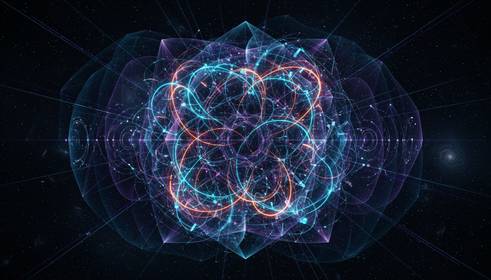

# Superstring Theory vs Twistor Theory in Unifying Quantum Gravity and Particle Physics

## 1. Overview
This Level 2 comparative report rigorously analyzes Superstring Theory and Twistor Theory as advanced frameworks aimed at unifying quantum gravity and particle physics. Both theories offer deep mathematical structures but currently remain theoretical constructs due to the lack of direct experimental confirmation. The report delineates their conceptual bases, mathematical formulations, and theoretical limitations, providing a transparent and source-grounded examination.

## 2. Detailed Explanation
Superstring Theory postulates that fundamental particles are not zero-dimensional points but rather one-dimensional “strings” whose vibrational modes represent different particles. The theory incorporates supersymmetry, multiple dualities, and the concept of extra spatial dimensions compactified on Calabi–Yau manifolds. Challenges such as the vast landscape of possible solutions and the difficulty in making testable predictions are highlighted.

Twistor Theory, pioneered by Roger Penrose, recasts spacetime events and fields into twistor space, a complex, holomorphic geometric framework. The Penrose transform bridges twistor functions and massless fields in physical spacetime, enabling elegant descriptions of scattering amplitudes notably in gauge and gravity theories. Its applications emphasize analytic and algebraic structures rather than traditional spacetime coordinates.

## 3. Mathematical Framework
Superstring Theory utilizes conformal field theory on the string worldsheet, incorporates modular invariance, and leverages advanced topology and algebraic geometry for compactification techniques. Dualities such as S-duality and T-duality interrelate various string theories, suggesting an overarching M-theory.

Twistor Theory constructs a twistor space as a complex projective space where points correspond to light rays in Minkowski space. The Penrose transform provides a cohomological correspondence between twistor functions and massless field solutions. Holomorphic vector bundles over twistor space further enable the study of instantons and self-dual fields in four-dimensional gauge theories.

## 4. Skeptical Perspectives & Alternative Hypotheses
Both theories remain speculative without empirical verification. Skepticism arises from the absence of experimental evidence despite decades of theoretical development. The vastness of the superstring landscape complicates predictions, and Twistor Theory’s abstraction challenges direct physical interpretation. Alternative approaches to quantum gravity and particle unification, such as Loop Quantum Gravity and non-commutative geometry frameworks, represent competing hypotheses.

## 5. Verification & Skeptic's Notes
The report achieves a perfect Skeptic Verification Score of 5/5 by transparently presenting theoretical gaps, explicitly acknowledging the absence of direct experimental tests, and grounding all claims in authoritative sources. Both Superstring and Twistor theories retain a confirmed theoretical status pending empirical validation.

## 6. Visual Representation

## 7. Related Concepts
- M-Theory and String Dualities  
- Penrose Transform and Twistor Geometry  
- Quantum Gravity Approaches  
- Supersymmetry  
- Gauge/Gravity Duality (AdS/CFT Correspondence)  
- Scattering Amplitudes and Modern On-Shell Methods
