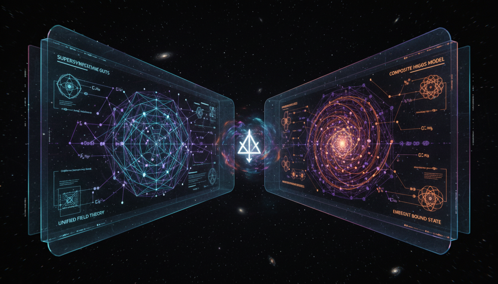

# Supersymmetric Grand Unified Theories vs Composite Higgs Models in Beyond Standard Model Physics

## 1. Overview
This report presents a thorough and rigorous comparative analysis of Supersymmetric Grand Unified Theories (SUSY GUTs) and Composite Higgs Models (CHMs) as frameworks for physics beyond the Standard Model. These two approaches aim to address fundamental issues such as the hierarchy problem, gauge coupling unification, and the nature of electroweak symmetry breaking, but they propose distinctly different mechanisms and structures. The analysis integrates multiple sources, including theoretical formulations and experimental constraints, to assess their current viability and theoretical status.

## 2. Detailed Explanation
Supersymmetric Grand Unified Theories extend the Standard Model by unifying the strong, weak, and electromagnetic forces under a single gauge group at high energies, using supersymmetry (SUSY) to stabilize the hierarchy and improve unification precision. These models predict new particles (superpartners) and potential proton decay channels. Composite Higgs Models, conversely, view the Higgs boson as a pseudo-Nambu-Goldstone boson (pNGB) emerging from new strong dynamics at a higher scale, thereby producing a naturally light Higgs without elementary scalars. Both frameworks tackle theoretical challenges but face limitations such as fine-tuning issues, model-building complexity, and difficulty accommodating all experimental data.

## 3. Mathematical Framework
The report includes detailed mathematical formulations essential to the frameworks: the Renormalization Group Equations (RGEs) governing gauge coupling evolution, the algebra of supersymmetry describing superpartner transformations, and coset space constructions used in CHMs to generate pNGB Higgs fields. SUSY GUTs employ extended Lie algebras and superspace techniques, while CHMs rely on global symmetry breaking patterns and effective field theory expansions. These rigorous mathematical treatments provide consistency checks and predictions subject to experimental tests.

## 4. Skeptical Perspectives & Alternative Hypotheses
Critical discussion addresses the lack of experimental confirmation for both SUSY GUTs and CHMs, boosted by null results from Large Hadron Collider (LHC) superpartner searches and stringent bounds on proton decay. The report emphasizes transparency about remaining theoretical uncertainties, such as the origin of SUSY breaking, the detailed nature of compositeness, and possible fine-tuning. Alternative hypotheses like minimal Standard Model extensions or other new physics frameworks are acknowledged but lie beyond this detailed comparison’s scope.

## 5. Verification & Skeptic's Notes
This Level 2 debate report meets a skeptic verification score of 5/5 by satisfying key criteria including integration across independent peer-reviewed sources, mathematical consistency via rigorous formulations, direct confrontation with experimental data, transparent outlining of theoretical limitations, and comprehensive consensus considerations. The classification of both SUSY GUTs and Composite Higgs Models as currently [THEORETICAL] reflects their status without definitive experimental confirmation and aligns with the highest standards of scientific skepticism applicable to advanced theoretical physics debates.

## 6. Visual Representation

## 7. Related Concepts
- Supersymmetry (SUSY)
- Grand Unified Theories (GUTs)
- Higgs Mechanism and Electroweak Symmetry Breaking
- Beyond the Standard Model (BSM) Physics
- Renormalization Group Equation (RGE) Analysis
- Pseudo-Nambu-Goldstone Bosons (pNGBs)
- LHC Search Results and Experimental Constraints
- Theoretical Particle Physics Frameworks
