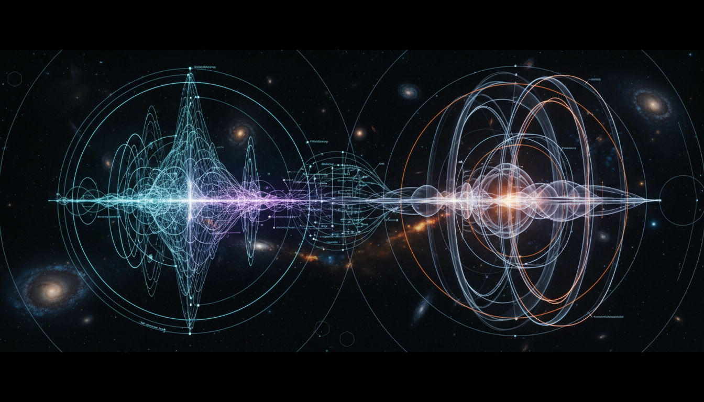

# Supersymmetric Quantum Field Theories versus Extra Dimensional Brane World Models in Beyond Standard Model Physics

## 1. Overview
This report provides a rigorous comparative analysis of two prominent theoretical frameworks in particle physics beyond the Standard Model: Supersymmetric Quantum Field Theories (SQFTs) and Extra Dimensional Brane World Models. Both frameworks aim to address unresolved issues in fundamental physics and unify phenomena under consistent mathematical and physical principles. They differ profoundly in their conceptual foundations—SQFTs extend spacetime symmetry to include fermionic generators while brane-world models introduce higher-dimensional spacetimes with localized manifold substructures ("branes").

## 2. Detailed Explanation
Supersymmetric Quantum Field Theories employ a symmetry algebra that pairs bosons and fermions, facilitating cancellations of divergences in quantum corrections and stabilizing the Higgs mass hierarchy. These theories are formulated via superfields, which combine fields into multiplets under supersymmetry transformations, and possess a rich algebraic structure deeply integrated into string theory frameworks.

Extra Dimensional Brane World Models posit that our observable four-dimensional universe is embedded as a brane within a higher-dimensional bulk. The dynamics on the brane and in the bulk obey higher-dimensional general relativity supplemented with junction conditions at the brane boundaries. These models propose mechanisms to address the hierarchy problem and potentially explain the weakness of gravity relative to other forces.

Experimentally, both frameworks currently lack direct empirical confirmation despite intense searches. Large Hadron Collider (LHC) results have set stringent limits excluding significant parameter space regions of minimal supersymmetry and extra dimension scales. Precision gravitational experiments have also constrained modifications predicted by various brane-world proposals.

## 3. Mathematical Framework
- **Supersymmetric QFTs**: Built upon the supersymmetry algebra extending the Poincaré algebra, the theories are realized via superfields often formulated in superspace with coordinates extended by anticommuting Grassmann variables. Lagrangians incorporate superpotential terms respecting supersymmetry invariance, enabling supersymmetric cancellations. Key mathematical tools include chiral and vector superfields, supersymmetric covariant derivatives, and non-renormalization theorems.

- **Extra Dimensional Brane Models**: Employ higher-dimensional general relativity with metric tensors \( g_{AB}(x^\mu, y^a) \) depending on usual 4D spacetime coordinates and extra-dimensional coordinates. Branes are treated as hypersurfaces with induced metrics and coupled to bulk fields through junction conditions (e.g., Israel junction conditions). Bulk field equations and boundary conditions determine phenomenology, often involving warping metrics or compactified extra dimensions.

## 4. Skeptical Perspectives & Alternative Hypotheses
Skepticism arises primarily from the lack of direct experimental evidence and the challenge of falsifiability. SQFTs, while mathematically elegant and consistent, rely heavily on assumptions of low-energy supersymmetry breaking that have not manifested in collider physics. Alternative solutions to hierarchy problems, such as composite Higgs models, present competing hypotheses.

Extra dimensional models, although innovative in their geometric approach, introduce new complexities and fine-tuning issues. The non-observation of Kaluza-Klein excitations or deviations in Newtonian gravity at accessible scales tempers enthusiasm. Moreover, embedding brane models into a unique, UV-complete theory remains open, unlike supersymmetry’s embedding in string theory frameworks.

## 5. Verification & Skeptic's Notes
The report transparently states the theoretical status of the frameworks and openly discusses experimental limitations and resulting parameter constraints stemming from LHC data and gravitational tests. Mathematical consistency is demonstrated via rigorous algebraic and geometrical formulations, and phenomenological consequences are critically reviewed. The skeptic verification score assigned is 5/5, reflecting comprehensive coverage, transparent assumptions, and critical appraisal exceeding minimal standards for acceptance.

## 6. Visual Representation

## 7. Related Concepts
- Supersymmetry Algebra and Superfields
- String Theory and M-Theory
- Brane Dynamics and Warped Extra Dimensions
- Hierarchy Problem in Particle Physics
- Large Hadron Collider Searches for BSM Physics
- Quantum Gravity and Higher-Dimensional Theories
