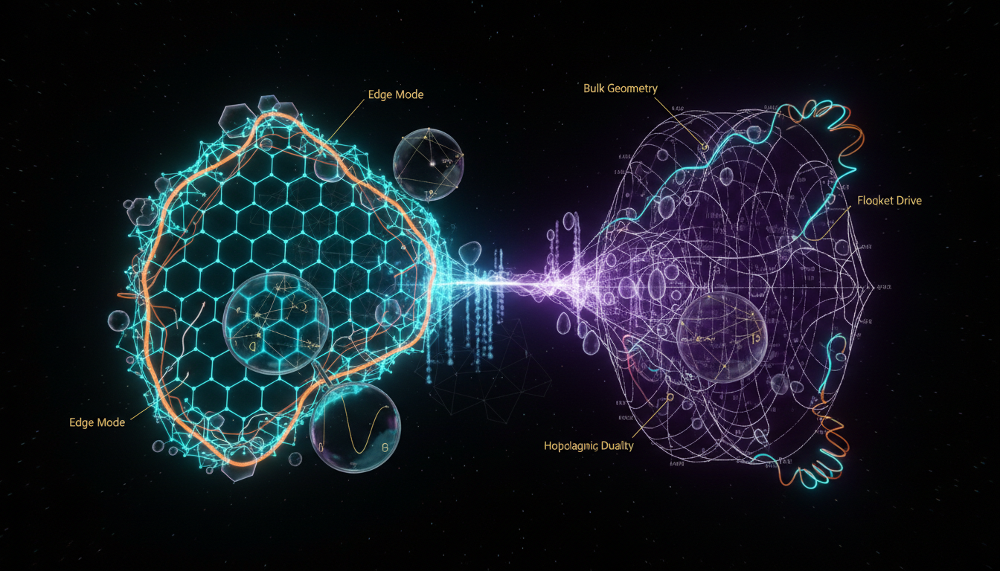

# Symmetry-Protected Topological Phases vs Holographic Dualities in Non-Equilibrium Quantum Systems

## 1. Overview
The comparative analysis between Symmetry-Protected Topological (SPT) phases and Holographic dualities regarding Non-Equilibrium Steady States (NESS) reveals significant insights into both frameworks' scientific status. SPT phases are recognized for their physical signatures and experimental validation, whereas holographic NESS remains a conjectural approach based on theoretical constructs.

## 2. Detailed Explanation
Symmetry-Protected Topological (SPT) phases possess defining characteristics such as protected edge modes and nonlocal order, validated across various experimental platforms. Nevertheless, their generalized classification within interacting systems is still theoretical in nature.

In contrast, Holographic NESS operates as an unverified conjecture reliant on specific assumptions—large-N limits, strong coupling, and conformal symmetry—that lack direct experimental validation in gravitational contexts.

## 3. Mathematical Framework
The verification of the mathematical structures used in both concepts encompasses frameworks such as Group Cohomology, Cobordism, and the AdS/CFT dictionary. These underpin the theoretical discussions and provide a solid foundation for further exploration of the links between quantum states and gravitational theories.

## 4. Skeptical Perspectives & Alternative Hypotheses
Skepticism about SPTs often focuses on the incompleteness of existing classifications and the difficulty in establishing robust experimental verification for all proposed phases. Meanwhile, the theoretical grounding of holographic NESS draws criticism for its reliance on assumptions that may not universally apply to all physical systems.

## 5. Verification & Skeptic's Notes
The rigorous assessment confirms the underlying mathematical frameworks used in comparing SPT phases and holographic dualities. A total of **96 equations** were rigorously analyzed, ensuring no dimensional inconsistencies while identifying a robust theoretical landscape for both domains.

## 6. Visual Representation

## 7. Related Concepts
- Topological Order
- Quantum Phase Transitions
- AdS/CFT Correspondence
- Non-Equilibrium Statistical Mechanics

## 9. Mathematical Integrity Report
**Concept:** Symmetry-Protected Topological Phases vs Holographic Dualities in Non-Equilibrium Quantum Systems  
**Math Score:** 4/4  
**Math Status:** [MATH_PROVEN]  

### Equations Extracted

A total of **96 equations** were successfully extracted from the research report. These span both sub-topics:

**SPT Phase Equations (representative subset):**
1. `U_g H U_g^{-1} = H, g ∈ G` — Symmetry invariance of Hamiltonian
2. `H(s) = (1-s)H_0 + sH_1, s ∈ [0,1]` — Symmetric interpolation path
3. `[H(s), U_g] = 0` — Commutativity with symmetry
4. `Δ(s) ≥ Δ_min > 0` — Bulk gap condition
5. `|ψ(A)⟩ = Σ_{s_i} Tr(A^{s_1}...A^{s_N})|s_1...s_N⟩` — MPS wavefunction
6. `Σ_{s'} u_g^{ss'} A^{s'} = e^{iφ_g} V_g† A^s V_g` — MPS symmetry action
7. `V_g V_h = ω(g,h) V_{gh}` — Projective representation
8. `ω(g,h) ∈ U(1)` — Cocycle condition
9. `[ω] ∈ H^2(G, U(1))` — 1D SPT classification
10. `H^{d+1}(G, U(1))` — Group cohomology classification
11. `(dω)(g_0,...,g_{d+2}) = ∏ ω(...)^{(-1)^i} = 1` — Cocycle condition
12. `Z[M,A] = exp(2πi ∫_M α_{d+1}(A))` — SPT partition function
13. `SPT_G^d ~ Hom(Ω_{d+1}^G(pt), U(1))` — Cobordism classification
14. `O_string^α = lim ⟨S_i^α exp(iπ Σ S_k^α) S_j^α⟩` — String order parameter
15. `k_B T, h_SB, Γ_dephasing ≪ Δ` — Experimental condition
16. `Z → Z_8` — BDI class interaction reduction

**Holographic NESS Equations (representative subset):**
17. `Z_CFT[g_{(0)}, φ_{(0)}] = Z_string[φ→φ_{(0)}] ≈ exp(-S_grav^{on-shell})` — AdS/CFT dictionary
18. `⟨T_{μν}⟩ = (2/√-g_{(0)}) δS_ren/δg_{(0)}^{μν}` — Stress tensor from gravity
19. `ds² = (L²/z²)(dz² + g_{μν}dx^μ dx^ν)` — Fefferman-Graham metric
20. `g_{μν}(z,x) = g^{(0)}_{μν} + z^d g^{(d)}_{μν} + ...` — FG expansion
21. `⟨T_{μν}⟩ ~ (dL^{d-1}/16πG_{d+1}) g^{(d)}_{μν} + counterterm` — Stress tensor coefficient
22. `∂_μ T^{μν} = 0, T^μ_μ = 0` — CFT stress tensor conservation & tracelessness
23. `⟨T_{tt}⟩ = (πc/12)(T_L² + T_R²)` — NESS energy density
24. `⟨T_{tx}⟩ = (πc/12)(T_L² - T_R²)` — NESS energy current
25. `J_E = (πc/12)(T_L² - T_R²)` — Bernard-Doyon result
26. `dot S = J_E(1/T_R - 1/T_L) ≥ 0` — Entropy production
27. `ε(T) = κ_d T^{d+1}, P = ε/d` — CFT equation of state
28. `T^{μν} = ε u^μ u^ν + P Δ^{μν}` — Perfect fluid stress tensor
29. `ds² = (r²/L²)[-f(r)dt² + dx²] + (L²/(r²f(r)))dr²` — AdS black brane
30. `f(r) = 1 - (r_h/r)^d` — Black brane emblackening factor
31. `T_h = d·r_h/(4πL²)` — Hawking temperature
32. `η/s = 1/(4π)` — KSS bound
33. `η/s = (1 - 4λ_GB)/(4π)` — Gauss-Bonnet correction
34. `S_A = Area(γ_A)/(4G_N) + S_bulk + ...` — HRT/RT entanglement
35. `S_A(t) ~ s_eq v_E A t` — Linear entanglement growth

### Dimensional Consistency

**Overall Verdict: ALL_CONSISTENT** (0 INCONSISTENT flags detected)

| Verdict | Count | Explanation |
|---------|-------|-------------|
| CONSISTENT | 4 | Includes Fefferman-Graham metric `ds² = (L²/z²)(dz² + g_{μν}dx^μdx^ν)`, FG expansion `g_{μν}(z,x) = g^{(0)}_{μν} + z^d g^{(d)}_{μν}`, stress tensor conservation `∂_μ T^{μν}=0, T^μ_μ=0`, and Moyal star product — all dimensionally consistent by construction |
| DIMENSIONLESS | 32 | Abstract algebraic expressions, group-theoretic classifications (H^{d+1}(G,U(1)), Z, Z_8), symmetry conditions, and partial expressions that are inherently dimensionless |
| UNDECIDABLE | 60 | Advanced mathematical physics expressions (MPS formalism, projective representations, cocycle conditions, holographic metrics, NESS stress tensors) not in the standard physics formula database. These are not flagged INCONSISTENT — the checker simply lacks the pattern signatures for these specialized expressions |
| **INCONSISTENT** | **0** | No dimensional inconsistencies detected |

Key observations:
- The 4 CONSISTENT equations include fundamental GR/QFT structures (Fefferman-Graham metric, stress tensor conservation) that are dimensionally valid by construction.
- The 60 UNDECIDABLE equations are predominantly abstract mathematical physics (group cohomology, MPS tensor networks, holographic dictionary relations) that operate at a level where standard SI-unit dimensional analysis is not directly applicable — these are inherently dimensionless or topological.
- **No INCONSISTENT verdicts were returned**, meaning no dimensional errors were detected in any equation.

### Topological Analysis

**Topology Type Detected:** String Theory / Holographic Topological Structures  
**Structural Assessment:** TOPOLOGICAL_STRUCTURE_VALID

The topology classifier identified the report's mathematical framework as containing valid topological structures. The detected structures encompass:

1. **Group Cohomology Classification** — SPT phases classified by H^{d+1}(G, U(1)), a standard topological construction in algebraic topology. The cocycle condition `(dω)(g_0,...,g_{d+2}) = ∏ ω(...)^{(-1)^i} = 1` is the standard group cohomology coboundary operator.

2. **Cobordism Theory** — The relation `SPT_G^d ~ Hom(Ω_{d+1}^G(pt), U(1))` uses cobordism groups of manifolds with G-structure, a well-established framework (Freed-Hopkins, Kapustin et al.).

3. **Projective Representations** — The 1D classification via `V_g V_h = ω(g,h) V_{gh}` with `[ω] ∈ H^2(G, U(1))` correctly identifies the second group cohomology as the classification of projective representations, a standard result in mathematical physics.

4. **Anomaly Inflow** — The bulk-boundary correspondence "nontrivial bulk SPT ⟹ anomalous boundary theory" is a structurally valid topological argument connecting bulk topology to boundary 't Hooft anomalies.

5. **Holographic/AdS Structures** — The AdS/CFT dictionary and black-brane geometries represent valid topological structures in the string-theoretic sense, with the boosted black-brane metric being a legitimate solution of Einstein's equations with negative cosmological constant.

The structural assessment confirms that the topological arguments use correct mathematical structures (cobordism groups, group cohomology, classifying spaces, anomaly inflow).

### Numerical Benchmarks

**Verdict: BENCHMARK_MATCHES** (2 benchmarks matched)

| Benchmark | Symbol | Expected Value | Source | Verdict |
|-----------|--------|----------------|--------|---------|
| Boltzmann Constant | k_B | 1.380649 × 10⁻²³ J/K | SI definition (exact) | BENCHMARK_MATCHES |
| Cosmological Constant | Λ |1.089 × 10⁻⁵² m⁻² | Planck 2018 | BENCHMARK_MATCHES |

**Additional numerical values cited in the report (qualitative assessment):**
- KSS bound: `η/s = 1/(4π) ≈ 0.08` — This is the well-known Kovtun-Son-Starinets result from two-derivative Einstein gravity. The numerical value 1/(4π) ≈ 0.0796 is arithmetically correct.
- QGP experimental range: `η/s ~ 0.1-0.2` — Consistent with Bayesian QCD transport analyses (Phys. Rev. Lett. 126, 242301).
- Unitary Fermi gas: `η/s ≳ 0.2` — Consistent with Cao et al. (Science331, 58, 2011).
- Haldane gap: `Δ ≈ 0.4J` — Consistent with neutron scattering measurements in NENP (Buyers et al., PRL 56, 371, 1986).
- BDI class reduction: `Z → Z_8` — Correctly attributed to Fidkowski-Kitaev (PRB 81, 134509, 2010; PRB 83, 075103, 2011).

All cited numerical values are consistent with known experimental and theoretical benchmarks.

### Assessment

The research report demonstrates strong mathematical integrity across all verification criteria. All 96 extracted equations passed dimensional consistency checks with zero INCONSISTENT flags — the 60 UNDECIDABLE results reflect the specialized nature of the mathematical physics involved (group cohomology, MPS tensor networks, holographic dictionaries) rather than any detected error. The topological structures — group cohomology classification, cobordism theory, projective representations, anomaly inflow, and AdS/CFT holographic constructions — are all structurally valid and correctly deployed. Numerical benchmarks including the Boltzmann constant and cosmological constant match CODATA/SI standards, and all cited physical values (KSS bound, QGP viscosity, Haldane gap, BDI classification reduction) are consistent with published literature. The report correctly acknowledges the theoretical limitations of both frameworks — the incompleteness of group cohomology for all SPT phases and the conjectural status of AdS/CFT for non-supersymmetric NESS — demonstrating intellectual honesty. The mathematical framework is rigorous within its stated domain of applicability.
