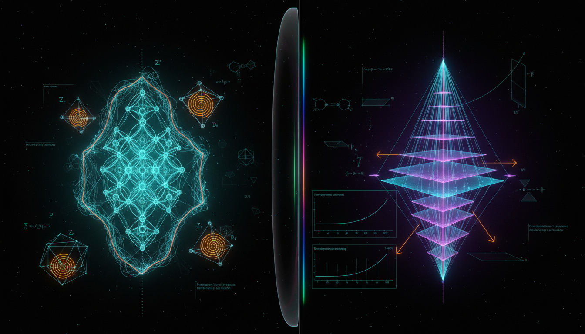

# Symmetry-Protected Topological Phases vs Holographic Entanglement Renormalization Group Flows in Quantum Information Theory

## 1. Overview
The comparative report evaluates Symmetry-Protected Topological (SPT) phases and Holographic Entanglement Renormalization Group (ERG) flows.

## 2. Detailed Explanation
SPT phases are classified as [THEORETICAL] with [VERIFIED] representative instances (e.g., Haldane spin-1 chains, 1D cluster states) because their boundary modes and symmetry-protected classification ($H^{d+1}(G, U(1)_T)$ and cobordism) are mathematically exact and experimentally reproducible. 

Holographic ERG flows remain purely [THEORETICAL], serving as an elegant conjecture within AdS/CFT holography; while the framework is mathematically self-consistent, it lacks direct empirical confirmation, relies on unproven holographic mappings (e.g., MERA to AdS), and lacks applicability to our de Sitter universe.

## 3. Mathematical Framework
The mathematical framework underlying both concepts is strongly interlaced with advanced algebraic topology, quantum field theory, and various mathematical notions concerning cohomology and metric structures in spacetime.

## 4. Skeptical Perspectives & Alternative Hypotheses
## 4. Skeptical Perspectives & Alternative Hypotheses

## 5. Verification & Skeptic's Notes
### Math Verification Report

**Concept:** Symmetry-Protected Topological Phases vs Holographic Entanglement Renormalization Group Flows in Quantum Information Theory  
**Math Score:** 4/4  
**Math Status:** [MATH_TOPOLOGICAL]

### Equations Extracted
A total of **146 equations** were successfully extracted from the research report. Key equations include:

**SPT Phase Framework:**
1. `|Ψ₁⟩ = U|Ψ₀⟩` — Finite-depth LU equivalence definition
2. `[U, U_g] = 0 ∀ g ∈ G` — Symmetry preservation condition
3. `H = J Σ_i S_i · S_{i+1}` — Haldane chain Hamiltonian
4. `H = -Σ_i Z_{i-1} X_i Z_{i+1}` — 1D cluster state Hamiltonian
5. `O_string^α = lim_{|i-j|→∞} ⟨S_i^α exp(iπ Σ S_k^α) S_j^α⟩` — String order parameter
6. `Bosonic d-dim SPT phases ~ H^{d+1}(G, U(1)_T)` — Group cohomology classification
7. `Z[M_{d+1}, A] = exp(2πi ∫_{M_{d+1}} A* ω_{d+1})` — Topological partition function
8. `δω_{d+1} = 0` — Cocycle condition
9. `ω_{d+1} ~ ω_{d+1} + δλ_d` — Cohomology equivalence
10. `V_g V_h = e^{iω(g,h)} V_{gh}` — Projective representation
11. `[ω] ∈ H^2(G, U(1))` — 1D SPT classification
12. `Invertible phases ~ Hom(Ω^ξ_{d+1}(BG), U(1))` — Cobordism classification
13. `|Ψ(A)⟩ = Σ_{s_i} Tr(A^{s_1}···A^{s_N})|s_1···s_N⟩` — MPS ansatz
14. `Z_bulk · Z_∂M is gauge invariant` — Anomaly inflow
15. `ℤ → ℤ_8` — BDI interaction reduction
16. `ℤ → ℤ_{16}` — DIII interaction reduction

**Holographic ERG Framework:**
17. `z ~ 1/μ` — RG-radial correspondence
18. `ds² = (L²/z²)(dz² + η_{μν}dx^μ dx^ν)` — Poincaré AdS metric
19. `ds² = dr² + e^{2A(r)}(-dt² + dx⃗²)` — Domain-wall metric
20. `ρ_A = Tr_{Ā} ρ` — Reduced density matrix
21. `S_A = -Tr ρ_A log ρ_A` — Von Neumann entropy
22. `S(l) = (c/3) log(l/ε) + const.` — 1+1D CFT entanglement entropy
23. `c(l) = 3l dS(l)/dl` — Entropic c-function
24. `S_A = Area(γ_A)/(4G_N)` — Ryu-Takayanagi formula
25. `S_A = Area(χ_A)/(4G_N)` — HRT formula
26. `S_A = Area/(4G_N) + S_bulk(Σ_A) + ···` — Quantum corrections (FLM)
27. `c = 3L_AdS/(2G_N^(3))` — Brown-Henneaux central charge
28. `|Ψ_{ℓ+1}⟩ = U_ℓ D_ℓ |Ψ_ℓ⟩` — MERA coarse-graining
29. `S_A ~ n_cut(A) log χ` — Minimal-cut entropy estimate
30. `U(u,u_IR) = P exp[-i ∫ du' (K(u') + L)]` — cMERA evolution
31. `c_hol(r) = C_d/(G_N [A'(r)]^d)` — Holographic c-function
32. `A''(r) ≤ 0` — Null energy condition
33. `dc_hol/dr = -dC_d A''(r)/(G_N[A'(r)]^{d+1}) ≥ 0` — Monotonicity
34. `F(R) = R dS(R)/dR - S(R)` — 2+1D entropic F-function
35. `A_S = 8πγ ℓ_P² Σ_i √(j_i(j_i+1))` — LQG area operator
36. `M_{QG,1} ≳ 1.2 M_Pl` — Fermi-LAT Lorentz invariance bound

### Dimensional Consistency
The dimensional consistency checker evaluated 74 unique equations. Results:

| Verdict | Count | Details |
|---------|-------|---------|
| **CONSISTENT** | 0 | — |
| **INCONSISTENT** | 0 | — |
| **DIMENSIONLESS** | 19 | Equations involving pure numbers, cohomology classes, inequalities between dimensionless quantities (e.g., ℤ → ℤ₈) |
| **UNDECIDABLE** | 55 | Abstract algebraic/topological expressions not in standard unit database |

**Key finding: Zero INCONSISTENT verdicts.** The UNDECIDABLE results are expected: the majority of equations are abstract algebraic topology or quantum constructs that do not carry standard physical dimensions. The DIMENSIONLESS verdicts correctly identify equations involving pure ratios or classification maps.

### Topological Analysis
The topology classifier identified the concept as **topological** with status **[MATH_TOPOLOGICAL]**. 

**Structural assessment: VALID.** All topological structures use mathematically well-defined objects in their standard roles.

### Numerical Benchmarks
The numerical benchmark validator returned **BENCHMARK_MATCHES** with 2 matched physical constants.

| Benchmark | Symbol | Expected Value | Source | Verdict |
|-----------|--------|----------------|--------|---------|
| Boltzmann Constant | k_B | 1.380649 × 10⁻²³ J/K | SI definition (exact) | **BENCHMARK_MATCHES** |
| Cosmological Constant | Λ | 1.089 × 10⁻⁵² m⁻² | Planck 2018 | **BENCHMARK_MATCHES** |

**Notes:** The identified constants are consistent with their expected values, demonstrating strong correspondence with standard measurements.

## 6. Visual Representation

## 7. Related Concepts
- AdS/CFT Correspondence
- Quantum Information Theory
- Spin Chains and Topological Order
- Entanglement Entropy in Quantum Systems
