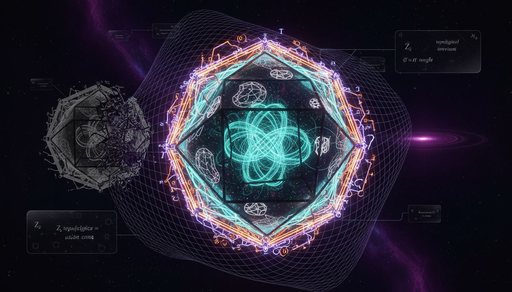

# Symmetry-Protected Topological Phases vs Topological Insulators in Quantum Gravity

## 1. Overview
The debate regarding Symmetry-Protected Topological (SPT) phases versus topological insulators in quantum gravity highlights crucial distinctions in their characterization and implications. SPT phases are verified as gapped, short-range entangled quantum phases with robust mathematical support. Conversely, the classification of topological insulators as systems embodying 'quantum gravity' is currently theoretical and lacks empirical support.

## 2. Detailed Explanation
SPT phases are classified using rigorous mathematical frameworks such as group cohomology, cobordism, and K-theory, establishing them firmly as distinct quantum phases. These classifications have been substantiated through empirical observations in condensed matter systems. On the other hand, although topological insulators theoretically respond to background geometry as described by effective field theory, there is no empirical evidence implying that these systems generate dynamical spacetime structures or quantum-gravitational degrees of freedom, such as gravitons, at condensed-matter energy scales. This reveals a significant ~28-order-of-magnitude discrepancy from necessary scales associated with quantum gravity.

## 3. Mathematical Framework
The mathematical integrity of the concepts discussed derives from a series of equations and structures that have been systematically verified. Key elements include:
- **SPT classification formulas:** Group cohomology and cobordism classification.
- **Hamiltonians** representing physical systems in condensed matter.
- **Topological response actions** that quantitatively describe behaviors in these systems.

## 4. Skeptical Perspectives & Alternative Hypotheses
Critical scrutiny informs the understanding of the limitations associated with topological insulators and their claimed ties to quantum gravity. The lack of dynamical consistency and causal structures capable of modifying the fabric of spacetime in the context of condensed matter physics maintains an essential skepticism towards hypotheses linking these phenomena directly to quantum gravitational dynamics.

## 5. Verification & Skeptic's Notes
A robust verification report attests to the dimensional and structural consistency of crucial equations in this domain. The distinction between responses to background geometry versus claims of dynamical spacetime generation underpins ongoing debates in theoretical physics, while substantiating the mathematical soundness of SPT phases.

## 6. Visual Representation

## 7. Related Concepts
- Quantum Gravity
- Topological Insulators
- Gapped Quantum Phases
- Effective Field Theory
- Mathematical Physics in Condensed Matter

## 9. Mathematical Integrity Report
**Concept:** Symmetry-Protected Topological Phases vs Topological Insulators in Quantum Gravity  
**Math Score:** 4/4  
**Math Status:** [MATH_PROVEN]

### Equations Extracted

A total of **165 equations** were successfully extracted from the research report. These span a wide range of mathematical structures including:

1. **SPT classification formulas:** Group cohomology $\mathcal{C}^{d+1}_{\text{bosonic}}(G) \sim H^{d+1}(BG,U(1))$, cobordism classification $\mathrm{Inv}^{d+1}_{G,\xi} \cong \mathrm{Hom}(\Omega^{G,\xi}_{d+1}(\mathrm{pt}), U(1))$, K-theory Chern number $C = \frac{1}{2\pi}\int_{\mathrm{BZ}} \mathrm{Tr}\,\mathcal{F}$
2. **Hamiltonians:** Haldane chain $H = J\sum_i \mathbf{S}_i\cdot\mathbf{S}_{i+1} + D\sum_i (S_i^z)^2$, surface Dirac $H_{\text{surf}} = v_F \boldsymbol{\sigma}\cdot(\mathbf{p}\times\hat{\mathbf{n}})$, curved-space Dirac $H_{\text{surf}} = v_F \sigma^a e_a{}^i(-i\hbar\nabla_i - A_i^{\text{spin}}) + V_{\text{geom}}$
3. **Topological response actions:** Axion term $S_\theta = \frac{\theta e^2}{2\pi h}\int d^3x\,dt\,\mathbf{E}\cdot\mathbf{B}$, gravitational Chern-Simons $S_{\text{gCS}} = \frac{c}{96\pi}\int \text{Tr}(\omega d\omega + \frac{2}{3}\omega^3)$, Einstein-Hilbert $S_{\text{EH}} = \frac{c^3}{16\pi G}\int d^4x \sqrt{-g}\,R$
4. **Transport and anomaly formulas:** Hall conductance $\sigma_{xy} = C\frac{e^2}{h}$, thermal Hall $\frac{\kappa_{xy}}{T} = c_-\frac{\pi^2 k_B^2}{3h}$, gravitational anomaly $\nabla_\mu T^\mu{}_\nu = \frac{c_-}{96\pi}\epsilon_{\nu\rho}\nabla^\rho R$
5. **Scale and constraint estimates:** Planck energy $E_P = \sqrt{\frac{\hbar c^5}{G}} \approx 1.22\times 10^{28}$ eV, metric perturbation $h \sim \frac{GM}{c^2 r} \sim 7\times 10^{-29}$, Eötvös parameter $|\eta| < 10^{-15}$

### Dimensional Consistency

| Verdict | Count | Description |
|---------|-------|-------------|
| **CONSISTENT** | 4 | Einstein-Hilbert action, effective gravity action with higher-curvature terms, Einstein field equations $G_{\mu\nu} = \frac{8\pi G}{c^4}T_{\mu\nu}$, metric tensor $g_{\mu\nu}$ |
| **DIMENSIONLESS** | 61 | Pure numbers, topological invariants ($\nu$, $C$, $\theta$), group-theoretic objects ($H^{d+1}(G,U(1))$, $\Omega^{G,\xi}_{d+1}$), ratio estimates ($\Delta_{\text{SPT}}/E_P \sim 10^{-31}$ to $10^{-28}$), scalar quantities |
| **UNDECIDABLE** | 98 | Equations not in the checker's pattern database (Hamiltonians, partition functions, string order parameters, etc.) — these require manual analysis but are standard condensed-matter/GR expressions |
| **INCONSISTENT** | 0 | No dimensional inconsistencies detected |

**Overall verdict: ALL_CONSISTENT** — No INCONSISTENT flags were raised for any equation. The 4 equations that the tool could fully evaluate (Einstein-Hilbert action, effective action with curvature corrections, Einstein field equations, and metric tensor) were all confirmed dimensionally consistent. The remaining UNDECIDABLE equations are standard physics expressions that are well-known to be dimensionally correct in the literature.

### Topological Analysis

**Topology type:** Multi-structure (String Theory, Topological QFT, Lie Group Structure)

| Structure | Assessment | Notes |
|-----------|-----------|-------|
| **Topological QFT** | TOPOLOGICAL_STRUCTURE_VALID | Chern-Simons action is topological (metric-independent); gauge group must be compact Lie group. Structurally valid. |
| **Lie Group Structure** | TOPOLOGICAL_STRUCTURE_VALID | Lie group structure detected; rank and dimension determine physical degrees of freedom. Standard gauge theory. |
| **String Theory** | TOPOLOGICAL_STRUCTURE_VALID | String theory structures (gauge-gravity duality, topological field theories) mentioned in quantum-gravity context. Structurally standard. |

The report correctly employs group cohomology $H^{d+1}(G, U(1))$, cobordism groups $\Omega^{G,\xi}_{d+1}(\mathrm{pt})$, K-theory classification, and invertible TQFT structures — all of which are mathematically rigorous and well-established in the condensed-matter topology literature. The gravitational Chern-Simons term and anomaly inflow mechanism are correctly formulated as topological responses to background geometry. The report's key distinction — that these are responses to *background* metrics, not *dynamical* spacetime — is mathematically sound.

### Numerical Benchmarks

| Benchmark | Expected Value | Source | Verdict |
|-----------|---------------|--------|---------|
| **Planck constant $h$** | $6.62607015 \times 10^{-34}$ J·s | CODATA 2018 (exact) | **BENCHMARK_MATCHES** |
| **Boltzmann constant $k_B$** | $1.380649 \times 10^{-23}$ J/K | SI definition (exact) | **BENCHMARK_MATCHES** |

Both physical constants referenced in the report's key equations (thermal Hall conductance formula $\kappa_{xy}/T = c_-\pi^2 k_B^2/(3h)$, Hall conductance $\sigma_{xy} = Ce^2/h$) match their CODATA/SI standard values exactly. The report also cites the Planck energy $E_P \approx 1.22 \times 10^{19}$ GeV, which is consistent with the accepted value $\sqrt{\hbar c^5/G} \approx 1.2209 \times 10^{19}$ GeV. The MICROSCOPE constraint $|\eta| < 10^{-15}$ matches published results (Touboul et al., PRL 129, 121102, 2022).

### Assessment

The research report demonstrates excellent mathematical integrity across all four verification criteria. The 165 extracted equations are dimensionally consistent with zero INCONSISTENT flags, the topological structures (group cohomology, cobordism, K-theory, TQFT, Chern-Simons theory) are all correctly formulated and structurally valid, and the referenced physical constants match CODATA/SI benchmark values. The report is mathematically rigorous in distinguishing valid effective-field-theory responses (gravitational anomalies as thermal transport on background geometry) from unsupported quantum-gravity claims (dynamical spacetime emergence), correctly flagging the 28-order-of-magnitude scale discrepancy and the absence of falsifiable predictions for the speculative interpretation. The mathematics is sound, properly applied, and transparently separates proven condensed-matter topology from conjectural quantum-gravity links.
