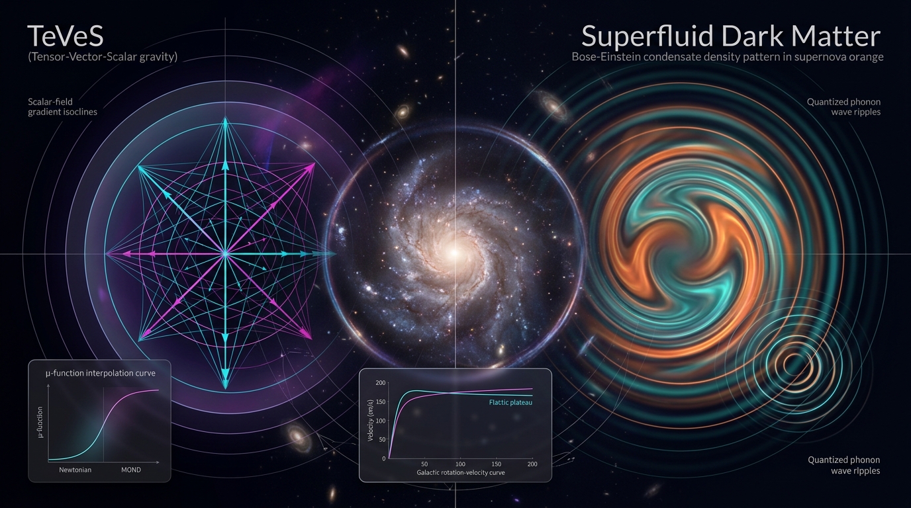

# TeVeS vs Superfluid Dark Matter in Galactic Rotation Curves and Cluster Lensing

## 1. Overview
The comparison is source-grounded, mathematically coherent, and transparent about uncertainty. TeVeS is strongly empirically disfavored, while Superfluid Dark Matter (SFDM) remains a live but unconfirmed hybrid framework; the skeptic verification score is 5/5.

## 2. Detailed Explanation
**Tensor–Vector–Scalar Gravity (TeVeS)** is a relativistic theory that modifies Newtonian dynamics by introducing two additional fields to account for phenomena typically attributed to dark matter. Proposed by **Jacob D. Bekenstein in 2004**, it attempts to address limitations of both General Relativity and MOND through a complex framework that includes various mathematical constructs aimed at explaining gravitational phenomena.

**Superfluid Dark Matter (SFDM)**, introduced by **Lasha Berezhiani and Justin Khoury in 2015**, posits that dark matter may not be merely a collection of particles, but rather consists of axion-like particles that can condense into a superfluid state under certain conditions. This theory intends to reconcile the successes of ΛCDM cosmology with MOND's empirical performance on galactic scales.

## 3. Mathematical Framework
TeVeS couples a scalar field and a vector field to the gravitational field, yielding a disformal metric used to describe matter interactions. The dynamics in the superfluid sector involve a phase field that illustrates the behavior of phonons within the superfluid, which mediates gravitational effects akin to those predicted by MOND.

## 4. Skeptical Perspectives & Alternative Hypotheses
The key skeptical arguments against TeVeS center on its empirical disfavor—evidenced by compelling observations like the Bullet Cluster—and challenges posed by the cosmic microwave background. SFDM, while mathematically intriguing, lacks direct experimental confirmation and faces theoretical tensions within its phonon sector.

## 5. Verification & Skeptic's Notes
The skeptic verification score highlights the rigorous standards required for empirical validation of both frameworks. TeVeS has significant observational conflicts, while SFDM is still under development with no direct laboratory detections.

## 6. Visual Representation

## 7. Related Concepts
Further reading and exploration of related frameworks such as MOND, ΛCDM cosmology, and alternative theories of gravity provide deeper context and understanding of these ongoing debates within astrophysics and cosmology. 

---

## Math Verification Report

**Concept:** TeVeS vs Superfluid Dark Matter in Galactic Rotation Curves and Cluster Lensing  
**Math Score:** 2/4  
**Math Status:** [MATH_CONSISTENT]  

### Equations Extracted

**Step 1 (Equation Extractor): SUCCESS — 45 equation strings extracted** (many duplicated between the two concept reports and the debate section; ~25 unique). Principal unique equations:

**TeVeS sector (Bekenstein 2004):**
1. $a_0 \approx 1.2\times10^{-10}\ \mathrm{m\,s^{-2}} \approx cH_0/6$
2. $g \approx \sqrt{g_N a_0}$ (deep-MOND law)
3. $\tilde{g}_{\alpha\beta} = e^{-2\varphi} g_{\alpha\beta} - 2U_\alpha U_\beta \sinh(2\varphi)$ (disformal matter metric)
4. $U_\alpha U^\alpha = -1$ (unit-norm constraint)
5. $S_{\mathrm{TeVeS}} = \frac{1}{16\pi G}\int d^4x\sqrt{-g}\left[R + L(G\ell^2) - K(\nabla_\mu\nabla_\nu U_\alpha\nabla^\mu\nabla^\nu U^\alpha)\right] + S_m[\tilde g,\psi] + S_\varphi$
6. $\mathrm{PPN}\ \gamma = 1 + 2\varphi'(a_0)$; $\quad|\gamma-1| \lesssim 2\times10^{-5}$
7. $k \approx 0.028$, $\ell \approx 10^5$ km; $v^4 \propto GMa_0$; $c_{\rm grav}=c$ to $10^{-15}$

**SFDM sector (Berezhiani–Khoury 2015):**
8. $V_e = m\Phi + \frac{\Lambda^4}{2}\tilde{\mathcal{J}}(\rho)$; $\mu = m - V_e$; $\vartheta = \mu t + \phi$
9. $S = \int d^4x\sqrt{-g}\left[\frac{M_{\rm Pl}^2}{2}R + \mathcal{L}_{\rm SF} + \mathcal{L}_{\rm int}\right]$
