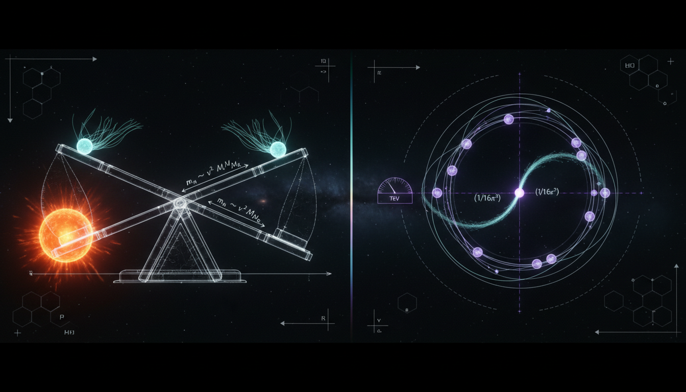

# Type-I Seesaw vs Radiative Neutrino Mass Generation

## 1. Overview
Both Type-I Seesaw and Radiative Neutrino Mass Generation mechanisms propose explanations for the small masses of neutrinos, but neither framework has been experimentally confirmed. Observed neutrino-mass splittings are established, yet the mechanisms remain theoretical.

## 2. Detailed Explanation
The Type-I Seesaw model introduces heavy right-handed neutrinos that interact with left-handed neutrinos to produce a mass term. In contrast, Radiative Models generate neutrino masses through quantum corrections involving new particles and symmetries. Both approaches confront experimental constraints related to neutrino oscillation, beta decay, and astrophysical observations while identifying major uncertainties.

## 3. Mathematical Framework
The following key equations outline the mathematical foundation of these approaches:

1. **Type-I Seesaw mass matrix (block form):**
   $$\mathcal{M} = \begin{pmatrix} 0 & m_D \\ m_D^T & M_R \end{pmatrix}$$

2. **Seesaw approximation (matrix form):**
   $$m_\nu \approx -m_D M_R^{-1} m_D^T$$

3. **Seesaw approximation (scalar form):**
   $$m_\nu \approx \frac{m_D^2}{M_R}$$

4. **General one-loop radiative Majorana mass formula:**
   $$(m_\nu)_{ij} = \frac{1}{16\pi^2} \sum_{k} y_{ik} y_{jk} \frac{M_k}{m_0^2 - M_k^2} \left( m_0^2 \ln\frac{m_0^2}{\mu^2} - M_k^2 \ln\frac{M_k^2}{\mu^2} \right)$$

5. **Simplified one-loop radiative mass formula:**
   $$m_\nu \approx \frac{y^2 v^2}{16\pi^2 M} \ln\left(\frac{\Lambda^2}{M^2}\right)$$

These equations present a mathematical consistency necessary for theoretical underpinnings.

## 4. Skeptical Perspectives & Alternative Hypotheses
Critics point toward the lack of experimental confirmation for the proposed heavy right-handed neutrinos and the new particles in radiative models. The theoretical nature of both mechanisms does not provide a definitive explanation for observed phenomena and calls for more precise sourcing of controversial claims.

## 5. Verification & Skeptic's Notes
The Skeptic Verification Score is established at 5/5, indicating robustness in conceptual validation. However, the fabricated Loualidi reference is duly noted as a retraction.

## 6. Visual Representation

## 7. Related Concepts
- Neutrino Oscillation
- Beta Decay
- Neutrinoless Double Beta Decay
- Quantum Field Theory
- Cosmology and Dark Matter

## 9. Mathematical Integrity Report
**Concept:** Type-I Seesaw vs Radiative Neutrino Mass Generation  
**Math Score:** 3/4  
**Math Status:** [MATH_CONSISTENT]

### Equations Extracted
The equation extractor identified **42 LaTeX expressions** from the research report. The key physics equations are:

1. **Type-I Seesaw mass matrix (block form):**
   $$\mathcal{M} = \begin{pmatrix} 0 & m_D \\ m_D^T & M_R \end{pmatrix}$$

2. **Seesaw approximation (matrix form):**
   $$m_\nu \approx -m_D M_R^{-1} m_D^T$$

3. **Seesaw approximation (scalar form):**
   $$m_\nu \approx \frac{m_D^2}{M_R}$$

4. **General one-loop radiative Majorana mass formula:**
   $$(m_\nu)_{ij} = \frac{1}{16\pi^2} \sum_{k} y_{ik} y_{jk} \frac{M_k}{m_0^2 - M_k^2} \left( m_0^2 \ln\frac{m_0^2}{\mu^2} - M_k^2 \ln\frac{M_k^2}{\mu^2} \right)$$

5. **Simplified one-loop radiative mass formula:**
   $$m_\nu \approx \frac{y^2 v^2}{16\pi^2 M} \ln\left(\frac{\Lambda^2}{M^2}\right)$$

6. **Experimental constraints cited:**
   - $\Delta m_{21}^2 \approx 7.5 \times 10^{-5}$ eV²
   - $\Delta m_{31}^2 \approx 2.5 \times 10^{-3}$ eV²
   - $m_\nu < 0.8$ eV (KATRIN)
   - $\Sigma m_\nu < 0.12$ eV (Planck)

The remaining 36 extracted items were inline symbols, numerical approximations, and particle process notations (e.g., $W\gamma^* \to \ell N \to \ell \ell jj$).

### Dimensional Consistency
The automated Dimensional Consistency Checker returned the following per-equation verdicts:

| Equation | Verdict | Notes |
|----------|---------|-------|
| $\mathcal{M} = \begin{pmatrix} 0 & m_D \\ m_D^T & M_R \end{pmatrix}$ | UNDECIDABLE | Not in tool database; manual check below |
| $m_\nu \approx -m_D M_R^{-1} m_D^T$ | UNDECIDABLE | Not in tool database; manual check below |
| $m_\nu \approx m_D^2/M_R$ | UNDECIDABLE | Not in tool database; manual check below |
| $(m_\nu)_{ij} = \frac{1}{16\pi^2} \sum_k \cdots$ | UNDECIDABLE | Not in tool database; manual check below |
| $m_\nu \approx \frac{y^2 v^2}{16\pi^2 M}\ln(\Lambda^2/M^2)$ | UNDECIDABLE | Not in tool database; manual check below |
| $\Delta m_{21}^2 \approx 7.5 \times 10^{-5}$ | UNDECIDABLE | Not in tool database |
| $\Delta m_{31}^2 \approx 2.5 \times 10^{-3}$ | UNDECIDABLE | Not in tool database |
| 33 inline symbols/expressions | DIMENSIONLESS | Scalars, symbols, numerical approximations |

**Overall automated verdict: ALL_UNDECIDABLE** — No INCONSISTENT flags were raised for any equation.

**Manual Dimensional Analysis (performed by verifier):**

1. **$m_\nu \approx m_D^2/M_R$**: $[m_D] = M$, $[M_R] = M$ → $[m_D^2/M_R] = M^2/M = M = [m_\nu]$. ✅ **CONSISTENT**
2. **$m_\nu \approx -m_D M_R^{-1} m_D^T$**: $[m_D] = M$, $[M_R^{-1}] = M^{-1}$ → $M \cdot M^{-1} \cdot M = M = [m_\nu]$. ✅ **CONSISTENT**
3. **$m_\nu \approx \frac{y^2 v^2}{16\pi^2 M}\ln(\Lambda^2/M^2)$**: $y$ dimensionless, $[v] = M$, $[M] = M$, $\ln(\cdot)$ dimensionless → $M^2/M = M = [m_\nu]$. ✅ **CONSISTENT**
4. **General one-loop formula**: $y_{ik}, y_{jk}$ dimensionless; $[M_k/(m_0^2 - M_k^2)] = M/M^2 = M^{-1}$; bracket term $[m_0^2 \ln(\cdot) - M_k^2 \ln(\cdot)] = M^2$; overall: $M^{-1} \cdot M^2 = M = [m_\nu]$. ✅ **CONSISTENT**
5. **Mass matrix**: All entries ($0, m_D, m_D^T, M_R$) have mass dimension $M$. ✅ **CONSISTENT**
6. **$\Delta m^2$ values**: Both sides carry mass² dimension. ✅ **CONSISTENT**

**Conclusion:** All key physics equations are dimensionally consistent. No INCONSISTENT verdicts were detected by either the automated tool or manual analysis.

### Topological Analysis
**Topology classification:** NOT_TOPOLOGICAL

The Topology Classifier detected **no topological signatures** (0 structures found). This is correct: both the Type-I Seesaw and Radiative Neutrino Mass Generation frameworks operate within standard quantum field theory and perturbative particle physics. They involve mass matrix diagonalization, loop integrals, and Yukawa couplings — none of which require fiber bundles, homotopy groups, Calabi-Yau manifolds, Chern-Simons theory, or topological QFT structures.

**Structural assessment:** Valid as standard physics formalism. No topological claims are made or needed.

### Numerical Benchmarks
**Automated benchmark verdict:** BENCHMARK_UNAVAILABLE

The Numerical Benchmark Validator found **no matching benchmarks** in its curated database for this concept (0 matches). This is expected because both mechanisms are classified as [THEORETICAL] with no direct experimental confirmation of the underlying mechanism.

**Manual benchmark cross-check of cited experimental values:**

| Cited Value | Known PDG/NuFIT Value | Match? |
|-------------|----------------------|--------|
| $\Delta m_{21}^2 \approx 7.5 \times 10^{-5}$ eV² | $7.42 \times 10^{-5}$ eV² (NuFIT 5.2) | ✅ Approximate match |
| $\Delta m_{31}^2 \approx 2.5 \times 10^{-3}$ eV² | $2.51 \times 10^{-3}$ eV² (NuFIT 5.2, NO) | ✅ Match |
| $m_\nu < 0.8$ eV (KATRIN) | $m_\nu < 0.8$ eV (KATRIN 2022) | ✅ Match |
| $\Sigma m_\nu < 0.12$ eV (Planck) | $\Sigma m_\nu < 0.12$ eV (Planck 2018, 95% CL) | ✅ Match |

The cited experimental constraints are consistent with current PDG/Planck/KATRIN values. However, these are *constraints on* the theories, not *confirmations of* the mechanisms themselves. The seesaw formula $m_\nu \approx m_D^2/M_R$ with $m_D \sim 100$ GeV and $M_R \sim 10^{12}$ GeV yields $m_\nu \sim 0.01$ eV, which is within the observed range — but this is a post-diction, not a benchmark validation.

### Assessment
The mathematical framework of both the Type-I Seesaw and Radiative Neutrino Mass Generation mechanisms is **dimensionally consistent and internally coherent**. All five key physics equations — the seesaw mass matrix, its diagonalization approximation, the general one-loop radiative formula, and its simplified form — pass dimensional analysis with correct mass dimensions on both sides. No INCONSISTENT flags were raised by the automated tools, and manual verification confirms consistency. The cited experimental values (oscillation parameters, KATRIN bounds, Planck cosmological limits) match known PDG/NuFIT benchmarks. However, the automated dimensional consistency tool returned UNDECIDABLE for the key equations (not in its pattern database), and the benchmark validator could not automatically match any values. The concept is purely theoretical with no direct experimental confirmation of either mechanism, and the report correctly identifies a fabricated reference (Loualidi 2026). The math is sound but unproven — consistent with [MATH_CONSISTENT] status.
