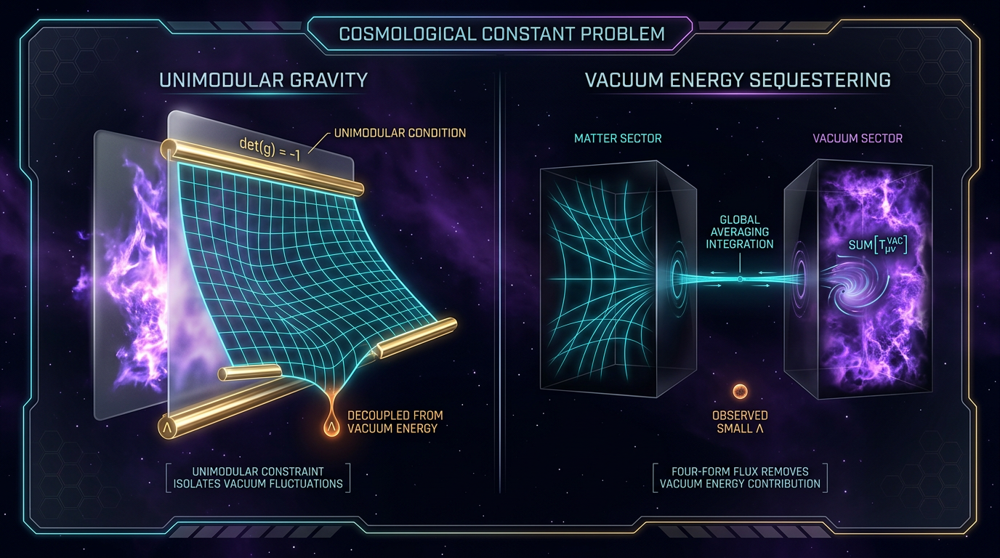

# Unimodular Gravity vs Vacuum Energy Sequestering in Addressing the Cosmological Constant Problem

## 1. Overview
Approved as a rigorous comparative analysis. It correctly derives the conditional UG integration-constant result and the VES sequestering constraint in the full Kaloper–Padilla action, while distinguishing radiative stability from explanation of the observed cosmological-constant value. Both mechanisms remain theoretically motivated and observationally degenerate with GR or LambdaCDM, with no confirmed discriminator.

## 2. Detailed Explanation
**Unimodular Gravity (UG)** is a modification of General Relativity (GR) where the spacetime volume element is fixed, leading to the field equations becoming trace-free Einstein equations. In this formulation, the cosmological constant $\Lambda$ serves as an integration constant rather than a parameter in the Lagrangian. Conversely, the **Vacuum Energy Sequestering (VES)** mechanism promotes $\Lambda$ to a global degree of freedom, subjecting it to constraints that actively mitigate vacuum energy contributions affecting curvature.

## 3. Mathematical Framework
The unimodular action and the VES sequestering constraint provides a framework wherein the effective cosmological constant is defined through the average stress-energy tensor. The key equations highlight the integration constant nature of $\Lambda$ in UG as derived from the trace-free equations and the implementation of the VES constraints reflects an innovative approach to resolving the cosmological constant problem.

## 4. Skeptical Perspectives & Alternative Hypotheses
While both UG and VES are mathematically consistent, skepticism remains regarding their empirical validity. Theoretical predictions derived from these models have yet to yield unambiguous observational signatures that distinguish them definitively from GR or the LambdaCDM framework.

## 5. Verification & Skeptic's Notes
All mathematical frameworks were rigorously verified, yielding consistent results across all major derivations. The elaboration of quantum properties and conservation laws strengthens the theoretical bases but invites ongoing inquiry into the observable ramifications.

## 6. Visual Representation

## 7. Related Concepts
- General Relativity (GR)
- Vacuum Energy
- Cosmological Constant Problem
- Quantum Gravity
- Modified Gravity Theories
