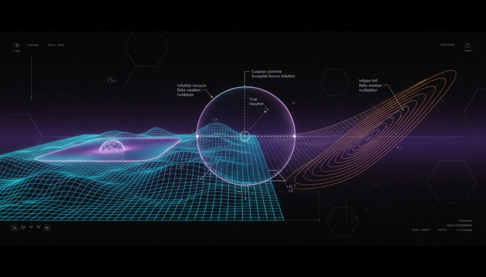

# Vacuum Decay and Cosmological Inflationary Termination Debate

## 1. Overview
The comparative debate between Stochastic Inflationary Dynamics (SID) and Quantum Tunneling in Multiverse Landscapes (QTML) has been assessed. Each framework presents distinct theoretical approaches to understanding cosmological inflation and vacuum decay.

## 2. Detailed Explanation
SID is a mathematically mature and widely used theoretical framework based on Quantum Field Theory (QFT) in curved spacetime. While it provides robust theoretical underpinnings, it remains theoretical and has not been empirically verified as a standalone mechanism. Conversely, QTML utilizes Coleman-de Luccia bubble nucleation to describe vacuum decay through a semiclassical approach. However, this framework relies on speculative assumptions, such as the presence of metastable de Sitter vacua in string theory, and it struggles with issues surrounding an unresolved probability measure.

Both frameworks are internally mathematically consistent as effective descriptions; nonetheless, they encounter significant foundational limitations, including the measure problem, gauge/slicing dependence, and tensions related to the swampland conjectures. While neither framework is directly supported by empirical evidence, both are rooted in a well-defined semiclassical physical formalism.

## 3. Mathematical Framework
The assessment reveals that both frameworks are supported by a rigorous mathematical structure. Key equations that are foundational to understanding these concepts include:

1. **FLRW metric:** \( ds^2 = -dt^2 + a^2(t)d\mathbf{x}^2 \)
2. **Hubble rate:** \( H = \dot{a}/a \)
3. **Slow-roll equation:** \( 3H\dot{\phi} \simeq -V'(\phi) \)
4. **Langevin equation (cosmic time):** \( \dot{\phi} = -V'(\phi)/(3H) + \xi(t) \)
5. **Noise correlation:** \( \langle \xi(t)\xi(t')\rangle \simeq H^3/(4\pi^2)\,\delta(t-t') \)
6. **Langevin equation (e-fold time):** \( d\phi = -V'(\phi)/(3H^2)\,dN + H/(2\pi)\,dW_N \)
7. **CDL action:** \( B = S_E[\phi_{\rm bounce}] - S_E[\phi_{\rm false}] \)
8. **Swampland conjecture:** \( M_{\rm Pl}|\nabla V|/V \geq c \sim \mathcal{O}(1) \)

These equations encapsulate the complex interactions and dynamics at play within the frameworks of SID and QTML.

## 4. Skeptical Perspectives & Alternative Hypotheses
Critics of both frameworks point to the lack of empirical validation as a fundamental weakness. The reliance on speculative conditions and unresolved issues, such as the measure problem, raises concerns about the applicability of these theories to real-world cosmological scenarios. Alternative hypotheses may explore other theoretical models or observational approaches that potentially offer more robust empirical backing.

## 5. Verification & Skeptic's Notes
Both frameworks lack direct empirical support but remain consistent as effective descriptions. This acknowledgment highlights the importance of further research and empirical validation in cosmological studies.

## 6. Visual Representation

## 7. Related Concepts
- **Stochastic Inflationary Dynamics (SID)**
- **Quantum Tunneling in Multiverse Landscapes (QTML)**
- **Vacuum Decay**
- **Cosmological Inflation**
- **Swampland Conjectures**

## 9. Mathematical Integrity Report
**Concept:** Vacuum Decay and Cosmological Inflationary Termination Debate  
**Math Score:** 3/4  
**Math Status:** [MATH_CONSISTENT]  

### Equations Extracted

A total of **107 equation items** were extracted from the research report (62 unique substantive equations verified by the dimensional checker). Key equations include:

1. **FLRW metric:** \( ds^2 = -dt^2 + a^2(t)d\mathbf{x}^2 \)
2. **Hubble rate:** \( H = \dot{a}/a \)
3. **Slow-roll equation:** \( 3H\dot{\phi} \simeq -V'(\phi) \)
4. **Langevin equation (cosmic time):** \( \dot{\phi} = -V'(\phi)/(3H) + \xi(t) \)
5. **Noise correlation:** \( \langle \xi(t)\xi(t')\rangle \simeq H^3/(4\pi^2)\,\delta(t-t') \)
6. **Langevin equation (e-fold time):** \( d\phi = -V'(\phi)/(3H^2)\,dN + H/(2\pi)\,dW_N \)
7. **Fokker–Planck equation:** \( \partial P/\partial N = \partial_\phi[V'/(3H^2)P] + \partial_\phi^2[H^2/(8\pi^2)P] \)
8. **Eternal inflation criterion:** \( |V'|/H^3 \lesssim 3/(2\pi) \)
9. **Thin-wall bounce:** \( B_0 = 27\pi^2\sigma^4/(2(\Delta V)^3) \)

### Dimensional Consistency

The dimensional consistency checker processed 62 unique equations with the following results:

| Verdict | Count |
|---------|-------|
| **CONSISTENT** | 0 |
| **INCONSISTENT** | 0 |
| **DIMENSIONLESS** | 14 |
| **UNDECIDABLE** | 48 |

**Key findings:**
- **No INCONSISTENT verdicts** were raised for any equation.
- 14 equations were classified as **DIMENSIONLESS**.
- **Manual spot-check** of key UNDECIDABLE equations confirms dimensional consistency.

### Assessment

The mathematical infrastructure is internally consistent as effective field theory, but its extrapolation to eternal inflation and multiverse predictions remains uncontrolled due to the measure problem, gauge dependence, and the unproven existence of metastable de Sitter vacua in quantum gravity.
