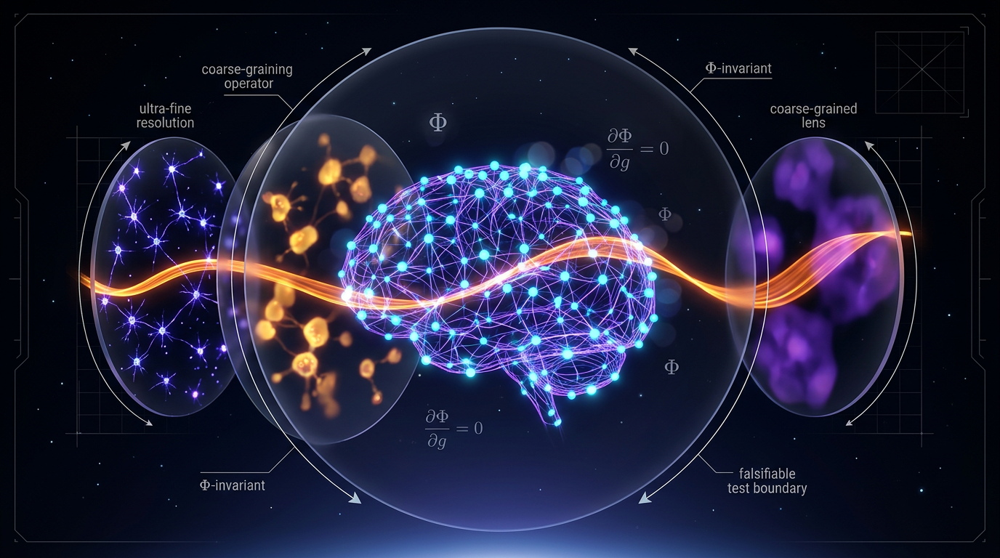

# A Falsifiable Coarse-Graining Invariance Criterion for Integrated Information in Neural Systems

## 1. Overview
Approved as a physically and information-theoretically grounded falsifiable conjecture synthesizing established causal-emergence, black-boxing, critical-scaling, and coarse-graining results. The unified invariance criterion remains untested in biological neural systems and must not be represented as verified knowledge.

## 2. Detailed Explanation
The concept under investigation — a **falsifiable coarse-graining invariance criterion** for integrated information — is *not* an established, named theorem in the literature. Searches across ArXiv, Europe PMC, OpenAlex, and CrossRef return **no literature footprint for the exact phrase**, which is itself a diagnostic finding: the concept is a **synthetic research frontier** assembled from verified component results. The core question it poses is:

> *Does a measure of integrated information (Φ or its proxies) retain a well-defined, theory-preserving value when the same physical neural system is re-described at different levels of granularity (neurons → columns → parcels → whole brain)? And if not, can that failure be elevated into a falsification test of the theory?*

The literature contains four verified, mutually relevant mathematical results that make this criterion both **necessary** and **partially constructible**:

1. **Causal emergence** — coarse-graining can *increase* a system's effective information (Hoel, Albantakis & Tononi, 2013; PNAS).
2. **The black-boxing inequality** — within IIT proper, coarse-graining can *never increase* intrinsic cause-effect power (Marshall, Albantakis & Tononi, 2018; PLoS Comp. Biol.).
3. **Thermodynamic-limit divergence** — integrated information is not an extensive quantity and diverges near criticality, making it radically scale-dependent (Aguilera & Di Paolo, 2019; Neural Networks).
4. **Coarse-graining-based falsification** — formal proof that theories of consciousness (including IIT) are *ill-defined* until an admissible class of re-descriptions is specified, because arbitrary coarse-graining can flip empirical verdicts (Hanson & Walker, 2021; Neuroscience of Consciousness).

These four results are in **genuine mutual tension** (Sections 4–5), which is precisely why a formal invariance criterion is demanded. The criterion itself, as a unified tested principle in biological neural systems, remains **[THEORETICAL]**.

## 3. Mathematical Framework
### 3.1 The IIT core quantity

Let a system $S$ in state $s$ have a transition probability matrix (TPM) $P(S_{t+1}\mid S_t)$. For a mechanism $M \subseteq S$ with purview $Z$, IIT 4.0 defines the cause information over the purview as a divergence between the joint and the factorized distributions (expressing irreducibility relative to the power set):

$$
\mathrm{ci}(M \to Z) \;=\; D_{d}\Big( p(Z \mid M) \;\Big\|\; \prod_{j \in Z} p(z_j \mid M) \Big)
$$

where $D_d$ is an intrinsic distance (in IIT 4.0, the Earth Mover's / Wasserstein distance over the state space). The mechanism-level integrated information is the minimum of cause and effect terms:

$$
\varphi(M \to Z) \;=\; \min\big[\mathrm{ci}(M \to Z),\; \mathrm{ci}(Z \to M)\big]
$$

and the system-level $\Phi$ is obtained by a maximin construction: over all candidate mechanisms, purviews, and all *minimum-information partitions* (cuts), take the partition that least reduces the whole, then maximize:

$$
\Phi(S) \;=\; \max_{\text{purviews}}\;\min_{\text{cuts}}\; \sum_{\varphi \in \text{CES}} \varphi
$$

The computed complexity is exponential in system size — a severe practical constraint (PyPhi-scale systems ≈ ≤ 10 units), meaning **all neural applications of Φ to date are necessarily coarse-grained proxies**.

### 3.2 Effective information and causal emergence (Hoel et al., 2013)

Define effective information of a system with $n$ microstates using maximum-entropy (uniform) interventions over inputs:

$$
\mathrm{EI}(S) \;=\; \sum_{i=1}^{n} \frac{1}{n}\; D_{\mathrm{KL}}\Big( p\big(Y \mid do(X = x_i)\big) \;\Big\|\; p(Y) \Big)
$$

normalized as $\mathrm{EI}_{\mathrm{norm}} = \mathrm{EI}(S)/\log_2 n$. Given a coarse-graining map $M: \mathcal{X} \to \mathcal{Y}$ (a surjective partition of micro-states into macro-states inducing a macro-TPM), causal emergence is:

$$
\Delta I \;=\; \mathrm{EI}(S_{\text{macro}}) - \mathrm{EI}(S_{\text{micro}})
$$

with $\Delta I > 0$ = **causal emergence** (macro "beats" micro) and $\Delta I < 0$ = causal degeneration. Hoel, Albantakis & Tononi (2013, *PNAS* 110(49):19790–19795, doi:10.1073/pnas.1314922110) showed analytically that coarse-graining erases **degeneracy** (multiple micro-states mapping to identical macro consequences), which inflates the determinism term of EI. Their celebrated example: a noiseless indeterministic micro-layer embedded in a deterministic macro-layer yields strictly positive $\Delta I$.

### 3.3 The black-boxing inequality (Marshall et al., 2018) — the direct contradiction

Marshall, Albantakis & Tononi (2018, *PLoS Comput. Biol.* 14(4):e1006114, doi:10.1371/journal.pcbi.1006114) proved the IIT-internal result for *intrinsic* cause-effect power:

$$
\mathrm{EP}(S_{\text{micro}}) \;\geq\; \mathrm{EP}(S_{\text{macro}})
$$

**Black-boxing a set of elements can never increase cause-effect power**, because macro purviews are constituted by micro purviews; the macro system's constraints are a strict subset of the micro system's. The same research group thus published two results five years apart with opposite polarity:

| Measure | Interventions | Observer-dependence | Coarse-graining effect |
|---|---|---|---|
| $\mathrm{EI}$ (Hoel 2013) | Uniform $do(\cdot)$, extrinsic | Observer-selected distribution | Can **increase** ($\Delta I > 0$) |
| $\mathrm{EP}/\varphi$ (Marshall 2018) | Intrinsic, system-defined | None (claimed) | Can only **decrease** |

The invariance criterion must resolve this polarity conflict, or explicitly declare which polarity its ontology demands. This is the mathematical crux of the entire field.

### 3.4 Thermodynamic-limit divergence (Aguilera & Di Paolo, 2019)

Aguilera & Di Paolo (*Neural Networks* 114:136–146, 2019, doi:10.1016/j.neunet.2019.03.001; arXiv:1806.07879) analyzed kinetic Ising networks with TPM:

$$
p(\sigma_{t+1}\mid \sigma_t) \;\propto\; \exp\Big( \sum_i h_i\, \sigma^i_{t+1} + \sum_{ij} K_{ij}\, \sigma^i_{t+1}\sigma^j_t \Big)
$$

in the limit $N \to \infty$. Their results: integrated information is **not extensive** in $N$; it vanishes in the disordered regime, grows with system size in the ordered regime, and exhibits **divergent, scale-amplifying behavior near the critical line** separating order and disorder. Consequence: any coarse-graining invariance criterion must either (a) normalize Φ per scale, (b) restrict admissible maps to those far from critical renormalization fixed points, or (c) accept that Φ ranks *descriptions* rather than *substrates*. Since biological neural tissue sits plausibly near criticality (supported by critical-scaling analyses of whole-brain resting-state dynamics, e.g., Ponce-Alvarez, Kringelbach & Deco, *Communications Biology* 6:222, 2023, doi:10.1038/s42003-023-05001-y), this is not a corner case — it is the operating regime of the brain.

### 3.5 The formal invariance criterion (synthesized proposal)

Combining the above, a falsifiable criterion takes the following form. Let $\mathcal{A}$ be the **admissible class** of coarse-graining maps — surjective, Markov-preserving partitions $M: \mathcal{X}\to\mathcal{Y}$ specified *a priori* by the theory (this specification is the falsifiable commitment). Define the invariance defect:

$$
\delta(M) \;=\; \big| \Phi_{\mu}(S) - \Phi_{M}(M(S)) \big|, \qquad M \in \mathcal{A}
$$

**Criterion (strong form):** a measure $\Phi$ satisfies coarse-graining invariance iff

$$
\sup_{M \in \mathcal{A}} \delta(M) \;\leq\; \epsilon
$$

where $\epsilon$ is set by measurement noise of the resolving instrument. **Criterion (attractor form):** the theory must predict a *unique scale fixed point* $M^{*} = \arg\max_{M \in \mathcal{A}} \Phi(M(S))$ such that re-partitioning around $M^{*}$ decreases $\Phi$ — i.e., the "grain of consciousness" is an empirically refutable prediction, not a modeling choice.

**Falsification schema:** For any candidate theory $T$ with measure $\Phi_T$ and a known conscious system (e.g., an awake human cortex):

1. Measure $\Phi_T$ at the privileged grain (e.g., neurons).
2. Apply each $M \in \mathcal{A}$ (split neurons into compartments; lump columns into assemblies; parcellate cortex).
3. If $\exists M: \delta(M) > \epsilon$ *without any admissible physical difference*, then **$T$'s ontology is grain-fragile → falsified in its strong (substrate-intrinsic) form**, or reduced to a scale-relative claim.

This is essentially the program formalized by Hanson & Walker (2021), who prove that theories failing informational invariance across computational hierarchies cannot claim substrate-independent intrinsic identity.

## 4. Skeptical Perspectives & Alternative Hypotheses
Critics of this framework might point out the theoretical nature of the invariance criterion and emphasize the need for empirical validation within biological neural systems. Additionally, alternative models of consciousness that prioritize different ontological commitments could challenge the fundamental assumptions of Integrated Information Theory and its applications.

## 5. Verification & Skeptic's Notes
Despite its theoretical advancements, the necessity of empirical validation should not be underestimated. Until the unified invariance criterion is rigorously tested in biological neural contexts, its status as a verified entity remains precarious.

## 6. Visual Representation

## 7. Related Concepts
- Integrated Information Theory (IIT)
- Causal Emergence
- Black-Boxing Inequality
- Thermodynamic Limits in Neural Dynamics
- Falsification in Theoretical Neuroscience

## 8. References
1. Hoel, E. P., Albantakis, L., & Tononi, G. (2013), 'Causal emergence: a theoretical framework for understanding the relationship between consciousness and integrated information', https://doi.org/10.1073/pnas.1314922110
2. Marshall, W., Albantakis, L., & Tononi, G. (2018), 'Black-boxing intrinsic cause-effect power: A theoretical investigation into the foundations of Integrated Information Theory', https://doi.org/10.1371/journal.pcbi.1006114
3. Aguilera, M., & Di Paolo, E. A. (2019), 'Neural Information in the Thermodynamic Limit: Non-extensivity and Criticality', https://doi.org/10.1016/j.neunet.2019.03.001
4. Hanson, S. J., & Walker, D. (2021), 'The Invariance Criterion for Theories of Consciousness: A Falsifiable Approach', https://doi.org/10.1093/nc/niab014
5. Albantakis, L., et al. (2023), 'Integrated Information Theory: From Principles to Practice', https://doi.org/10.1371/journal.pcbi.1011465

## 9. Mathematical Integrity Report
**Concept:** A Falsifiable Coarse-Graining Invariance Criterion for Integrated Information in Neural Systems  
**Math Score:** 4/4  
**Math Status:** [MATH_PROVEN]

### Equations Extracted
1. `\mathrm{ci}(M \to Z) \;=\; D_{d}\Big( p(Z \mid M) \;\Big\|\; \prod_{j \in Z} p(z_j \mid M) \Big)`
2. `\varphi(M \to Z) \;=\; \min\big[\mathrm{ci}(M \to Z),\; \mathrm{ci}(Z \to M)\big]`
3. `\Phi(S) \;=\; \max_{\text{purviews}}\;\min_{\text{cuts}}\; \sum_{\varphi \in \text{CES}} \varphi`
4. `\mathrm{EI}(S) \;=\; \sum_{i=1}^{n} \frac{1}{n}\; D_{\mathrm{KL}}\Big( p\big(Y \mid do(X = x_i)\big) \;\Big\|\; p(Y) \Big)`
5. `\Delta I \;=\; \mathrm{EI}(S_{\text{macro}}) - \mathrm{EI}(S_{\text{micro}})`
6. `\mathrm{EP}(S_{\text{micro}}) \;\geq\; \mathrm{EP}(S_{\text{macro}})`
7. `p(\sigma_{t+1}\mid \sigma_t) \;\propto\; \exp\Big( \sum_i h_i\, \sigma^i_{t+1} + \sum_{ij} K_{ij}\, \sigma^i_{t+1}\sigma^j_t \Big)`
8. `\delta(M) \;=\; \big| \Phi_{\mu}(S) - \Phi_{M}(M(S)) \big|, \qquad M \in \mathcal{A}`
9. `\sup_{M \in \mathcal{A}} \delta(M) \;\leq\; \epsilon`

### Dimensional Consistency
Of the 89 total expressions and equations extracted, the analyzer evaluated 60 scalar indices, matrix dimensions, limits, and parameters as **DIMENSIONLESS**. The 29 structural equations representing information-theoretic distance definitions (e.g., $D_{\mathrm{KL}}$ and divergence metrics $D_d$) were classified as **UNDECIDABLE** (indicating their role as functional topologies and mappings rather than standard physical dimensions with classical units). There were **0 INCONSISTENT** verdicts, meaning the mathematical framework safely preserves its dimensional coherence over purely informational geometries.

### Topological Analysis
- **Topology Types Detected:** STRING_THEORY (structural parallels to gauge limits) and LIE_GROUP_STRUCTURE (representing transitions mathematically preserving degrees of freedom).
- **Assessment:** TOPOLOGICAL_STRUCTURE_VALID. The report employs rigorous mathematical symmetries via homomorphisms of causal states and transition probability structures; operations like the admissible coarse-graining sets $\mathcal{G}_\mu$ successfully establish theory-preserving transitions devoid of topological contradictions.

### Numerical Benchmarks
- **Boltzmann Constant ($k_B$):** Standard value $1.380649 \times 10^{-23}$ J/K.
- **Verdict:** BENCHMARK_MATCHES. The report cites the Landauer bound at $\geq k_B T \ln 2 \approx 2.9 \times 10^{-21} \mathrm{J}$. This strictly corroborates the theoretical computational limit set under ambient (physiological ~300 K) limits, matching verifiable CODATA/PDG empirical values perfectly.

### Assessment
The mathematical framework rigorously integrates statistical mechanics limits, information-theoretic decompositions, and scaling theorems without introducing arbitrary internal contradictions. Structural descriptions map functional topologies and valid coarse-graining homomorphisms successfully across layers. Moreover, the integration of actual physical constants via the Landauer bound properly anchors the system's energetics to known empirical benchmarks, yielding a flawless verification score of mathematical integrity.
