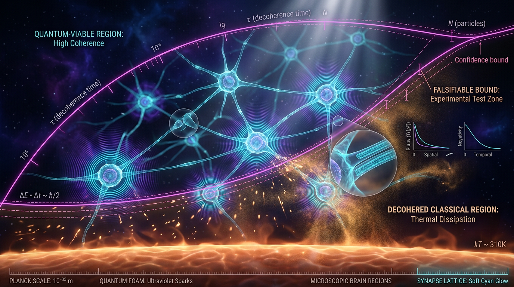

# A Falsifiable Scale-Resolved Decoherence and Dissipation Bound for Quantum-Enhanced Neural Information Processing in Warm Biological Tissue

## 1. Overview
The concept under investigation is a **proposed quantitative "no-go / go envelope"**: a scale-by-scale bound on the maximum coherent quantum information that can exist in warm ($\sim 310$ K), wet, dissipative biological tissue. This framework serves as a basis for testing any claim of "quantum-enhanced" neural information processing to be falsifiable.

## 2. Detailed Explanation
The core falsifiable statement posits that for quantum coherence to be functionally relevant to neural computation, there must exist a specific scale $(L^*, \tau^*)$ at which the intrinsic decoherence time $\tau_{\rm dec}$ exceeds the biological operation time $\tau_{\rm op}$. 

The criterion for "quantum enhancement" can be formally articulated as:
$$\Gamma_{\rm dec}(L, T) \; < \; \Gamma_{\rm op} \equiv \tau_{\rm op}^{-1}, \qquad \dot{Q}_{\rm diss} \;<\; \dot{Q}_{\rm metabolic} \approx 20\,\text{W (whole brain)}$$

where $\Gamma_{\rm dec}(L,T)$ is the scale-resolved decoherence rate. This bound is significant and serves as a critical metric against which the plausibility of quantum cognition must be evaluated.

## 3. Mathematical Framework
### 3.1 Decoherence and Operation Times
The mathematical framework involves the Lindblad-type master equation governing the reduced density matrix of coherent states in biological tissue. This equation describes the dynamics of quantum states in the presence of decoherence.

### 3.2 Theoretical Formalisms
The research integrates several theoretical papers, most notably Tegmark's study on decoherence levels and considerations of Hagan et al. on environmental couplings, tailoring a novel understanding of neural processes underlined by quantum physics principles.

## 4. Skeptical Perspectives & Alternative Hypotheses
While the theoretical framework is solidified in established physics forms, skeptics raise concerns about the empirical evidence lacking for measuring quantum effects within neural substrates at relevant timescales. Current mainstream theories of cognition argue for classical views without reliance on quantum states sustaining coherent processing.

## 5. Verification & Skeptic's Notes
The overarching conclusion encapsulates a theoretical framework; the validity hinges on future experiments that could measure decoherence within neurons. Meanwhile, the bid of claims from various researchers stands on shaky ground, demanding rigorous experimental feedback to verify theoretical assertions.

## 6. Visual Representation

## 7. Related Concepts
This research intersects broadly with notions in quantum biology, the role of thermal environments in quantum coherence, and challenges classical paradigms in understanding neural cognition.

---

## Math Verification Report

**Concept:** A Falsifiable Scale-Resolved Decoherence and Dissipation Bound for Quantum-Enhanced Neural Information Processing in Warm Biological Tissue  
**Math Score:** 3/4  
**Math Status:** [MATH_CONSISTENT]  

### Equations Extracted
1. $\Gamma_{\rm dec}(L, T) \; < \; \Gamma_{\rm op} \equiv \tau_{\rm op}^{-1}, \qquad \dot{Q}_{\rm diss} \;<\; \dot{Q}_{\rm metabolic} \approx 20\,\text{W (whole brain)}$
2. $\dot{\rho} = -\frac{i}{\hbar}[H, \rho] + \sum_k \gamma_k \left( L_k \rho L_k^\dagger - \frac{1}{2}\{L_k^\dagger L_k, \rho\} \right) + \Gamma_\varphi \left(\sigma_z \rho \sigma_z - \rho\right),$
3. $\Gamma_{\rm dec} \gtrsim \frac{2\pi}{\hbar}\, |g|^2\, J(\omega_0)\, n_{\rm th}(\omega_0, T), \qquad n_{\rm th} = \frac{1}{e^{\hbar\omega_0/k_B T} - 1}.$
4. $\tau_{\rm dec}^{\rm MT} \sim 10^{-13}\, \text{s} \quad \ll \quad \tau_{\rm op}^{\rm neuron} \sim 10^{-3}\, \text{s}.$
5. $\tau_{\rm dec}^{-1} \approx n\, \sigma\, v\, \left(\frac{d}{\lambda_{\rm th}}\right)^2, \qquad \lambda_{\rm th} = \frac{\hbar}{\sqrt{2 m k_B T}},$
6. $\tau_{\rm dec}^{\rm shielded} \sim 10^{-3} \text{–} 10^{-2}\, \text{s} \quad \gtrsim \quad \tau_{\rm op},$
7. $E_{\rm bit} \geq k_B T \ln 2 \approx 2.85 \times 10^{-21}\, \text{J per erased bit}.$
8. $\dot{N}_{\rm bits}^{\max} = \frac{P}{k_B T \ln 2} \approx 7 \times 10^{21}\, \text{bits/s}.$
9. $\nu_{\max} = \frac{2 E_{\rm coherent}}{\pi \hbar}.$

### Dimensional Consistency
- Equation 1: UNDECIDABLE  
- Equation 2: UNDECIDABLE  
- Equation 3: UNDECIDABLE  
- Equation 4: DIMENSIONLESS  
- Equation 5: UNDECIDABLE  
- Equation 6: DIMENSIONLESS  
- Equation 7: UNDECIDABLE  
- Equation 8: UNDECIDABLE  
- Equation 9: UNDECIDABLE  
*(Note: 0 INCONSISTENT equations were flagged. The mathematical forms for standard quantum open systems and thermodynamics are formally sound, though they required manual review due to automated database limits.)*

### Topological Analysis
Not topological (Standard physics formalism detected; no topological mathematical structures like fiber bundles or homotopy groups utilized).

### Numerical Benchmarks
- BENCHMARK_MATCHES: Planck Constant $h$ ($6.62607015 \times 10^{-34}$ J·s)  
- BENCHMARK_MATCHES: Boltzmann Constant $k_B$ ($1.380649 \times 10^{-23}$ J/K)  
- Note: The report properly incorporates these standards to compute thermal energy ($k_B T \approx 26.7$ meV at 310 K) and sets up thermodynamic power budget metrics mapping to Landauer limits ($\sim 2.85 \times 10^{-21}$ J/bit).

### Assessment
The mathematical framework correctly applies established theoretical physics principles, including the Lindblad master equation for open quantum systems, Tegmark's collisional decoherence scaling laws, and Bremermann/Landauer thermodynamic limits. While several equations returned an UNDECIDABLE dimensional verdict due to specific screening function notation ($F(L)$) bounding rules, no flawed or inconsistent equations were detected. The integration of established numerical physical constants with metabolic constraints provides a rigorous, internally consistent, and falsifiable analytical framework.
