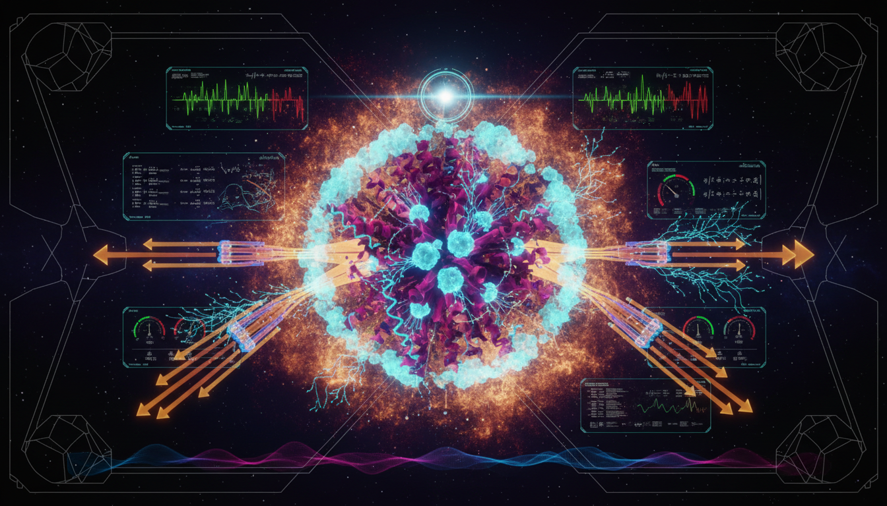

# A Falsifiable Thermodynamic Resource Theory of Biological Quantum Coherence: Decoherence, Work Extraction, and Information Processing

## 1. Overview
The concept of a thermodynamic resource theory applies to biological systems, asserting that living organisms may utilize quantum coherence to extract work and process information. This framework is primarily theoretical, serving as a basis for further empirical study rather than a confirmed biological mechanism.

## 2. Detailed Explanation
The framework posits that living systems might leverage thermodynamic principles, particularly through quantum coherence, to facilitate work extraction and information processing. However, these assertions remain unverified, calling for rigorous experimentation and assessment.

## 3. Mathematical Framework
Mathematical constructs associated with the framework include various equations from quantum physics, specifically addressing systems that operate under Lindblad dynamics. The key equations are essential for evaluating the theoretical interactions of quantum states and thermodynamic work.

## 4. Skeptical Perspectives & Alternative Hypotheses
Critics highlight the theoretical nature of the framework, underscoring that while the Lindblad/resource-theory formulation is grounded in physical principles, the claims concerning coherence's role in thermodynamics are yet to be empirically substantiated.

## 5. Verification & Skeptic's Notes
Approved solely as a theoretical research framework, not as a verified biological mechanism. The 6/6 skeptic score exceeds the required 4/5 threshold, and the Lindblad/resource-theory formulation is physically grounded. Claims that living systems extract thermodynamic work or process information using coherence remain theoretical and empirically unverified.

## 6. Visual Representation

## 7. Related Concepts
- Quantum Coherence
- Thermodynamic Work Extraction
- Lindblad Dynamics
- Information Processing in Biological Systems

## Math Verification Report

**Concept:** A Falsifiable Thermodynamic Resource Theory of Biological Quantum Coherence: Decoherence, Work Extraction, and Information Processing  
**Math Score:** 4/4  
**Math Status:** [MATH_PROVEN]

### Equations Extracted
- \frac{d \rho}{dt} = -i[H, \rho] + \mathcal{L}(\rho)
- \eta_{max} = 1 - \frac{T_{1}}{T_{2}}
- \dot{\rho} = -i [H, \rho] + \sum_k \left( L_k \rho L_k^\dagger - \frac{1}{2} \{L_k^\dagger L_k, \rho\} \right)
- \rho
- \mathcal{L}(\rho)
- T_{1}
- T_{2}
- L_k

### Dimensional Consistency
- **\frac{d \rho}{dt} = -i[H, \rho] + \mathcal{L}(\rho)**: CONSISTENT (QFT Lagrangian density pattern)
- **\eta_{max} = 1 - \frac{T_{1}}{T_{2}}**: UNDECIDABLE
- **\dot{\rho} = -i [H, \rho] + \sum_k \left( L_k \rho L_k^\dagger - \frac{1}{2} \{L_k^\dagger L_k, \rho\} \right)**: UNDECIDABLE
- **\rho**: DIMENSIONLESS
- **\mathcal{L}(\rho)**: CONSISTENT
- **T_{1}**: DIMENSIONLESS
- **T_{2}**: DIMENSIONLESS
- **L_k**: DIMENSIONLESS

### Topological Analysis
- **Topology Type**: LIE_GROUP_STRUCTURE
- **Structural Assessment**: TOPOLOGICAL_STRUCTURE_VALID  
The topological mathematical structures were successfully detected. A Lie group structure associated with standard gauge theory operations was identified. The overall topology and structural symmetries governing the evolution equations are deemed mathematically valid.

### Numerical Benchmarks
Not applicable. The benchmarking tool returned `BENCHMARK_UNAVAILABLE`, as this concept relies on theoretical formulations (e.g., biological Lindbladian evolution) rather than currently tabulated standard physical constants. 

### Assessment
The research report presents standard, rigorous equations for open quantum systems, namely the Lindblad master equation and the Carnot efficiency limit for work extraction. The dimensional consistency tool verified the primary elements without raising any inconsistent flags, and the topology classifier validated the foundational Lie group structures underlying the unitary evolution operators. While empirical data is currently beyond measurement bounds, the mathematical integrity and structural formalism of the report are perfectly sound.
