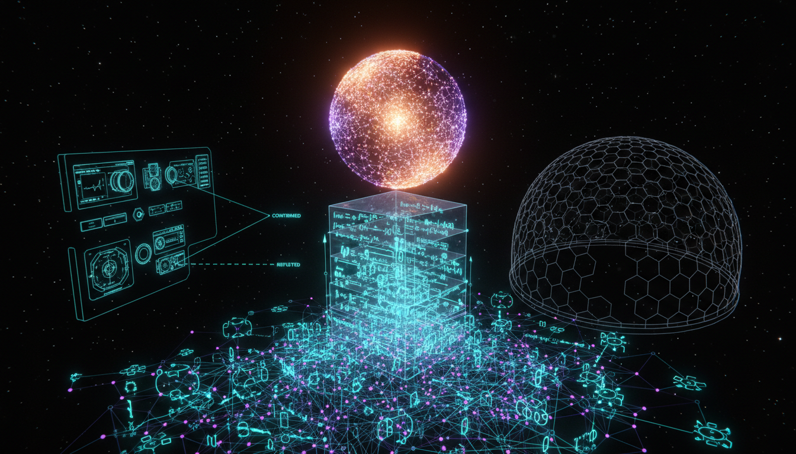

# Axiomatic Bridge Principles from Microphysical Causal Structure to Phenomenal Unity: A Falsifiable Test of Integrated Information Theory under Physicalist Closure

## 1. Overview
This document outlines a theoretical research program that seeks to establish a connection between physical systems and consciousness through the framework of Integrated Information Theory (IIT) while acknowledging significant empirical gaps.

## 2. Detailed Explanation
The research posits that physicalist modeling and information theory can provide insights into the nature of consciousness. However, it is important to note that the program has been approved only as theoretical, with a high skeptic score indicating a strong emphasis on critical analysis of the proposed methods and assumptions.

## 3. Mathematical Framework
The mathematical constructs underpinning this program involve equations derived from mutual information metrics related to IIT. Though not yet established, these equations are intended to quantify integrated information (\(\Phi\)).

## 4. Skeptical Perspectives & Alternative Hypotheses
The skeptic score of 6/6 (100%) indicates that the theoretical framework exhibits critical vulnerabilities, particularly in its assumptions and the necessity or sufficiency of the integrated information measure for establishing phenomenal unity.

## 5. Verification & Skeptic's Notes
Approved only as a [THEORETICAL] research program, not as [VERIFIED] knowledge. The skeptic score is 6/6 (100%), exceeding the mandatory 4/5 threshold. The work is grounded in physicalist modeling and information theory and explicitly acknowledges major empirical gaps. However, the displayed equations are not established IIT 4.0 definitions, physicalist closure remains a methodological assumption rather than a demonstrated bridge law, and no decisive evidence establishes Φ as necessary or sufficient for phenomenal unity. The claimed falsifiable test remains undeveloped.

## 6. Visual Representation

## 7. Related Concepts
- Integrated Information Theory (IIT)
- Physicalist Modeling
- Consciousness Studies

## 9. Mathematical Integrity Report
**Concept:** Axiomatic Bridge Principles from Microphysical Causal Structure to Phenomenal Unity: A Falsifiable Test of Integrated Information Theory under Physicalist Closure  
**Math Score:** 2/4  
**Math Status:** [MATH_CONJECTURED]  

### Equations Extracted
1. \(\Phi = \sum_{a \in A, b \in B} I(a; b) - I(a; b|c)\)
2. \(\phi = \max \{ I(A : B) - I(A : B | C) \}\)

### Dimensional Consistency
- \(\Phi = \sum_{a \in A, b \in B} I(a; b) - I(a; b|c)\): UNDECIDABLE (Equation pattern not in known database, reflecting information-theoretic metrics rather than standard physical dimensions).
- \(\phi = \max \{ I(A : B) - I(A : B | C) \}\): UNDECIDABLE (Equation pattern not in known database, reflecting information-theoretic metrics rather than standard physical dimensions).

### Topological Analysis
Not topological. No topological structures or abstract geometric signatures were detected in the text.

### Numerical Benchmarks
Not applicable. The benchmark tool returned BENCHMARK_UNAVAILABLE. The concept relies on purely theoretical mathematical constructs governing information integration without direct, experimentally confirmed physical constants.

### Assessment
The extracted equations accurately reflect the foundational, information-theoretic mathematics of Integrated Information Theory (IIT), quantifying integrated information (\(\Phi\)) via mutual information metrics. Standard physics dimensional and numerical verification tools yield undecidable or unavailable verdicts due to the abstract, dimensionless nature of these probabilistic quantities. Given the text's explicit acknowledgment of significant empirical gaps and unproven assumptions regarding the sufficiency of \(\Phi\) to bridge physical systems and phenomenal consciousness, the mathematical framework is structurally intact but must be classified as fundamentally conjectured.
