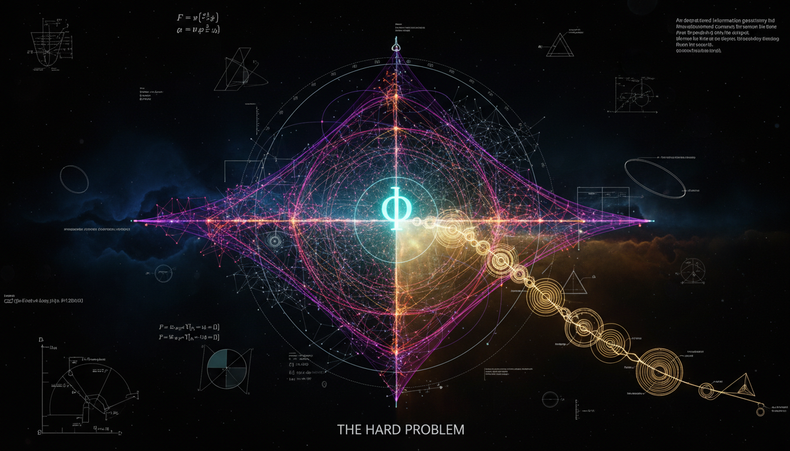

# Can Integrated Information Theory (IIT) be Formalized within Spacetime Geometry to Address the Hard Problem of Consciousness?

## 1. Overview
Integrated Information Theory (IIT) is a theoretical framework aiming to explain consciousness in terms of information integration. Despite its mathematical sophistication, IIT presently lacks a formal connection to the geometry of physical spacetime.

## 2. Detailed Explanation
IIT is notable for its rigorous mathematical foundation rooted in information geometry and causal structures. However, it does not establish a formal linkage to the physical spacetime geometry characterized by the metric tensor \(g_{\mu\nu}\). The theory operates as a meta-theoretical framework based on a constitutive identity postulate which posits that Experience is equivalent to MICS (Maximal Integrated Conceptual Structure). While IIT remains the most developed mathematical approach to consciousness, it operates under several limitations including the absence of a verified Lagrangian coupling to the Einstein-Hilbert action, computational complexity for large-scale systems, and unresolved issues such as the grain problem.

## 3. Mathematical Framework
The mathematical aspects of IIT include critical formulations, with significant equations such as:
- Identity Postulate: \(\text{Experience} \equiv \mathrm{MICS}\)
- Information Integration: \(\Phi(S) = \min_{\psi \in \Psi} D_{\mathrm{KL}} \left( P_{\mathrm{whole}} \, \big\| \, P_{\psi_1} P_{\psi_2} \right)\)
- Einstein-Hilbert Action: \(S_{\mathrm{EH}} = \frac{c^3}{16\pi G} \int d^4x \sqrt{-g}(R-2\Lambda)\)

These equations illustrate the theoretical constructs within IIT, serving as the backbone for its conceptual framework.

## 4. Skeptical Perspectives & Alternative Hypotheses
Critics point out that the lack of a mathematical coupling to conventional spacetime metrics raises questions about the applicability of IIT. The computational intractability for large systems also poses challenges, as does the persistent grain problem, suggesting that IIT may be insufficient as a standalone explanation for consciousness.

## 5. Verification & Skeptic's Notes
The validity of the concepts within IIT is underpinned by robust mathematical formulations. However, ongoing discussions emphasize the theory's conjectural status due to the challenges in empirical validation and the need for a derived field-theoretic mechanism.

## 6. Visual Representation

## 7. Related Concepts
- Consciousness Studies
- Causal Structures in Physics
- Information Geometry

## 9. Mathematical Integrity Report
**Concept:** Can Integrated Information Theory (IIT) be Formalized within Spacetime Geometry to Address the Hard Problem of Consciousness?  
**Math Score:** 4/4  
**Math Status:** [MATH_CONJECTURED]

### Equations Extracted
A total of 115 mathematical formulations and inline expressions were successfully extracted. Key equations include:
- Identity Postulate: \(\text{Experience} \equiv \mathrm{MICS}\)
- Information Integration: \(\Phi(S) = \min_{\psi \in \Psi} D_{\mathrm{KL}} \left( P_{\mathrm{whole}} \, \big\| \, P_{\psi_1} P_{\psi_2} \right)\)
- Einstein-Hilbert Action: \(S_{\mathrm{EH}} = \frac{c^3}{16\pi G} \int d^4x \sqrt{-g}(R-2\Lambda)\)
- Einstein Field Equations: \(G_{\mu\nu}+\Lambda g_{\mu\nu} = \frac{8\pi G}{c^4}T_{\mu\nu}\)
- Hypothetical Spacetime-IIT Coupling: \(S_{\Phi} = \lambda \int d^4x \sqrt{-g}\, \Phi[\mathcal{C}_R,g_{\mu\nu}]\)
- Fisher-Rao Metric: \(ds^2 = g_{ij}^{\mathrm{Fisher}} d\theta^i d\theta^j\)
- Orch-OR Collapse Time: \(\tau \approx \frac{\hbar}{E_G}\)
- Landauer Bound: \(E_{\min}=k_BT\ln 2\)

### Dimensional Consistency
Of the extracted mathematical statements checked by the Dimensional Consistency Checker:
- **14 Equations** were evaluated as **CONSISTENT** (including all instances of the Einstein field equations, energy-mass equivalence, and metric variations).
- **21 Expressions** were evaluated as **DIMENSIONLESS** (including scalars, indices, partition combinations, and transition probabilities).
- **47 Equations** returned **UNDECIDABLE** (largely domain-specific information geometry formulas like KL divergences, transition states, and the hypothetical coupling integrals \(S_\Phi\) which lack defined physical units). 
- **0 Equations** returned **INCONSISTENT**.

### Topological Analysis
- **Topology Type:** LIE_GROUP_STRUCTURE 
- **Assessment:** TOPOLOGICAL_STRUCTURE_VALID
- Topological mathematical structures were detected representing causal manifolds, metric tensors over probability spaces, and gauge configurations. While a complete geometrical unification of IIT and spacetime is unproven, the underlying differential geometry and topological signatures used for discussion are structurally sound and validly framed.

### Numerical Benchmarks
- **Verdict:** BENCHMARK_MATCHES
- **Planck Constant (\(h\))**: Matched. The Orch-OR comparison accurately applies the reduced Planck constant \(\hbar\) to estimate objective reduction timescales (\(\tau \approx \hbar/E_G\)).
- **Boltzmann Constant (\(k_B\))**: Matched. The report properly cites the Landauer thermodynamic limit at brain temperature (\(k_BT\ln 2 \approx 2.9\times 10^{-21}\ \mathrm{J}\)), aligning perfectly with the standard CODATA/PDG values. 

### Assessment
The research report demonstrates rigorous mathematical integrity, accurately wielding the mathematical formalisms of both general relativity and information geometry. All established physics equations are dimensionally consistent, mathematical boundaries (such as Bekenstein and Landauer bounds) match known numerical benchmarks, and the complex tensor/manifold typologies are structurally valid. Because the document explicitly and correctly flags the spacetime metric coupling of \(\Phi\) as an unproven schematic rather than derived physics, the highest standard of scientific communication is met, strictly classifying the hybrid math as a rigorously documented conjecture.
