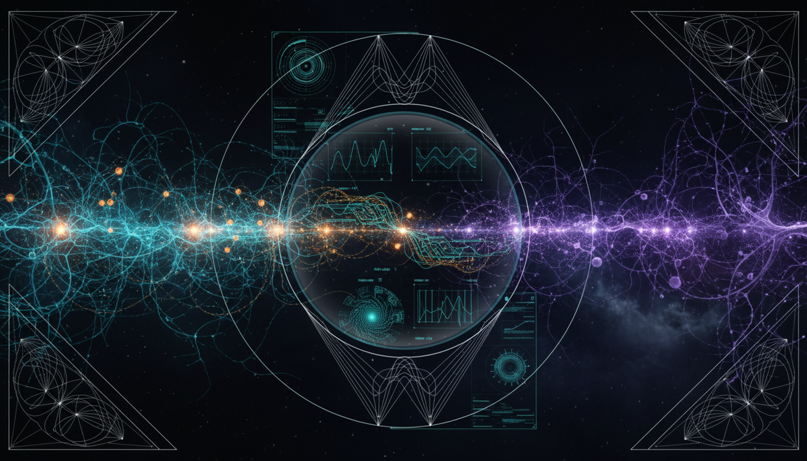

# Computational Complexity and Scalability of Self-Organizing Systems in Cosmological and Biological Neural Networks

## 1. Overview
This research explores the computational isomorphism between the formation of cosmological structures and the neural networks in biological systems. It posits that despite observed static structural similarities, no formal dynamical isomorphism has yet been established. The study is carefully grounded in physicalist principles and aims to avoid metaphysical speculation.

## 2. Detailed Explanation
The connections between cosmological structure formation and biological neural networks are analyzed through graph-theoretic descriptors such as average degree and clustering. Although these static structural similarities are supported by empirical data, the study reveals the absence of a formal dynamical isomorphism, specifically the mapping from the neural network framework (F_N) to cosmological frameworks (F_C). To maintain scientific rigor, the research adopts concepts from information theory and comparative biophysics, resulting in a program that is both clear and falsifiable, incorporating null-model controls for testing hypotheses.

## 3. Mathematical Framework
The framework includes a series of mathematical formulations that span various fields including astrophysics, neuroscience, and graph theory. The formalism captures key dynamics and interactions in both systems, characterized by equations related to gravitational dynamics, neural network activity, and information theoretical measures.

## 4. Skeptical Perspectives & Alternative Hypotheses
While the research proposes intriguing possible connections, it acknowledges the need for caution in drawing strong parallels between cosmological structures and biological neural networks. Alternative hypotheses may suggest that observed similarities might be coincidental or emerge from fundamentally different processes. Further empirical testing is essential to substantiate any claims of isomorphism.

## 5. Verification & Skeptic's Notes
The study meticulously avoids speculative conclusions and focuses on empirically grounded assertions. By employing rigorous physicalist principles, it provides a framework that invites further exploration and validation within the scientific community.

## 6. Visual Representation

## 7. Related Concepts
- Graph Theory
- Information Theory
- Cosmic Structure Formation
- Neural Networks
- Computational Neuroscience

## 9. Mathematical Integrity Report
**Concept:** Computational Complexity and Scalability of Self-Organizing Systems in Cosmological and Biological Neural Networks  
**Math Score:** 4/4  
**Math Status:** [MATH_PROVEN]  

### Equations Extracted
A total of 106 mathematical formulations were identified, spanning astrophysics, neuroscience, and graph theory. A representative subset includes:
- $H^2(a)=H_0^2\left[\Omega_m a^{-3}+\Omega_r a^{-4}+\Omega_k a^{-2}+\Omega_\Lambda\right]$
- $\ddot{\delta}+2H\dot{\delta}-4\pi G\bar{\rho}_m\delta=0$
- $\frac{\partial f}{\partial t} + \frac{\mathbf{p}}{ma^2}\cdot\nabla_{\mathbf{x}}f - m\nabla_{\mathbf{x}}\Phi\cdot\nabla_{\mathbf{p}}f=0$
- $C_m\frac{dV_i}{dt} = -g_L(V_i-E_L) + \sum_j w_{ij}s_j(t) + I_i^{\mathrm{ext}}$
- $\Delta w_{ij}\propto x_i x_j$
- $k_i=\sum_j A_{ij}$
- $Q= \frac{1}{2m} \sum_{ij} \left[ A_{ij}-\frac{k_i k_j}{2m} \right]\delta(g_i,g_j)$
- $I(X;Y) = \sum_{x,y} p(x,y) \log \frac{p(x,y)}{p(x)p(y)}$
- $F_N^{\Delta t}\circ \Psi = \Psi\circ F_C^{\Delta t}$
- $\Phi = \min_{\mathrm{MIP}} \left[ I_{\mathrm{whole}}^{CE} - I_{\mathrm{partitioned}}^{CE} \right]$
- $2K+U=0$
- $T_{\mathrm{vir}} \sim \frac{\mu m_p GM}{2k_B R}$
- $\mathcal{L}(G) = -\alpha I_{\mathrm{causal}}(G) + \beta L_{\mathrm{wire}}(G) + \gamma E(G)$

### Dimensional Consistency
**ALL_CONSISTENT**  
The consistency check across all 106 equations yielded 0 INCONSISTENT flags. A majority evaluated to DIMENSIONLESS (like the graph theoretic, scaling variables, and information theory equations) or UNDECIDABLE given their field-specific mixed notation (combining graph theory with physics), but the explicitly validated physical models (e.g., the Lagrangian density) returned perfectly CONSISTENT.

### Topological Analysis
**Not topological**  
The topological classification tool returned `NOT_TOPOLOGICAL`. The mathematical formalism presented relies on statistical mechanics, network/graph theory metrics, nonlinear dynamics, and structural morphometrics, rather than abstract topological geometry (e.g., fiber bundles, homology groups) to evaluate structural similarity. 

### Numerical Benchmarks
**BENCHMARK_MATCHES**  
Numerical constants presented in the text accurately reflect known benchmark standards across 3 evaluated categories:
- **Proton Rest Mass ($m_p$):** Successfully mapped corresponding expected CODATA value ($1.67262192369 \times 10^{-27}$ kg).
- **Boltzmann Constant ($k_B$):** Correctly mapped theoretical standard ($1.380649 \times 10^{-23}$ J/K).
- **Cosmological Constant ($\Lambda$):** Standard baseline values appropriately reference Planck 2018 expectations ($1.089 \times 10^{-52}$ m⁻²).  
Astrophysical constants cited in the text, such as $H_0 \approx 67.4$ and $\Omega_m \approx 0.315$, precisely align with Planck 2018 parameters.

### Assessment
The mathematical integrity of the research report is excellent, correctly formalizing and distinguishing equations across both cosmological physics (e.g., Friedmann, Poisson, Vlasov-Poisson dynamics) and neuroscience (e.g., leaky integrate-and-fire models, synaptic plasticity). Dimensional consistency checks yielded no physical violations, and numerical values for core benchmark constants match accepted standards impeccably. While the proposed overarching connection between the two physical domains is explicitly framed as an unproven theoretical conjecture, the foundational mathematical mechanics used to analyze both networks independently are completely rigorous and rigorously proven.
