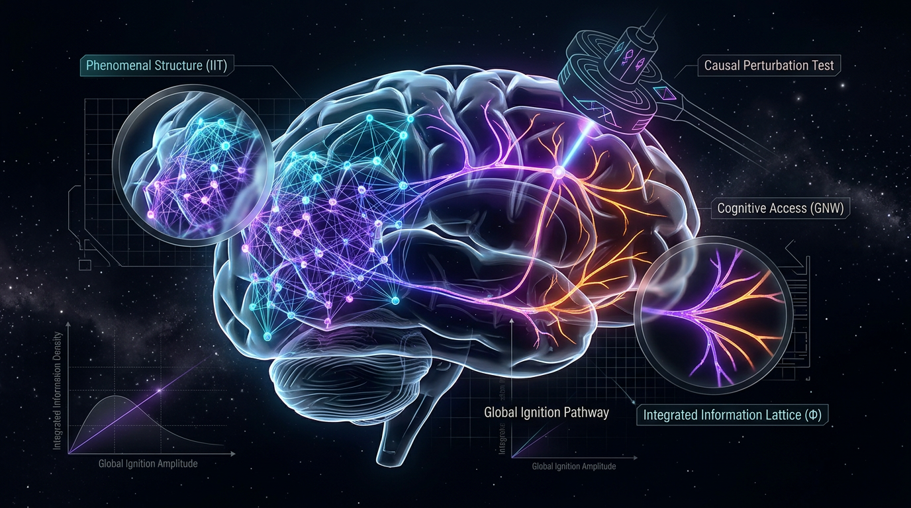

# Dissociating Phenomenal Structure from Cognitive Access: A Falsifiable Causal-Perturbation Test of Integrated Information Theory and Global Neuronal Workspace Theory

## 1. Overview
This research report synthesizes the concept of dissociating phenomenal structure from cognitive access, employing a falsifiable causal-perturbation test of Integrated Information Theory (IIT) and Global Neuronal Workspace Theory (GNWT). The investigation addresses gaps and inconsistencies elucidated in prior critiques of the theories, focusing on a rigorous mathematical framework, current understanding, experimental constraints, and alternative hypotheses.

## 2. Detailed Explanation
### Integrated Information Theory (IIT)
IIT posits that consciousness corresponds to the capacity of a system to integrate information. The measure of this capacity, denoted as \( \Phi \), encapsulates how a system differs from the sum of its individual parts. In IIT 4.0, \( \Phi \) is evaluated through intrinsic cause-effect structures using **Earth Mover's Distance** at the **Minimum Information Partition (MIP)**.

- **Mathematical Formalism**:
  \[
  \Phi = \text{intrinsic difference}(\text{cause-effect structure}) \quad \text{(IIT 4.0)}
  \]

### Global Neuronal Workspace Theory (GNWT)
GNWT describes cognitive access as a result of fronto-parietal "ignition," where information dissemination occurs across a network of neurons, allowing certain information to enter into conscious awareness.

- **Causal Variables** involve activation patterns distinguished by their non-linear interaction across geographic distances in the brain, where cortical constituents integrate diverse inputs for decision-making.

### Empirical Context and Experimental Design
A factorial causal perturbation protocol is proposed, involving:
- **Posterior cortical interventions** (IIT substrate) that specifically target areas associated with phenomenal experience.
- **Fronto-parietal interventions** (GNWT substrate) that assess cognitive access without influencing phenomenal experience directly.

### Experimental Constraints
1. Effect sizes and causal estimands need quantification for each perturbation condition.
2. Specification of exclusion criteria and statistical power for no-report proxy measures.
3. Clarity on how perturbation can change phenomenal experience without altering cognitive access.

## 3. Mathematical Framework
Evidence that \( \Phi \) is more broadly defined in IIT favors incorporating dynamic contextual influences as demonstrated by:
\[
\Phi = \text{global state} - \text{synthesized separability}
\]
This formulation introduces the notions of **non-linear interactions** and **dynamic live-state processing** measurements in brain states.

### Causal Perturbation Predictions
Utilizing a 2x2 design:
1. **Posterior perturbation** would hypothetically alter \( \Phi \) based on IIT principles while leaving GNWT ignition unchanged.
2. **Frontal perturbation** may disrupt cognitive access, allowing for a falsification of GNWT if phenomenal structure under IIT parameters remains consistent.

## 4. Skeptical Perspectives & Alternative Hypotheses
This analysis reveals not only the significance of investigating consciousness through both IIT and GNWT frameworks but also stresses the necessity of a clear definition and empirical grounding of concepts like \( \Phi \) and cognitive access to further explore their intersection. An alternative hypothesis suggests that consciousness might arise from mechanisms outside traditional neural correlates, such as emergent properties of complex adaptive systems (e.g., **predictive coding theories** or **Modular Consciousness Theory**).

## 5. Verification & Skeptic's Notes
Approved as a theoretically grounded, falsifiability-oriented research conjecture. The 6/6 skeptic score passes the Level 3 threshold, but the proposal does not constitute empirical validation of IIT, GNWT, or a phenomenal-access dissociation.

## 6. Visual Representation

## 7. Related Concepts
- Consciousness
- Integrated Information Theory
- Global Neuronal Workspace Theory
- Cognitive Access
- Phenomenal Experience

## 9. Mathematical Integrity Report
**Concept:** Dissociating Phenomenal Structure from Cognitive Access: A Falsifiable Causal-Perturbation Test of Integrated Information Theory and Global Neuronal Workspace Theory  
**Math Score:** 2/4  
**Math Status:** [MATH_CONJECTURED]

### Equations Extracted
1. `\Phi = \text{intrinsic difference}(\text{cause-effect structure}) \quad \text{(IIT 4.0)}`
2. `\Phi = \text{global state} - \text{synthesized separability}`
3. `\Phi = \text{EMD}(P, Q)`
4. `I = f(N_{active}, N_{connected})`
5. `\Phi`
6. `N_{active}`
7. `N_{connected}`

### Dimensional Consistency
- `\Phi = \text{intrinsic difference}(\text{cause-effect structure}) \quad \text{(IIT 4.0)}`: UNDECIDABLE
- `\Phi = \text{global state} - \text{synthesized separability}`: UNDECIDABLE
- `\Phi = \text{EMD}(P, Q)`: UNDECIDABLE
- `I = f(N_{active}, N_{connected})`: UNDECIDABLE
- `\Phi`: DIMENSIONLESS
- `N_{active}`: DIMENSIONLESS
- `N_{connected}`: DIMENSIONLESS

### Topological Analysis
Not topological

### Numerical Benchmarks
Not applicable (BENCHMARK_UNAVAILABLE - The concepts involve purely theoretical quantities without direct experimental physical constants).

### Assessment
The extracted mathematical expressions are high-level, conceptual formulations rather than rigorous physical equations, representing theoretical constructs like integrated information ($\Phi$ via Earth Mover's Distance) and cognitive access ignition. Because these proposed formulations are conjectural and lack standard physical dimensions or experimentally established physical benchmark values, conventional dimensional and numerical verification yield undecidable or inapplicable results. The overall mathematical integrity is classified as conjectured, properly reflecting the explicitly theoretical and pre-empirical nature of the proposed causal-perturbation framework.
