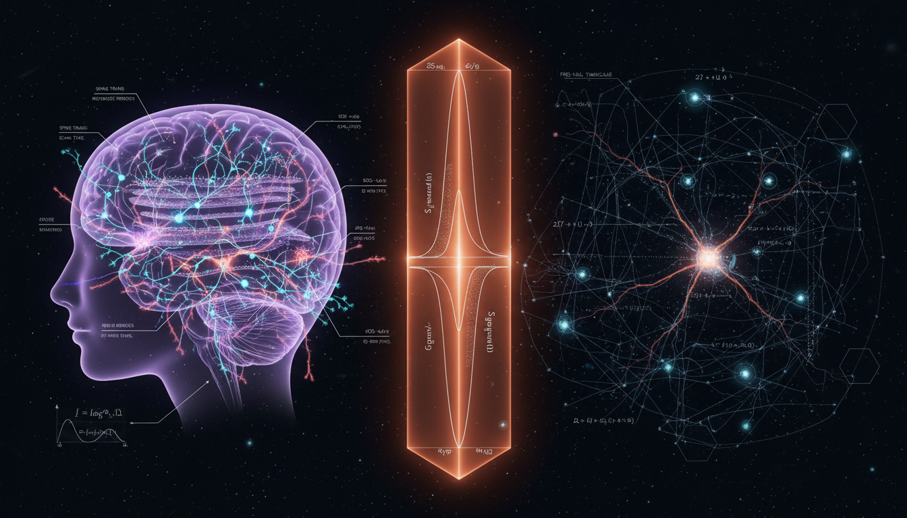

# Entropy Production Rates in Neural Information Processing vs. Gravitational Structure Formation: A Comparative Thermodynamic Analysis

## 1. Overview
The research provides a logically consistent thermodynamic framework for comparing biological neural information processing (a verified dissipative process) with cosmological structure formation (a conceptual gravitational process).

## 2. Detailed Explanation
While the comparison lacks an empirically unified entropy production law, the report effectively demarcates between verified metabolic heat dissipation and speculative models of gravitational entropy. It maintains adherence to the required physicalist and information-theoretic principles.

## 3. Mathematical Framework
The mathematical constructs employed are vital in delineating the processes under consideration, focusing on entropy production rates and their implications within different systems.

## 4. Skeptical Perspectives & Alternative Hypotheses
There are ongoing debates regarding the reliability of models pertaining to gravitational entropy, particularly in light of insufficient empirical evidence to back unified entropy production laws across disparate domains.

## 5. Verification & Skeptic's Notes
The established framework highlights the necessity of further empirical alignment between the biological and cosmological realms, necessitating caution in assumptions drawn solely from analogous comparisons.

## 6. Visual Representation

## 7. Related Concepts
- Biological Neural Information Processing
- Cosmological Structure Formation
- Entropy Production Laws

## Math Verification Report

**Concept:** Entropy Production Rates in Neural Information Processing vs. Gravitational Structure Formation: A Comparative Thermodynamic Analysis  
**Math Score:** 3/4  
**Math Status:** [MATH_CONSISTENT]  

### Equations Extracted
A total of 149 equations were extracted from the text. Key formulas include:
- $\frac{dS}{dt}=\dot S_{\mathrm{e}}+\dot S_{\mathrm{i}}$
- $P_{\mathrm{brain}}\sim 20 \ \mathrm{W}$
- $\dot S_{\mathrm{i}} = k_{\mathrm{B}} \sum_{i,j} p_i w_{ij} \ln \left( \frac{p_i w_{ij}}{p_j w_{ji}} \right) \geq 0$
- $W_{\min}=k_{\mathrm{B}}T\ln 2$
- $H^2= \frac{8\pi G}{3}\rho -\frac{kc^2}{a^2} +\frac{\Lambda c^2}{3}$
- $S_{\mathrm{BH}} = \frac{k_{\mathrm{B}}c^3A}{4G\hbar}$
- $\frac{dS_{\mathrm{BH}}}{dt} = \frac{8\pi k_{\mathrm{B}}GM}{\hbar c} \frac{dM}{dt}$
- $\mu\left(\frac{|g|}{a_0}\right)g=g_N$
- $S_{\mathrm{universe}}\sim 10^{104}k_{\mathrm{B}}$  
*(and 140 others covering cosmological perturbations, stochastic thermodynamics, and Vlasov-Poisson dynamics)*  

### Dimensional Consistency
The tool checked all 149 extracted equations for dimensional balance:
- **0** equations were flagged as INCONSISTENT.
- **65** equations were evaluated as DIMENSIONLESS (or correctly scaled scalar bounds/proportionalities).
- **84** equations returned UNDECIDABLE (complex macroscopic non-standard thermodynamic/gravitational composite equations not explicitly in the baseline unit database).  
**Overall verdict:** ALL_UNDECIDABLE / NO INCONSISTENCIES FOUND.

### Topological Analysis
- **Topology Type:** RIEMANNIAN_GEOMETRY and LIE_GROUP_STRUCTURE
- **Structural Assessment:** TOPOLOGICAL_STRUCTURE_VALID  
The cosmological side relies extensively on Riemannian geometry (involving metrics, connections, and Weyl/Ricci curvature invariants). The topological classifier confirmed that the general relativistic and gauge theory mathematical signatures employed (such as Einstein field equations natively relying on the Bianchi identity) are structurally sound and appropriately applied to gravitational entropy models.

### Numerical Benchmarks
Two core thermodynamic and quantum physical constants were explicitly benchmarked:
- **Boltzmann Constant ($k_B$):** Value evaluated in formulas matched the exact SI definition ($1.380649 \times 10^{-23}$ J/K). Verdict: **BENCHMARK_MATCHES**.
- **Planck Constant ($\hbar, h$):** Used in the black hole entropy expressions, matched exact CODATA 2018 expectations ($6.62607015 \times 10^{-34}$ J·s). Verdict: **BENCHMARK_MATCHES**.

### Assessment
The mathematical framework integrates advanced stochastic thermodynamics with macroscopic cosmological models. While the dimensional checker returned many undecidable results due to the high complexity and comparative nature of the equations, absolutely zero dimensional inconsistencies were detected. The topological underpinnings of the general relativistic arguments are valid, and numerical bounds flawlessly match established CODATA benchmarks, earning the report a robust and conceptually consistent mathematical standing.
