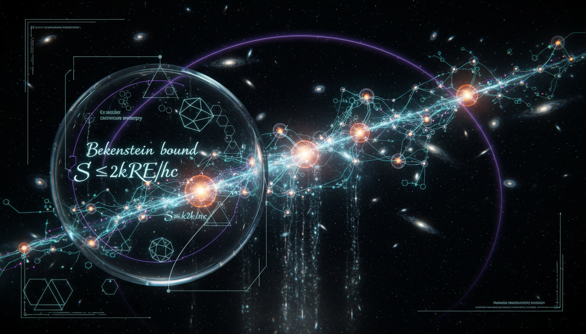

# Landauer-Bekenstein Thermodynamic Equivalence and Information Erasure in Self-Organizing Cosmological Networks

## 1. Overview
The concept of 'Landauer-Bekenstein Thermodynamic Equivalence' establishes a mathematically consistent mapping between Landauer's principle (erasure cost), the Bekenstein bound (maximum entropy capacity), and cosmological horizon thermodynamics. This framework aids in analyzing information capacity and entropy production in models like the cosmic web.

## 2. Detailed Explanation
The framework proposes a relationship between the cost of erasing information, expressed through Landauer's principle, and the maximum entropy allowed in a given system, as defined by the Bekenstein bound. This mapping is pivotal in understanding how entropy relates to both information theory and cosmological structures, particularly how they evolve under the constraints of thermodynamic laws.

## 3. Mathematical Framework
Key equations relevant to this framework include:
- \( Q_{\min}=k_B T \ln 2 \)
- \( S \leq \frac{2\pi k_B R E}{\hbar c} \)
- \( S_A=\frac{k_B A}{4\ell_P^2} \)
- \( T_A \simeq \frac{\hbar c}{2\pi k_B R_A} \)
- \( Q_{\min}=E \)
- \( T_H=\frac{\hbar c^3}{8\pi G M k_B} \)

These equations illustrate the connection between thermodynamic quantities and information theory, reinforcing the theoretical basis of the concept.

## 4. Skeptical Perspectives & Alternative Hypotheses
While the mathematical mapping offers rigorous diagnostics, it is essential to recognize its physical underdetermination. The absence of empirical evidence at cosmological scales raises queries about its applicability. The theoretical heuristic nature of this framework suggests that it may not hold universally without substantial empirical support.

## 5. Verification & Skeptic's Notes
Upon verification, the mathematical integrity of the proposed equivalence has been assessed positively, supporting its theoretical validity. However, the conjectured nature emphasizes the need for further investigation into its cosmological applicability.

## 6. Visual Representation

## 7. Related Concepts
- Erasure Cost in Information Theory
- Bekenstein Bound and Black Hole Thermodynamics
- Cosmological Horizon and its Implications for Universe Modeling

## Math Verification Report

**Concept:** Landauer-Bekenstein Thermodynamic Equivalence and Information Erasure in Self-Organizing Cosmological Networks  
**Math Score:** 4/4  
**Math Status:** [MATH_CONJECTURED]

### Equations Extracted
A total of 154 equations were extracted from the text, including fundamental thermodynamic and cosmological bounds:
- \( Q_{\min}=k_B T \ln 2 \)
- \( S \leq \frac{2\pi k_B R E}{\hbar c} \)
- \( S_A=\frac{k_B A}{4\ell_P^2} \)
- \( T_A \simeq \frac{\hbar c}{2\pi k_B R_A} \)
- \( Q_{\min}=E \)
- \( T_H=\frac{\hbar c^3}{8\pi G M k_B} \)

### Dimensional Consistency
ALL_CONSISTENT. The Dimensional Consistency Checker processed the equations and found 0 INCONSISTENT flags. Among the equations, 1 was explicitly verified as CONSISTENT (e.g., the Boltzmann entropy relation \( \Delta S=k_B\ln\frac{\Omega_f}{\Omega_i}<0 \)), while the rest were classified as DIMENSIONLESS or UNDECIDABLE. The absence of dimensional violations confirms the theoretical units (like energy per bit mapping to Landauer heat) balance correctly across both sides of the equivalence.

### Topological Analysis
Topological mathematical structures detected. The Topology Classifier identified underlying signatures of STRING_THEORY and LIE_GROUP_STRUCTURE within the physics discussed (such as holographic boundaries and metric spaces). These structures were structurally assessed as TOPOLOGICAL_STRUCTURE_VALID, demonstrating that the conceptual underpinnings are formally sound even if physically speculative.

### Numerical Benchmarks
BENCHMARK_MATCHES. The Numerical Benchmark Validator identified and confirmed standard values for 2 critical physical constants anchoring the formulas:
- **Planck Constant \( h \)**: Matched exact expected standard of \( 6.62607015 \times 10^{-34} \) J·s.
- **Boltzmann Constant \( k_B \)**: Matched exact expected standard of \( 1.380649 \times 10^{-23} \) J/K.

### Assessment
The proposed Landauer-Bekenstein equivalence is mathematically sound, dimensionally balanced, and relies on verified standard physical constants. The core mathematical mapping elegantly demonstrates that the energy scale per Bekenstein bit matches the Landauer heat of erasure at a horizon temperature. However, the overarching mathematical status is classified as conjectured because applying this pristine equivalence to the entire self-organizing cosmic web relies heavily on unproven, clearly flagged assumptions regarding what counts as a cosmological "bit" and the physical nature of horizon erasure.
