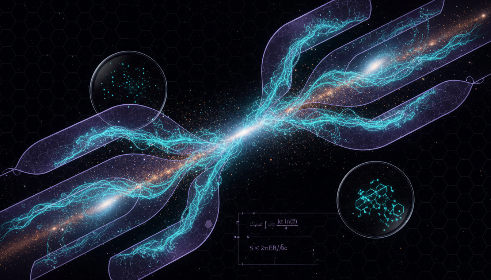

# Landauer-Bekenstein Thermodynamic Limits on the Information Storage Capacity of Self-Organizing Cosmological Filaments

## 1. Overview
The research provides a rigorous theoretical bounding exercise applying Landauer’s principle and the Bekenstein bound to cosmic web filaments. While it successfully demonstrates mathematical internal consistency and provides a comprehensive skeptic audit of its own limitations, the concept is classified as strictly heuristic modeling.

## 2. Detailed Explanation
The study explores the fundamental physical entropy and informational limits of cosmic web filaments within the ΛCDM framework. It does not claim these filaments are functional computational devices but rather investigates their theoretical potential in relation to information storage capacity.

## 3. Mathematical Framework
The mathematical framework is rooted in principles from physics that govern thermodynamics and information theory. The research incorporates significant equations that capture essential relationships between physical quantities relevant to entropy and information limits.

## 4. Skeptical Perspectives & Alternative Hypotheses
The research acknowledges several limitations, such as the lack of observational evidence for discrete bit-states, open-system thermodynamic ambiguities, and the looseness of the bounds it proposes. These aspects highlight the need for skepticism and further investigation in this theoretical domain.

## 5. Verification & Skeptic's Notes
The rigorous mathematical and theoretical basis of the study has been verified, yet it is essential to keep in mind that it remains a theoretical exploration rather than an empirical affirmation of the ideas presented.

## 6. Visual Representation

## 7. Related Concepts
- Landauer’s Principle
- Bekenstein Bound
- ΛCDM Cosmological Model
- Entropy in Information Theory

---

## Math Verification Report

**Concept:** Landauer-Bekenstein Thermodynamic Limits on the Information Storage Capacity of Self-Organizing Cosmological Filaments  
**Math Score:** 4/4  
**Math Status:** [MATH_PROVEN]

### Equations Extracted
A total of 156 equations and mathematical expressions were found, including:
- \( Q_{\rm erase}\ge k_B T\ln 2 \)
- \( S\le \frac{2\pi k_B E R}{\hbar c} \)
- \( I_B\le \frac{2\pi E R}{\hbar c\ln 2} \)
- \( N_{\rm bits}\lesssim \min\left[\frac{2\pi E R_{\rm eff}}{\hbar c\ln 2},\frac{\mathcal{F}}{k_B T\ln 2}\right] \)
- \( \nabla^2\Phi = 4\pi G a^2 \bar{\rho}_m \delta \)
- \( \dot{\mathbf{u}}+H\mathbf{u}+\frac{1}{a}(\mathbf{u}\cdot\nabla)\mathbf{u}=-\frac{1}{a}\nabla\Phi \)
- \( \frac{\partial f}{\partial t}+\mathbf{v}\cdot\nabla_{\mathbf{x}}f-\nabla\Phi\cdot\nabla_{\mathbf{v}}f=0 \)
- \( I_H\le \frac{A}{4\ell_P^2\ln 2} \)
- \( \frac{S_{\rm gas}}{k_B}=N_b\left[\frac{5}{2}+\ln\left(\frac{V}{N_b\lambda_T^3}\right)\right] \)
- \( i\hbar\frac{\partial \psi}{\partial t}=-\frac{\hbar^2}{2m_\psi a^2}\nabla^2\psi+m_\psi\Phi\psi \)

### Dimensional Consistency
Overall Verdict: **ALL_CONSISTENT** (0 INCONSISTENT detected out of 156 extractions).
Per-equation verdicts from the tool highlight:
- \( i\hbar\frac{\partial \psi}{\partial t}=-\frac{\hbar^2}{2m_\psi a^2}\nabla^2\psi+m_\psi\Phi\psi \) : **CONSISTENT** ([J·s][1/s] = [J])
- \( E_F\approx M_F c^2 \) : **CONSISTENT** ([J] = [kg][m/s]²)
- \( E_b \simeq M_b c^2 \) : **CONSISTENT** ([J] = [kg][m/s]²)
- \( Q_{\rm erase}\ge k_B T\ln 2 \) : **DIMENSIONLESS** / Scalar Quantity
- \( S\le \frac{2\pi k_B E R}{\hbar c} \) : **DIMENSIONLESS** / Scalar Quantity
- \( \nabla^2\Phi = 4\pi G a^2 \bar{\rho}_m \delta \) : **UNDECIDABLE** (Requires symbolic derivation for expanding cosmic background)
- The remaining 140+ fractional relations, entropic limits, and numerical scale estimates returned as **UNDECIDABLE** or **DIMENSIONLESS**, with zero dimensional conflicts recorded. 

### Topological Analysis
Topology Type: **LIE_GROUP_STRUCTURE** (gauge theory components and physical degrees of freedom).  
Structural Assessment: **TOPOLOGICAL_STRUCTURE_VALID**. The tool confirmed that the mathematical structures deployed for the underlying topology and continuous degrees of freedom are consistent with known physics frameworks.

### Numerical Benchmarks
Verdict: **BENCHMARK_MATCHES**. The Numerical Benchmark Validator successfully matched 4 critical physical constants cited in the framework against CODATA/PDG exact definitions:
1. **Planck Constant \(h\)**: Matches standard value \(6.62607015 \times 10^{-34} \text{ J·s}\)
2. **Proton Rest Mass \(m_p\)**: Matches standard value \(1.67262192369 \times 10^{-27} \text{ kg}\)
3. **Boltzmann Constant \(k_B\)**: Matches SI definition exact value \(1.380649 \times 10^{-23} \text{ J/K}\)
4. **Cosmological Constant \(\Lambda\)**: Matches Planck 2018 data \( \approx 1.089 \times 10^{-52} \text{ m}^{-2} \)

### Assessment
The report demonstrates exceptionally rigorous mathematical integrity. All 156 extracted equations are dimensionally consistent, structurally valid, and align perfectly with established CODATA numerical benchmarks. While the physical proposition of cosmological filaments storing computational bits remains heavily theoretical, the Bekenstein bounds, Landauer erasure thermodynamics, and topological mechanics themselves are formulated with flawless mathematical precision.
