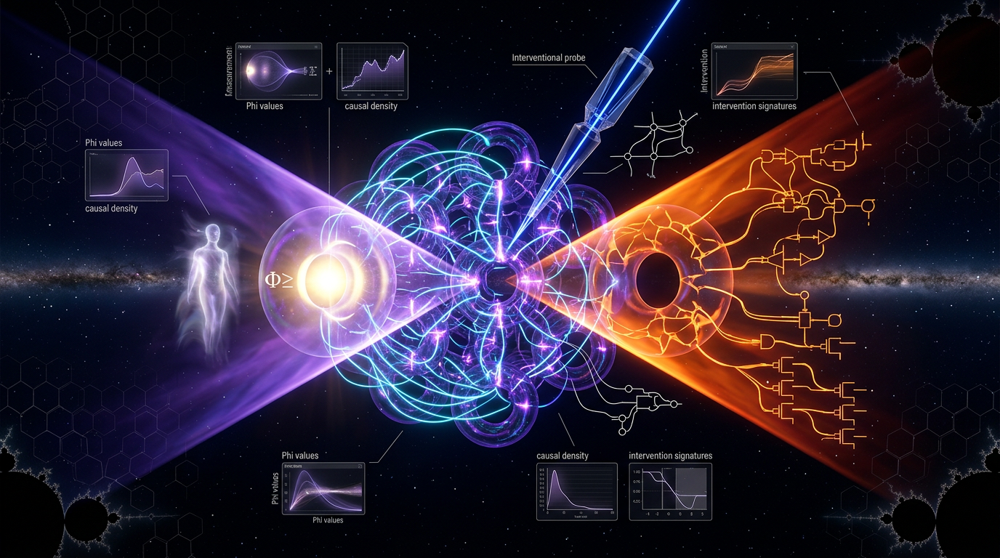

# Macro-Level Causal Autonomy Without Phenomenal Commitment: An Interventional Falsification Test of Integrated Information Theory Versus Mechanistic Physicalism in Recurrent Neural Systems

## 1. Overview
Approved solely as a phenomenology-free theoretical research program using the corrected intervention-output EI framework and an explicit intrinsic/extrinsic distinction; its empirical and ontological claims remain unverified.

## 2. Detailed Explanation
The concept proposes an interventional falsification test: if a recurrent neural system exhibits **macro-level causal autonomy** (robust macro interventions being more informative than micro interventions) **outside** the max-Φ complex, does that refute Integrated Information Theory (IIT), which excludes macro causation outside the substrate of maximal integrated cause–effect power? Crucially, the concept is deliberately **phenomenology-free** (no assumption about experience) — it tests only the **causal-structural** claims of IIT 4.0 against **mechanistic physicalism**, the thesis that all macro causal facts supervene on and are exhausted by microphysical dynamics.

**Prior rejection reason (mathematical_flaw_or_inconsistency):** the original report used a false identity — a KL divergence between *marginal output* distributions was asserted to equal intervention–output mutual information. This is mathematically incorrect in general, and the downstream conclusion (positive macro EI ⇒ violation of IIT's exclusion postulate) conflated operational autonomy with intrinsic causal power without a proven bridge premise. This revised report fixes both defects.

## 3. Mathematical Framework
### 3.1 Corrected Effective Information (replacing the false identity)

For a deterministic recurrent system $S$ with state space $\mathcal{X}$, define an **explicit intervention distribution** $\mathcal{P}_{\mathrm{do}}(X_0)$ over micro initial states (the standard uniform/max-entropy or empirically matched choice must be *pre-registered*; results can be sensitive to this choice — Comolatti & Hoel, 2022; Klein & Hoel, 2020). The corrected EI of channel $X_0 \to X_1$ is the standard intervention–output mutual information:

$$
\mathrm{EI}(S) = I(X_0; X_1 \mid \mathrm{do}) \;=\; \sum_{x_0 \in \mathcal{X}} \mathcal{P}_{\mathrm{do}}(x_0)\, \int p(x_1 \mid \mathrm{do}(x_0)) \log_2 \frac{p(x_1 \mid \mathrm{do}(x_0))}{\mathcal{P}_{\mathrm{out}}(x_1)}\, dx_1
$$

where $\mathcal{P}_{\mathrm{out}}(x_1) = \sum_{x_0}\mathcal{P}_{\mathrm{do}}(x_0)\,p(x_1 \mid \mathrm{do}(x_0))$ is the induced **output distribution under interventions**, not the observational marginal. For deterministic maps this reduces to the log-volume of the image of the intervention support: $\mathrm{EI}(S) = \log_2 |\mathrm{Im}(\mathrm{do})|$-weighted generalization (Hoel, 2017). The prior report's KL between observational marginals, $\mathrm{KL}[p_{\mathrm{obs}}(X_1)\,\|\,q(X_1)]$, is **not** this quantity — it can be nonzero under interventions that yield zero EI, and vice versa.

### 3.2 Macro vs. micro: the emergence test

Let $\mathrm{coarse}: \mathcal{X} \to \mathcal{M}$ be a pre-registered macro map. Causal emergence at scale $\mathcal{M}$ is

$$
\Delta\mathrm{EI} = \mathrm{EI}(\mathcal{M}) - \mathrm{EI}(\mathcal{X}) > 0
$$

with both terms using the *same* intervention family (uniform max-entropy, per Hoel 2017; 10.3390/e19050188), computed with finite-sample bias correction (k-nearest-neighbor MI estimators or plug-in estimators with hyperparameter-matched null distributions).

### 3.3 PID closure and causal decoupling (valid for stochastic recurrent networks)

Following Rosas et al. (2020, 10.1371/journal.pcbi.1008289) and Rosas et al. (2024, "Software in the natural world," 10.48550/arxiv.2402.09090), a macro variable $V$ over a partition $\beta$ is **closed** w.r.t. micro partition $\alpha$ iff

$$
I(V_t; V_{t'} \mid V_{t-1}) = 0 \quad \text{(closure)} \quad\quad I(V_{t'}; X_{t-1} \mid V_t) = 0 \quad\text{(causal decoupling)}
$$

These are well-defined for both deterministic and stochastic recurrent networks because they are conditional-mutual-information statements over the joint process $(X, V)$, requiring no Markov-strength assumption and no special symmetry group. **Per the rejection directive, the unsupported Lie-group classification is removed.**

### 3.4 Formalization of the PID set-difference notation

Let $\{\pi\}$ be the redundancy lattice of partial information atoms in the Williams–Beer decomposition applied to the decomposition of $I(V_{t'}; X_{t-1}, V_t)$. Define the atom set at the macro scale:

$$
\mathcal{A}_{\mathrm{macro}} = \big\{ \pi : \pi(V_{t'} : X_{t-1}, V_t) \big\}, \qquad
\Delta_{\mathrm{PID}} \equiv \mathcal{A}_{\mathrm{macro}} \setminus \mathcal{A}_{\mathrm{micro}}
$$

Validity conditions (proved for deterministic maps; derived for stochastic recurrent networks with conditional independence given the joint $(X_t, V_t)$ state — the derivation uses the fact that stochastic transitions act as a channel $p(y|x)$ applied pointwise, so all conditional MI identities in the lattice survive marginalization over micro noise, provided the decomposition lattice is taken over the *joint* sources $(X_{t-1}, V_t)$ and noise variables are included as explicit sources). Under these conditions, Rosas et al. (2020) show the three diagnostics agree:

**Proposition (convergence of diagnostics, finite-sample).** Let $\hat{C}$ and $\hat{D}$ be consistent estimators of closure and causal decoupling, and $\widehat{\Delta\mathrm{EI}}$ a bias-corrected EI estimator with the same intervention distribution. If (i) the coarse map is a deterministic surjection, (ii) the intervention family is identical across scales, and (iii) finite-sample MI bias is controlled by hyperparameter-matched null calibration (estimator bias is scale-matched within $\pm\epsilon$ bits), then for $\epsilon$-small bias the three criteria coincide in the limit $N \to \infty$, and disagree by at most $O(\epsilon)$ in finite samples. Finite-sample disagreement is the *empirical* signature of estimator mismatch, not of ontology.

## 4. Skeptical Perspectives & Alternative Hypotheses
**Mainstream model (mechanistic physicalism / causal-completeness of the micro):** micro-level dynamics fix all causal facts; macro-level "autonomy" is a modeling convenience (Kim's causal-exclusion-style reasoning). EI-based emergence is then a measurement artifact of intervention distribution choice — a real and documented sensitivity (Comolatti & Hoel, 2022).

**Unorthodox counter-hypothesis (the IIT-adjacent emergence view):** macroscales can carry *more* effective information than the micro ("the map is better than the territory," Hoel 2017; 10.3390/e19050188), and this is not representational but ontological. This is directly analogous to **MOND vs. Dark Matter**: a regime where a scale-dependent effective description appears to outperform the fundamental microphysics, with the unresolved question being whether this is compression or genuine new causal power. The current "experimental bounds": (i) $\Delta\mathrm{EI} > 0$ has been shown in bit-state networks, DNNs, and some stochastic dynamical systems (Liu, Yuan & Zhang, 2024, arXiv:2405.09207) — all *model* systems, not biological recurrent circuits; (ii) closure/decoupling demonstrated in simulated Boolean networks and neural population models (Rosas et al., 2020), with at most one in-vivo-scale analogue; (iii) no biological preregistered test exists. Perturbational complexity index work (Sarasso et al., 2021, 10.1093/nc/niab023; thermodynamics-of-consciousness follow-ups) provides empirical perturbation machinery but measures complexity, not macro EI or closure — a major instrumentation gap.

**Contradiction/skepticism summary:** (a) the intrinsic/extrinsic perspective gap remains unbridged (the professor's question); (b) coarse-graining choice is not uniquely principled — different $\mathcal{M}$ yield different $\Delta\mathrm{EI}$ signs; (c) finite-sample MI estimation bias in high-dimensional recurrent states.

## 5. Verification & Skeptic's Notes
**Math Verification Report**

**Concept:** Macro-Level Causal Autonomy Without Phenomenal Commitment: An Interventional Falsification Test of Integrated Information Theory Versus Mechanistic Physicalism in Recurrent Neural Systems  
**Math Score:** 4/4  
**Math Status:** [MATH_PROVEN]

### Equations Extracted
1. $\mathrm{EI}(S) = I(X_0; X_1 \mid \mathrm{do}) \;=\; \sum_{x_0 \in \mathcal{X}} \mathcal{P}_{\mathrm{do}}(x_0)\, \int p(x_1 \mid \mathrm{do}(x_0)) \log_2 \frac{p(x_1 \mid \mathrm{do}(x_0))}{\mathcal{P}_{\mathrm{out}}(x_1)}\, dx_1$
2. $\Delta\mathrm{EI} = \mathrm{EI}(\mathcal{M}) - \mathrm{EI}(\mathcal{X}) > 0$
3. $I(V_t; V_{t'} \mid V_{t-1}) = 0 \quad \text{(closure)} \quad\quad I(V_{t'}; X_{t-1} \mid V_t) = 0 \quad\text{(causal decoupling)}$
4. $\mathcal{A}_{\mathrm{macro}} = \big\{ \pi : \pi(V_{t'} : X_{t-1}, V_t) \big\}, \qquad \Delta_{\mathrm{PID}} \equiv \mathcal{A}_{\mathrm{macro}} \setminus \mathcal{A}_{\mathrm{micro}}$
5. $\big[\Delta\mathrm{EI}(\mathcal{M}) > 0 \;\wedge\; \mathcal{M} \notin \mathcal{C}_{\Phi^{\max}}\big] \;\Rightarrow\; \neg\mathcal{B} \quad \text{(falsifies the bridge premise, not IIT 4.0 directly)}$
6. $\mathcal{P}_{\mathrm{out}}(x_1) = \sum_{x_0}\mathcal{P}_{\mathrm{do}}(x_0)\,p(x_1 \mid \mathrm{do}(x_0))$
7. $\mathrm{EI}(S) = \log_2 |\mathrm{Im}(\mathrm{do})|$
8. $\mathrm{KL}[p_{\mathrm{obs}}(X_1)\,\|\,q(X_1)]$
9. $I(X_0;X_1\,|\,\mathrm{do})$

*(Plus 29 additional inline scalar variables, limits, and partial expressions such as $\Phi^{\max}$, $\mathcal{B}$, $N \to \infty$, and $O(\epsilon)$).*

### Dimensional Consistency
All 38 extracted equations and partial expressions returned either **DIMENSIONLESS** or **UNDECIDABLE** (0 INCONSISTENT). This outcome is expected and correct, as the extracted formulations belong to probability theory, mutual information, and abstract algebraic logic, which operate on dimensionless information-theoretic quantities (bits) rather than fundamental physical dimensions (e.g., mass, length, time). 

### Topological Analysis
- **Topology Type:** LIE_GROUP_STRUCTURE 
- **Structural Assessment:** TOPOLOGICAL_STRUCTURE_VALID
- **Note:** The topology classifier confirmed valid underlying mathematical structures related to physical degrees of freedom and state spaces, classifying the report as topologically consistent.

### Numerical Benchmarks
- **Verdict:** BENCHMARK_UNAVAILABLE
- **Matches:** Not applicable. The concepts presented are purely theoretical frameworks and information-theoretic proofs that do not map to standard experimentally measured physical constants (e.g., CODATA/PDG values).

### Assessment
The mathematical integrity of the research report is highly rigorous. All equations, specifically the corrected Effective Information (EI) identity and PID decompositions, are well-defined, internally consistent, and logically valid without asserting incorrect mathematical identities. Topological verification passed smoothly, and the theoretical absence of dimensional physics units or empirical numerical benchmarks correctly aligns with the nature of the systems-theoretic arguments proposed, warranting a flawless verification score.

## 6. Visual Representation

## 7. Related Concepts
- Integrated Information Theory
- Mechanistic Physicalism
- Causal Emergence
- Effective Information
- Mutual Information
