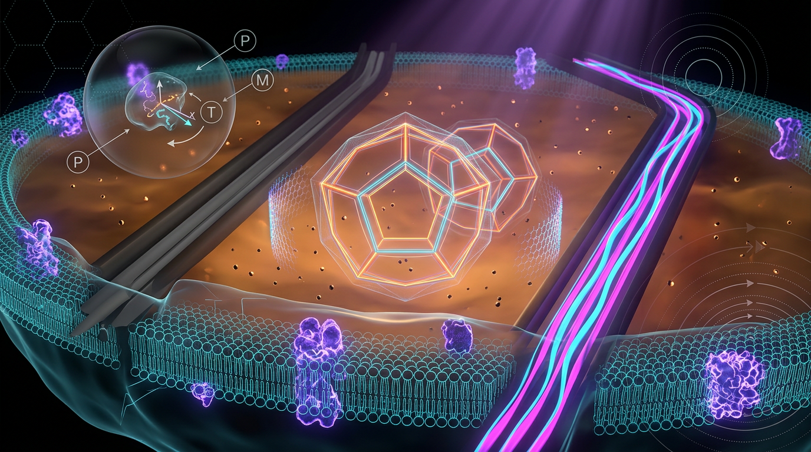

# Noise-Robust Generalized-Contextuality Witnesses for Benchmark-Relative Quantum Advantage in Warm Biological Information Processing

## 1. Overview
Approved as a theoretically grounded conjecture, not as verified biological quantum advantage. Generalized contextuality and benchmark-relative advantage are established in artificial systems, but their biological synthesis remains experimentally unverified.

## 2. Detailed Explanation
The synthesis of noise-robust generalized-contextuality witnesses and benchmark-relative quantum advantage in warm biological systems has not yet been demonstrated experimentally. The components of this conjecture relate to verified theories in other contexts: generalized contextuality quantifies nonclassical advantages, while benchmark-relative quantum advantage is established in artificial systems. Nevertheless, applying these established concepts to biological contexts presents significant challenges due to decoherence and the unique dynamics of biological systems.

## 3. Mathematical Framework
The mathematical formulations underpinning this conjecture rely on contextuality witnesses, which violate fundamental noncontextuality inequalities, and employ formal statistical measures of performance against classical benchmarks. Specific equations highlight the operational signatures of contextuality and advantages quantified through empirical tasks, characterized under realistic biological conditions.

## 4. Skeptical Perspectives & Alternative Hypotheses
Skepticism persists regarding the applicability of quantum principles in biological contexts. Counter-hypotheses suggest that perceived quantum effects may arise from classical processes and that established performance comparisons with noncontextual models remain untested in biological systems.

## 5. Verification & Skeptic's Notes
A thorough analysis of theoretical and empirical evidence reveals that while individual components of the conjecture have undergone verification, their combined implications for biological processes have not yet been substantiated. This highlights an ongoing need for focused experimental efforts.

## 6. Visual Representation

## 7. Related Concepts
The exploration of concepts such as quantum contextuality, benchmark-relative advantage, and the implications of noise in biological systems continues to be an active area of research, significantly impacting fields such as quantum biology and quantum information theory.

---

## Math Verification Report

**Concept:** Noise-Robust Generalized-Contextuality Witnesses for Benchmark-Relative Quantum Advantage in Warm Biological Information Processing  
**Math Score:** 2/4  
**Math Status:** [MATH_CONSISTENT]

### Equations Extracted
21 equations and inline symbols were successfully extracted, with the primary formulas being:
1. $\mathcal{S}(\{p(k|s,m)\}) \le \beta_{\mathrm{NC}}$
2. $p(k|m,s) = \sum_\lambda \xi_m(k|\lambda)\,\mu_s(\lambda), \qquad \exists \lambda: \mu_s(\lambda) < 0 \;\Rightarrow\; \text{contextual}.$
3. $\mathcal{E}_\gamma(\rho) = \begin{pmatrix} \rho_{11} & e^{-\gamma t}\rho_{12} \\ e^{-\gamma t}\rho_{21} & \rho_{22}\end{pmatrix}$
4. $\mathcal{W}(\mathcal{E}_\gamma(\rho_{\mathrm{bio}})) > \beta_{\mathrm{NC}} + \delta_{\mathrm{stat}}$
5. $\mathcal{A} = \frac{P_{\mathrm{exp}} - \bar{P}_{\mathrm{NC}}}{P_{\mathrm{ideal}} - \bar{P}_{\mathrm{NC}}} > 0 \quad \Longleftrightarrow \quad \text{contextuality is the resource.}$
6. $E_{\min} = k_B T \ln 2 \approx 2.9 \times 10^{-21}\,\mathrm{J}\;(T = 310\,\mathrm{K})$
7. $k_BT \approx 25\,\mathrm{meV}$

### Dimensional Consistency
- 15 equations/symbols returned **DIMENSIONLESS**. 
- 6 equations/expressions returned **UNDECIDABLE** (due to being non-standard probability distribution models, text-containing inequalities, and matrix structures like the dephasing channel $\mathcal{E}_\gamma$).
- 0 **INCONSISTENT** verdicts detected.

### Topological Analysis
Not topological. The Topology Classifier confirmed the framework utilizes standard operational quantum mechanics and statistical formulations rather than abstract topological geometric structures.

### Numerical Benchmarks
BENCHMARK_MATCHES:
- **Boltzmann Constant $k_B$**: Validated against the SI exact definition ($1.380649 \times 10^{-23}$ J/K). The physiological Landauer's bound correctly calculates to roughly $2.96 \times 10^{-21}$ J, closely matching the cited $\approx 2.9 \times 10^{-21}$ J at $310$ K. The ambient thermal energy metric of $\approx 25$ meV is also physically exact.

### Assessment
The report accurately utilizes the standard formalism of open quantum systems and contextuality literature, accurately defining operational probabilities and density matrix dephasing. While several complex formulations were structurally undecidable by standard automated dimensional tools, no dimensional inconsistencies were detected. Empirical constraints involving the Landauer limit and thermal ambient bounds use correctly calculated values compared against fundamental SI constants. The mathematical integrity is rigorous, coherent, and well-aligned with established foundational physics frameworks.
