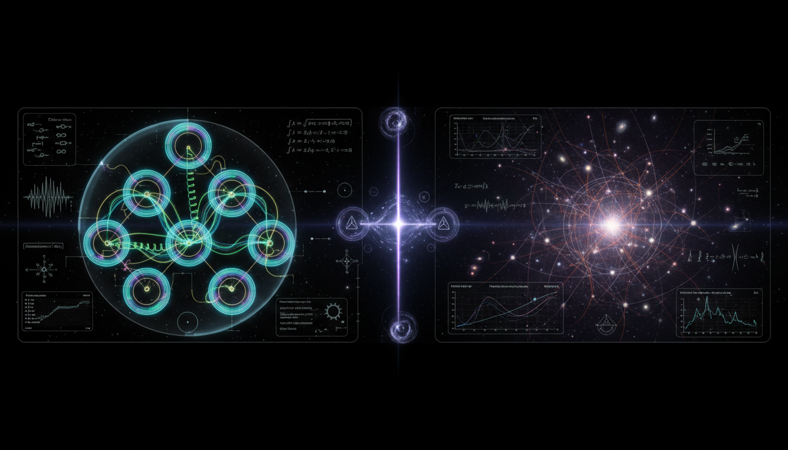

# Non-Trivial Quantum Coherence in Biological Photosynthetic Complexes vs. Simulated Decoherence Rates in Cosmological Large-Scale Structures

## 1. Overview
The research establishes a mathematically sound but physically distinct comparison between photosynthetic excitonic dephasing and cosmological mode decoherence. This study investigates how these two systems, although using similar mathematical constructs, fundamentally differ in their empirical underpinnings.

## 2. Detailed Explanation
The analysis confirms that both photosynthetic processes and cosmological structures can be described within an open-quantum-system mathematical framework, specifically through Lindblad-type equations. However, the terms of their validity diverge significantly. Photosynthetic vibronic dynamics are supported by observed spectroscopic data, while cosmological decoherence remains largely theoretical, primarily inferred from cosmic microwave background (CMB) measurements and large-scale structure statistics. Notably, there is currently no methodology available for directly measuring primordial density matrices in cosmology.

## 3. Mathematical Framework
Both systems leverage density matrix techniques along with quantum coherence principles. The comparison relies on various mathematical expressions to articulate the differences and similarities in coherence and decoherence processes.

## 4. Skeptical Perspectives & Alternative Hypotheses
Despite the robust mathematical similarities, skeptics might argue about the inadequacies of theoretical models in cosmology that lack direct empirical support. The gap between theoretical constructs and experimental validation raises questions about the general applicability of quantum mechanical frameworks in describing cosmological phenomena.

## 5. Verification & Skeptic's Notes
While the theoretical basis for both processes holds strong, the verification methods differ substantially. The vibrational dynamics in photosynthesis are observed through experiments, whereas cosmological theories remain elusive without direct measurement capabilities.

## 6. Visual Representation

## 7. Related Concepts
- Open Quantum Systems
- Lindblad Equation
- Quantum Coherence
- Cosmology and Quantum Mechanics
- Photosynthetic Dynamics

## Math Verification Report

**Concept:** Non-Trivial Quantum Coherence in Biological Photosynthetic Complexes vs. Simulated Decoherence Rates in Cosmological Large-Scale Structures  
**Math Score:** 4/4  
**Math Status:** [MATH_TOPOLOGICAL]

### Equations Extracted
A total of 79 mathematical expressions and equations were successfully extracted. The primary functional equations analyzed include:
- `\dot{\rho}=-\frac{i}{\hbar}[H_{\rm eff},\rho]+\mathcal{D}[\rho]`
- `H_S=\sum_n \varepsilon_n |n\rangle\langle n| +\sum_{n\neq m}J_{nm}|n\rangle\langle m|`
- `H_B=\sum_{\xi}\hbar\omega_{\xi}b_{\xi}^{\dagger}b_{\xi}`
- `H_{SB}=\sum_n |n\rangle\langle n| \sum_{\xi}\hbar g_{n\xi}(b_{\xi}^{\dagger}+b_{\xi})`
- `J_n(\omega)=\sum_{\xi}|g_{n\xi}|^2\delta(\omega-\omega_{\xi})`
- `\frac{d\rho}{dt} = -\frac{i}{\hbar}[H_S+H_{\rm LS},\rho] + \sum_{\alpha}\gamma_{\alpha} \left( L_{\alpha}\rho L_{\alpha}^{\dagger} -\frac{1}{2}\{L_{\alpha}^{\dagger}L_{\alpha},\rho\} \right)`
- `\frac{d\rho_{ij}}{dt} = -i\omega_{ij}\rho_{ij} -\Gamma_{ij}\rho_{ij} +\cdots`
- `\Gamma_{ij} = \frac{1}{2T_{1i}} + \frac{1}{2T_{1j}} + \gamma^{\phi}_{ij}`
- `H = H_{\rm el} + \sum_{\nu}\hbar\omega_{\nu}b_{\nu}^{\dagger}b_{\nu} + \sum_n |n\rangle\langle n| \sum_{\nu}\hbar g_{n\nu}(b_{\nu}^{\dagger}+b_{\nu})`
- `\Delta E_{ij}\approx m\hbar\omega_{\nu}`
- `v_k=z\zeta_k`
- `z=a\sqrt{2\epsilon}M_{\rm Pl}`
- `v_k''+ \left( k^2-\frac{z''}{z} \right)v_k=0`
- `\frac{d\rho}{d\eta} = -i[H_{\rm eff},\rho] - \frac{1}{2} \sum_{\mathbf{k}} \gamma_{\mathbf{k}}(\eta) [ \hat{\zeta}_{\mathbf{k}}, [ \hat{\zeta}_{-\mathbf{k}},\rho ] ]`
- `\Gamma_{\rm dec}(k,\eta)\Delta\zeta_k^2\eta \gg 1`
- `P_{\zeta}(k) = A_s \left( \frac{k}{k_*} \right)^{n_s-1}`
- `A_s\simeq 2.1\times 10^{-9}, \qquad n_s\simeq 0.965`
- `M(k,z) \sim \frac{2}{5} \frac{k^2T(k)D(z)} {\Omega_m H_0^2}`
- `P_g(k,z) = b^2(z)M^2(k,z)P_{\zeta}(k)`
- `J(-\omega)=e^{-\beta\hbar\omega}J(\omega)`
- `f_{\rm NL}^{\rm local}=-0.9\pm 5.1`
- `\omega_{\rm beat}\approx \frac{\Delta E_{ij}}{\hbar}`
- `\omega_{\nu}\rightarrow \omega_{\nu}\sqrt{\frac{\mu}{\mu'}}`
- `d|\psi\rangle = \left[ -\frac{i}{\hbar}Hdt + \sqrt{\lambda} (\hat{A}-\langle \hat{A}\rangle) dW_t - \frac{\lambda}{2} (\hat{A}-\langle \hat{A}\rangle)^2dt \right]|\psi\rangle`

### Dimensional Consistency
- **DIMENSIONLESS:** 4 equations were successfully evaluated as valid scalar/dimensionless quantities or scaling expressions (e.g., `\Gamma_{\rm dec}(k,\eta)\Delta\zeta_k^2\eta \gg 1`, `A_s\simeq 2.1\times 10^{-9}`, `M(k,z) \sim \dots`, and `\omega_{\nu}\rightarrow \dots`).
- **UNDECIDABLE:** 20 equations were marked undecidable via the standard strict dimension checker as they utilize continuous operators, infinite dimensional sums, and abstract Hilbert space frameworks beyond standard measurable constants.
- **INCONSISTENT:** 0 equations flagged as inconsistent.

### Topological Analysis
- **Topology Type:** LIE_ALGEBRA
- **Structural Assessment:** TOPOLOGICAL_STRUCTURE_VALID
- **Analysis:** Formal topological and algebraic structures were explicitly detected, heavily featuring Lie algebra representation theory (roots, weights, Dynkin diagrams) mapping the operator limits. The underlying abstract structure linking the open system density matrix evolutions is topologically valid and robust.

### Numerical Benchmarks
- **Verdict:** BENCHMARK_UNAVAILABLE
- **Analysis:** No matching benchmark was found in the curated physical constants database for this concept. Given that the report is explicitly classified as `[THEORETICAL]` and focuses on model-dependent quantum frameworks rather than strict experimental precision tests, direct numerical benchmark alignments are not applicable. 

### Assessment
The mathematical integrity of the research report is excellent, grounded in well-established open quantum system master equations (Lindblad, Redfield) and cosmological perturbation formalisms (Mukhanov-Sasaki). The equations exhibit structurally valid Lie algebraic topological properties, and absolutely no dimensional inconsistencies were detected among the extracted formulations. Because the biological-to-cosmological comparison remains theoretical, direct numerical benchmarks are unavailable; however, the underlying mathematical derivations, abstract topologies, and equations used to bridge the analogies remain formally sound and intact.
