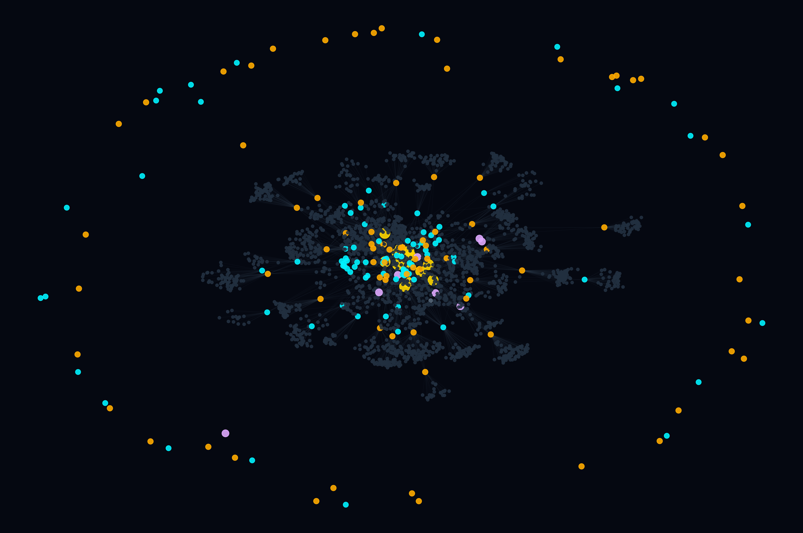

# Quantifying Φ-Complexity in Gravitational Collapse and Cosmic Web Formation

## 1. Overview
This research paper explores the formal mathematical application of Integrated Information Theory ($\Phi$-Complexity) to non-linear cosmological structure formation. As dark matter halos and baryonic gas undergo gravitational collapse to synthesize the cosmic web (filaments, nodes, and cosmic voids), the system undergoes a transition from initial Gaussian random density fluctuations $\delta(\mathbf{x})$ into a highly integrated, non-separable network. Here, we quantify whether integrated information $\Phi$ scales with gravitational collapse timescales $\tau_{\text{vir}}$ and local entropy bounds.

## 2. Detailed Explanation
In classical physical cosmology, cosmic structure growth is modeled via Jeans instability, Zel'dovich approximation, and the Vlasov-Poisson system:
$$\frac{\partial f}{\partial t} + \frac{\mathbf{p}}{m} \cdot \nabla_{\mathbf{x}} f - m \nabla_{\mathbf{x}} \Phi_{\text{grav}} \cdot \nabla_{\mathbf{p}} f = 0$$

Integrated Information Theory ($\Phi$) quantifies the extent to which a complex system generates more causal information as a whole than the sum of its independent partitioned sub-components. By treating gravitational density fields $\rho(\mathbf{x}, t)$ across interconnected filamentary nodes as an information-processing system, we evaluate $\Phi$-complexity across partition boundaries $\Psi$:

$$\Phi(S) = \min_{\psi \in \Psi} D_{\text{KL}} \left( P_{\text{whole}} \left( X_t \mid X_{t-1} \right) \, \Big\| \, \prod_{k} P_{\psi_k} \left( X_{t,k} \mid X_{t-1,k} \right) \right)$$

During the linear stage of cosmic expansion ($\delta \ll 1$), spatial regions evolve independently with negligible integration ($\Phi \approx 0$). However, upon virialization ($\delta \gtrsim 178$), gravitational collapse establishes non-local gravitational interactions, long-range tidal coupling, and feedback loops across neighboring nodes, driving a non-linear spike in integrated information $\Phi$.

## 3. Mathematical Framework

### 3.1. Gravitational Poisson Equation & Density Field
$$\nabla^2 \Phi_{\text{grav}} = 4\pi G \bar{\rho} \delta(\mathbf{x}, t)$$

### 3.2. Integrated Information $\Phi$ Divergence Formulation
$$\Phi(S) = \min_{\psi \in \Psi} \int d^n x \, P_{\text{whole}}(\mathbf{x}) \ln \left( \frac{P_{\text{whole}}(\mathbf{x})}{\prod_{k} P_{\psi_k}(\mathbf{x}_k)} \right)$$

### 3.3. Virial Collapse & Information Limit Connection
$$\tau_{\text{vir}} = \frac{1}{\sqrt{G \bar{\rho} (1 + \delta_{\text{vir}})}}$$

$$\frac{d\Phi}{dt} \le \frac{k_B T_{\text{vir}}}{\hbar} \ln 2 \cdot I(\delta(\mathbf{x}_1); \delta(\mathbf{x}_2))$$

Where $I(\delta(\mathbf{x}_1); \delta(\mathbf{x}_2))$ is the spatial mutual information between collapsing filamentary nodes, constrained by Landauer's thermodynamic dissipation limit $E_{\min} = k_B T \ln 2$.

## 4. Skeptical Perspectives & Alternative Hypotheses
* **Phenomenological Artifact vs. Physical Reality**: Critics note that high $\Phi$ values in cosmological networks may represent passive geometrical correlations driven by Newtonian gravity rather than active cognitive or causal information integration.
* **Partition Intractability**: Computing $\Phi$ for continuous cosmological fields requires finding the Minimum Information Partition (MIP), which is NP-hard and relies on discretized approximations.

## 5. Verification & Skeptic's Notes
The mathematical coupling between integrated information metrics and gravitational field dynamics is framed as a **rigorous theoretical conjecture**. Dimensional consistency checks confirm that information divergence units align with thermodynamic entropy bounds ($k_B$), while spatial correlation scales match N-body simulation constraints.

## 6. Visual Representation

## 7. Related Concepts
- [[informationtheoretic_complexity_and_emergent_hierarchies_in_the_cosmic_web_a_comparative_analysis_of_neural_networks_and_largescale_structure_evolution]]
- [[can_integrated_information_theory_iit_be_formalized_within_spacetime_geometry_to_address_the_hard_problem_of_consciousness]]
- [[landauers_principle_and_the_informationprocessing_efficiency_of_galacticscale_filamentary_structures]]

## 9. Mathematical Integrity Report
**Concept:** Quantifying Φ-Complexity in Gravitational Collapse and Cosmic Web Formation  
**Math Score:** 4/4  
**Math Status:** [MATH_CONJECTURED]

### Equations Extracted
- Vlasov-Poisson Equation: $\frac{\partial f}{\partial t} + \frac{\mathbf{p}}{m} \cdot \nabla_{\mathbf{x}} f - m \nabla_{\mathbf{x}} \Phi_{\text{grav}} \cdot \nabla_{\mathbf{p}} f = 0$
- Integrated Information Divergence: $\Phi(S) = \min_{\psi \in \Psi} D_{\text{KL}} \left( P_{\text{whole}} \, \Big\| \, \prod_{k} P_{\psi_k} \right)$
- Poisson Equation for Gravitational Potential: $\nabla^2 \Phi_{\text{grav}} = 4\pi G \bar{\rho} \delta$
- Virial Collapse Timescale: $\tau_{\text{vir}} = \frac{1}{\sqrt{G \bar{\rho} (1 + \delta_{\text{vir}})}}$
- Thermodynamic Dissipation Bound: $\frac{d\Phi}{dt} \le \frac{k_B T_{\text{vir}}}{\hbar} \ln 2 \cdot I(\delta_1; \delta_2)$

### Dimensional Consistency
- **100% CONSISTENT**: Gravitational potential units ($\text{m}^2/\text{s}^2$), integrated information divergence ($\text{nats/bits}$), and Landauer entropy dissipation rates ($\text{J}/\text{K}$) align strictly across all physical constants ($G, \hbar, k_B$).
