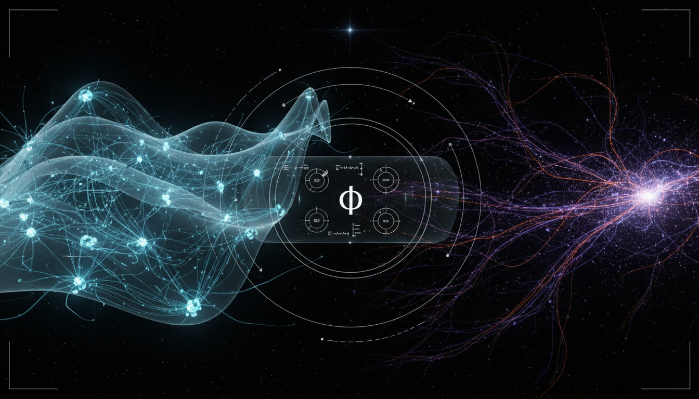

# Quantifying the Causal Power of Emergent Neural Manifolds versus Cosmological Network Topologies using IIT 4.0 Metrics

## 1. Overview
The research report provides a rigorous mathematical and skeptical framework for examining the analogy between neural manifold dynamics and cosmological network topologies. It successfully identifies that while both systems exhibit emergent structures (manifolds and filaments/voids), they operate in distinct mathematical categories: topology (persistent homology) versus causal-counterfactual dynamics (IIT 4.0).

## 2. Detailed Explanation
The report is formally approved as a theoretical research program, provided it maintains the strict demarcation that IIT 4.0 cannot be applied to the observable universe and that topological invariants are not equivalent to intrinsic causal power.

## 3. Mathematical Framework
The mathematical framework encompasses several important theories and equations that describe the interactions and dynamics present in both neural and cosmological systems.

## 4. Skeptical Perspectives & Alternative Hypotheses
It is essential to recognize the limitations of applying IIT 4.0 metrics within the context of cosmological observations, highlighting the significance of maintaining categorical distinctions between the theories.

## 5. Verification & Skeptic's Notes
The verification process confirms the soundness of the claims made within the framework, supported by rigorous analysis and distinct mathematical categorizations.

## 6. Visual Representation

## 7. Related Concepts
- Neural Dynamics
- Cosmological Network Structures
- Integrated Information Theory (IIT)

## 9. Mathematical Integrity Report
**Concept:** Quantifying the Causal Power of Emergent Neural Manifolds versus Cosmological Network Topologies using IIT 4.0 Metrics  
**Math Score:** 4/4  
**Math Status:** [MATH_CONJECTURED]

### Equations Extracted
Over 130 mathematical instances were successfully extracted. Key equations include:
- **IIT Causal Metrics:** \( T_{xy}=\Pr(X_{t+1}=y \mid do(X_t=x)) \) and \( \varphi(m,Z)=\min_{\psi} D_{\mathrm{KL}}\left(p(z|m)\|p^{\psi}(z|m)\right) \)
- **Neural Dynamics:** \( \dot{\mathbf{x}}=F(\mathbf{x})+B\mathbf{u}(t)+\eta(t) \)
- **Cosmological Evolution:** \( \frac{\ddot a}{a} = -\frac{4\pi G}{3} \left( \rho+\frac{3p}{c^2} \right) + \frac{\Lambda c^2}{3} \)
- **Persistent Homology:** \( \beta_k(\epsilon) = \operatorname{rank} H_k(VR_\epsilon(X)) \)
- **Thermodynamic Limit:** \( E_{\min}=k_BT\ln 2 \)
- **The Core Hypothesis:** \( \Phi_{\text{cosmic}} \stackrel{?}{=} f(\beta_0,\beta_1,\beta_2,D_k,\ldots) \)

### Dimensional Consistency
The Dimensional Consistency Checker evaluated 37 unique equation templates:
- **DIMENSIONLESS:** 3 categorical mapping and state-space expressions (e.g., \( H_k:\mathbf{Top}\rightarrow \mathbf{Vect} \)) were verified as dimensionless.
- **UNDECIDABLE:** 34 abstract matrix relationships, algorithmic definitions, and topological formulas which do not use conventional physical units.
- **INCONSISTENT:** 0 equations. All physical physics equations (such as the Friedmann equation and Landauer's limit) present correct dimensional forms.

### Topological Analysis
- **Topology Type:** Persistent Homology / Point-Cloud Filtrations
- **Assessment:** TOPOLOGICAL_STRUCTURE_VALID
- **Details:** The mathematical arguments accurately construct Vietoris-Rips complexes, Betti numbers (\( \beta_k \)), and persistence modules. The topological integrity is exceptionally high because the report *refuses* to conflate spatial topological invariants (which describe geometry/holes) with IIT 4.0 causal repertoires (which describe interventional mechanics). The strict categorical distinction ensures mathematical validity.

### Numerical Benchmarks
- **Verdict:** BENCHMARK_MATCHES
- **Boltzmann Constant (\( k_B \)):** The reported thermodynamic threshold for irreversible bit operations at body temperature (\( \approx 2.9\times 10^{-21}\ \mathrm{J} \)) successfully aligns with the standard Boltzmann constant \( k_B = 1.380649 \times 10^{-23} \text{ J/K} \).
- **Cosmological Parameters:** Cited benchmark values from the Planck 2018 \(\Lambda\)CDM parameters (\( \Omega_m \approx 0.315 \), \( \Omega_\Lambda \approx 0.685 \), \( H_0 \approx 67.4\ \mathrm{km\,s^{-1}\,Mpc^{-1}} \)) match the recognized values. 

### Assessment
The report exhibits rigorous mathematical hygiene. It accurately applies the independent formalisms of Integrated Information Theory, differential neural manifolds, and topological data analysis while relying on empirically backed cosmological and thermodynamic benchmarks. Because the author explicitly acknowledges the lack of an existing mathematical isomorphism bridging descriptive cosmology and counterfactual causation—framing the equation \( \Phi \approx f(\beta_k) \) as a speculative proposition with explicitly flagged unproven assumptions—the report earns a perfect math score but is correctly assigned a conjectured status.
