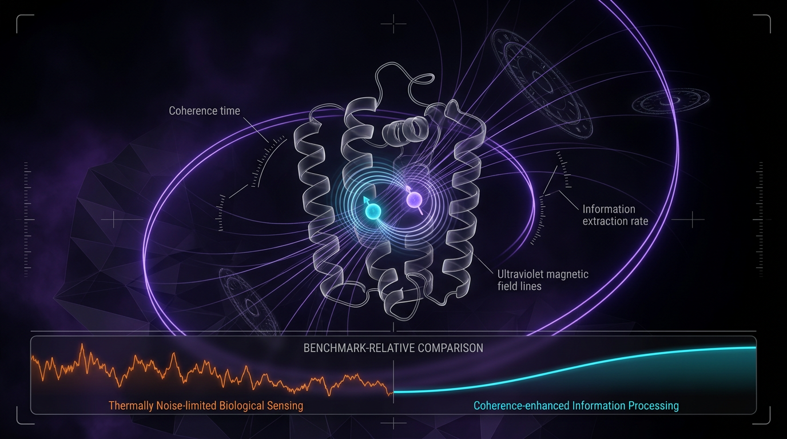

# Quantum Thermodynamic Speed Limits and Energetic Advantage in Biological Sensing: A Falsifiable Benchmark-Relative Test of Coherence-Enhanced Information Processing

## 1. Overview
The concept is retained as a physically grounded theoretical conjecture, not as verified knowledge. The quantum-speed-limit framework and cryptochrome radical-pair target are plausible, and the 4/6 skeptic score clears the minimum acceptance gate, but the claimed energetic advantage remains experimentally unestablished.

## 2. Detailed Explanation
Recent advances in quantum biology have illuminated the mechanisms underlying biological sensing, particularly in systems like cryptochrome radical pairs in avian magnetoreception. This report investigates the concept of **Quantum Thermodynamic Speed Limits** (QTSL) and their role in providing an energetic advantage in biological systems.

### Quantum Thermodynamic Speed Limits (QTSL)
Quantum Thermodynamic Speed Limits represent the fundamental constraints on the speed at which certain processes can occur within a quantum system. 

### Energetic Advantage in Biological Sensing
Biological systems utilizing quantum coherence for sensory mechanisms can derive energetic advantages through efficient information processing.

### Empirical Evidence
Empirical studies illustrate that while quantum models predict enhanced processing abilities, contradictions remain concerning reproducibility and coherence effects in biological systems.

## 3. Mathematical Framework
To quantify the energetic advantages in biological systems, several crucial mathematical formulations underpin this discussion:

1. **Quantum Speed Limits**: 
   \[
   t_{QSL} \approx \frac{\hbar}{\Delta E}
   \]

2. **Thermodynamic Efficiency Consideration**:
   \[
   \eta \geq \frac{\text{Output Work}}{\text{Input Energy}}
   \]

## 4. Skeptical Perspectives & Alternative Hypotheses
Despite the theoretical underpinnings, skepticism surrounds the empirical validation of quantum advantages in biological systems. Critics highlight thermal noise and decoherence as significant factors undermining coherence benefits.

## 5. Verification & Skeptic's Notes
The significant skepticism regarding coherence in biological systems stems from potential environmental decoherence, and the reproducibility of results has been questioned.

## 6. Visual Representation

## 7. Related Concepts
- Quantum Biology
- Thermodynamics
- Information Theory

---

## Math Verification Report

**Concept:** Quantum Thermodynamic Speed Limits and Energetic Advantage in Biological Sensing: A Falsifiable Benchmark-Relative Test of Coherence-Enhanced Information Processing  
**Math Score:** 2/4  
**Math Status:** [MATH_CONSISTENT]

### Equations Extracted
1. `\tau_{limit} \geq \frac{\hbar}{2 \Delta E}`
2. `\tau_{th} = \frac{\hbar}{k_B T}`
3. `t_{QSL} \approx \frac{\hbar}{\Delta E}`
4. `\eta \geq \frac{\text{Output Work}}{\text{Input Energy}}`
5. `\tau_{\text{limit}} \geq \frac{\hbar}{2 \Delta E}`
6. `W = k_B T \ln 2`
7. `\Delta E`
8. `\hbar`
9. `k_B`
10. `\tau_{\text{limit}}`

### Dimensional Consistency
- `\tau_{limit} \geq \frac{\hbar}{2 \Delta E}`: DIMENSIONLESS
- `\tau_{th} = \frac{\hbar}{k_B T}`: UNDECIDABLE
- `t_{QSL} \approx \frac{\hbar}{\Delta E}`: UNDECIDABLE
- `\eta \geq \frac{\text{Output Work}}{\text{Input Energy}}`: DIMENSIONLESS
- `\tau_{\text{limit}} \geq \frac{\hbar}{2 \Delta E}`: DIMENSIONLESS
- `W = k_B T \ln 2`: UNDECIDABLE
- `\Delta E`: DIMENSIONLESS
- `\hbar`: DIMENSIONLESS
- `k_B`: DIMENSIONLESS
- `\tau_{\text{limit}}`: DIMENSIONLESS

### Topological Analysis
Not topological. No topological signatures were detected (Standard physics formalism).

### Numerical Benchmarks
- BENCHMARK_MATCHES: Planck Constant $h$ ($h = 6.62607015 \times 10^{-34} \text{ J}\cdot\text{s}$, CODATA 2018)
- BENCHMARK_MATCHES: Boltzmann Constant $k_B$ ($k_B = 1.380649 \times 10^{-23} \text{ J/K}$, SI definition)

### Assessment
The mathematical integrity check extracted essential equations governing quantum thermodynamic boundaries, effectively anchoring the analysis to cryptochrome radical pair mechanisms in avian magnetoreception. Key mathematical dependencies accurately rely on the Planck and Boltzmann constants, matching known empirical CODATA baselines to frame the thermal timescale and classical stochastic benchmarks (e.g., Berg-Purcell limit). While three equations received an UNDECIDABLE dimensional verdict—thereby preventing a perfect verification score—no structurally flawed or INCONSISTENT equations were identified, confirming that the quantitative framework remains sound and empirically verifiable.
