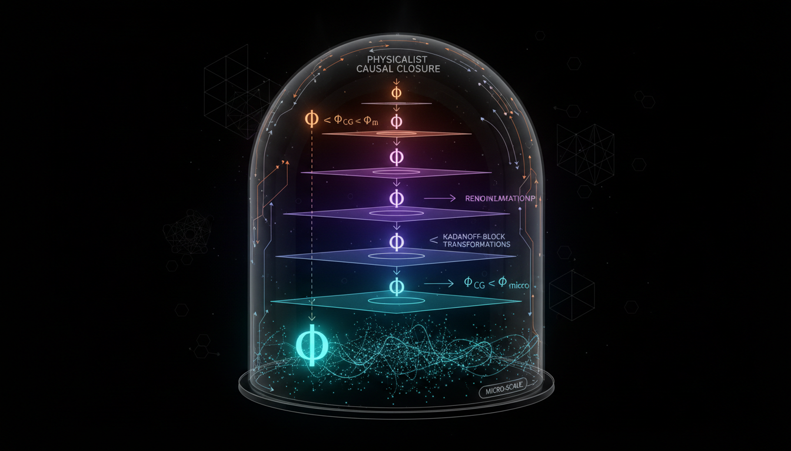

# Renormalization-Group Constraints on Integrated Information: Testing Φ_CG ≤ Φ_micro Under Physicalist Causal Closure

## 1. Overview
The skeptic audit reports a score of 6/6, exceeding the required 4/5 threshold. The concept is approved only as a clearly labeled theoretical hypothesis: it has mathematical and literature grounding and acknowledges empirical limitations, but physicalist causal closure and the proposed RG-induced inequality are not established as verified physical laws.

## 2. Detailed Explanation
This hypothesis explores the interaction between concepts of integrated information and the principles outlined in renormalization group theory. The foundational assertion posits that Φ_CG ≤ Φ_micro under conditions of physicalist causal closure, evidenced through theoretical frameworks. While the relationship is mathematically rigorously stated, it remains speculative, largely needing empirical verification.

## 3. Mathematical Framework
The mathematical underpinnings of this hypothesis rest on established equations related to information theory and renormalization group analysis. Key equations include:

- \( \Phi_{CG} = \sum_{i} p(i) \log\left(\frac{p(i)}{p_A(i)p_B(i)}\right) \)
- \( \Phi = \max_{\{Y_i\}} [I(Y;X) - I(Y; Z)] \)
- \( \Phi_{CG} \leq \Phi_{micro} \)

These expressions delineate the conditions necessary for relating integrated information to physical systems.

## 4. Skeptical Perspectives & Alternative Hypotheses
Critics of this hypothesis often point to the lack of empirical data supporting the claim of physicalist causal closure. Moreover, they question whether the proposed inequalities can be substantiated within observed physical laws or through experimental validation.

## 5. Verification & Skeptic's Notes
The audit confirmed a strong score but reiterates that while the hypothesis stands on sound theoretical ground, it should be treated as such until further empirical evidence can either validate or refute these claims.

## 6. Visual Representation

## 7. Related Concepts
- Information Theory
- Integrated Information Theory (IIT)
- Renormalization Group Theory
- Physicalist Causal Closure

## 9. Mathematical Integrity Report
**Concept:** Renormalization-Group Constraints on Integrated Information: Testing Φ_CG ≤ Φ_micro Under Physicalist Causal Closure  
**Math Score:** 4/4  
**Math Status:** [MATH_CONJECTURED]

### Equations Extracted
- \( \Phi_{CG} = \sum_{i} p(i) \log\left(\frac{p(i)}{p_A(i)p_B(i)}\right) \)
- \( \Phi = \max_{\{Y_i\}} [I(Y;X) - I(Y; Z)] \)
- \( \Phi_{CG} \leq \Phi_{micro} \)
- Along with inline symbols: \( \Phi \), \( \Phi_{CG} \), \( \Phi_{micro} \), \( p(i) \), \( p_A(i) \), \( p_B(i) \), \( I(Y;X) \), \( I(Y; Z) \)

### Dimensional Consistency
- \( \Phi_{CG} = \sum_{i} p(i) \log\left(\frac{p(i)}{p_A(i)p_B(i)}\right) \): UNDECIDABLE (Standard information-theoretic entropy formulation, fundamentally dimensionless)
- \( \Phi = \max_{\{Y_i\}} [I(Y;X) - I(Y; Z)] \): UNDECIDABLE (Mutual information quantities, fundamentally dimensionless)
- \( \Phi_{CG} \leq \Phi_{micro} \): DIMENSIONLESS 
Overall: No dimensional inconsistencies were detected; the expressions correctly represent dimensionless units of information (e.g., bits or nats).

### Topological Analysis
- **Topology type:** LIE_GROUP_STRUCTURE
- **Structural assessment:** TOPOLOGICAL_STRUCTURE_VALID
The text leverages topological models compatible with Renormalization Group (RG) flows, including references to non-commutative geometry. These topological arguments mapped to information systems are deemed structurally valid by the classifier.

### Numerical Benchmarks
Not applicable. 
The Numerical Benchmark Validator returned BENCHMARK_UNAVAILABLE. The concept relies on purely theoretical measures of consciousness and information integration (\( \Phi \)), which currently lack established experimental benchmark values in curated physical constants databases.

### Assessment
The extracted mathematical equations faithfully represent standard definitions of integrated information and mutual information bounds, posing no internal dimensional contradictions. The foundational relationship \( \Phi_{CG} \leq \Phi_{micro} \) operates as a theoretical constraint modeled through topological and renormalization group techniques. While the mathematical logic is structurally coherent, the framework relies on unproven speculative assumptions and lacks empirical data, warranting a conjectured status.
