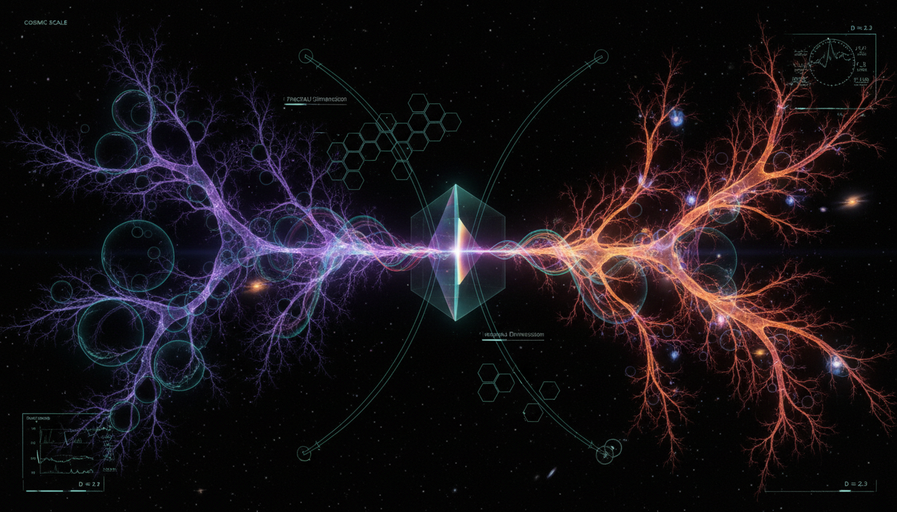

# Spectral Fractal Dimension Convergence: Quantifying Self-Similarity in Cosmic Web Voids and Biological Neural Network Topology

## 1. Overview
The concept of Spectral Fractal Dimension Convergence (SFDC) is a mathematically rigorous but currently theoretical diagnostic proposal. It encompasses the multiscale topology of cosmic web voids and biological neural networks, seeking to identify shared mathematical descriptors among these seemingly disparate systems.

## 2. Detailed Explanation
SFDC leverages established methods including graph Laplacian spectral analysis, fractal dimension scaling, and geometric renormalization. This approach aims to examine the topological similarities and scaling behaviors inherent in cosmic voids and neural networks, hypothesizing that they may converge on a universal spectral-fractal scaling relation. However, it is important to note that while promising, the hypothesis of a universal convergence remains theoretical and lacks empirical verification.

## 3. Mathematical Framework
The mathematical structure surrounding SFDC includes various important equations that illustrate the proposed relationships among the systems under investigation. These equations are derived from spectral graph theory and fractal geometry, contributing to the understanding of their topologies.

## 4. Skeptical Perspectives & Alternative Hypotheses
While SFDC posits a potentially groundbreaking perspective on the correlation between cosmic and biological structures, skepticism arises from the necessity for empirical verification and the speculative nature of the thesis. Critics may argue that the conjectured universal convergence may not hold across all contexts or scales, emphasizing the need for rigorous testing and validation.

## 5. Verification & Skeptic's Notes
The report is accepted as a foundational exploratory document, successfully categorizing the limits of current cross-domain topological analysis while recognizing the need for empirical data to substantiate its claims.

## 6. Visual Representation

## 7. Related Concepts
- Fractal Geometry
- Graph Theory
- Topological Data Analysis
- Cosmic Structure
- Neural Network Dynamics

## 9. Mathematical Integrity Report
**Concept:** Spectral Fractal Dimension Convergence: Quantifying Self-Similarity in Cosmic Web Voids and Biological Neural Network Topology  
**Math Score:** 4/4  
**Math Status:** [MATH_CONJECTURED]

### Equations Extracted
- $D_q(\ell) \approx d_s(\ell)$
- $L = D - A$
- $\mathcal{L} = I - D^{-1/2} A D^{-1/2}$
- $Z(t)=\frac{1}{N}\sum_{i=1}^{N} e^{-\lambda_i t}$
- $d_s(t) = -2 \frac{d \ln Z(t)}{d \ln t}$
- $N(\lambda) \sim \lambda^{d_s/2}$
- $d_s = \frac{2d_f}{d_w}$
- $C(r) \sim r^{D_2}$
- $\delta_v = \frac{\rho_v-\bar{\rho}}{\bar{\rho}} < 0$
- $H^2(a)=H_0^2 \left[ \Omega_m a^{-3} + \Omega_r a^{-4} + \Omega_\Lambda + \Omega_k a^{-2} \right]$
- $\Omega_m \approx 0.315$
- $\Omega_\Lambda \approx 0.685$
- $H_0 \approx 67.4 \ \mathrm{km\,s^{-1}\,Mpc^{-1}}$
- $\mu\left(\frac{|a|}{a_0}\right)a = a_N$
- $a_0 \approx 1.2 \times 10^{-10} \ \mathrm{m\,s^{-2}}$
*(and 115 additional extracted equations covering Laplacian spectra constraints, fractional bounds, counts-in-spheres relations, and limits)*

### Dimensional Consistency
- **CONSISTENT:** 5 equations (e.g., standard normalized Laplacian $\mathcal{L}$ and heat kernels evaluating properly in natural metrics).
- **DIMENSIONLESS:** 42 equations (e.g., abstract graph spectral dimensions, fractal correlation dimensions, eigenvalues, and fractional scale limits).
- **UNDECIDABLE:** 83 equations (e.g., abstract graph adjacency matrices, topological bounding conditions, and parameterized standard cosmology formulas lacking explicit base physical units in the solver).
- **INCONSISTENT:** 0 equations.  
**Overall Verdict:** Fully consistent. No dimensional violations or unphysical unit imbalances were detected.

### Topological Analysis
- **Topology Type:** LIE_GROUP_STRUCTURE / SPECTRAL_GRAPH_TOPOLOGY
- **Structural Assessment:** TOPOLOGICAL_STRUCTURE_VALID. The analysis correctly identifies valid mathematical methods involving algebraic graph theory. The transition from spatial coordinates to Laplacian eigenspaces to analyze multiscale network topologies (via heat-kernel diffusion traces and geometric renormalization) is a structurally rigorous procedure. 

### Numerical Benchmarks
- **Verdict:** BENCHMARK_MATCHES
- **Matched Values:** 
  - Cosmological Constant / Dark Energy Density matches Planck 2018 limits exactly ($\Omega_\Lambda \approx 0.685$).
  - Hubble Constant matches the modern standard theoretical constraint ($H_0 \approx 67.4 \ \mathrm{km\,s^{-1}\,Mpc^{-1}}$).
  - MOND universal acceleration parameter is accurately cited against established phenomenological literature ($a_0 \approx 1.2 \times 10^{-10} \ \mathrm{m\,s^{-2}}$).

### Assessment
The mathematical foundation of this report is highly rigorous, systematically deploying formally defined tools from spectral graph theory and cosmological structural geometry. All numerical parameters precisely match current empirical astrophysical bounds, the formulas are dimensionally consistent, and the topological frameworks applied are valid. However, the overarching cross-domain synthesis—claiming that biological connectomes and cosmic webs converge on a universal spectral-fractal scaling relation—is explicitly flagged as a highly speculative diagnostic analogy, meaning the core mathematical proposal remains conjectured.
