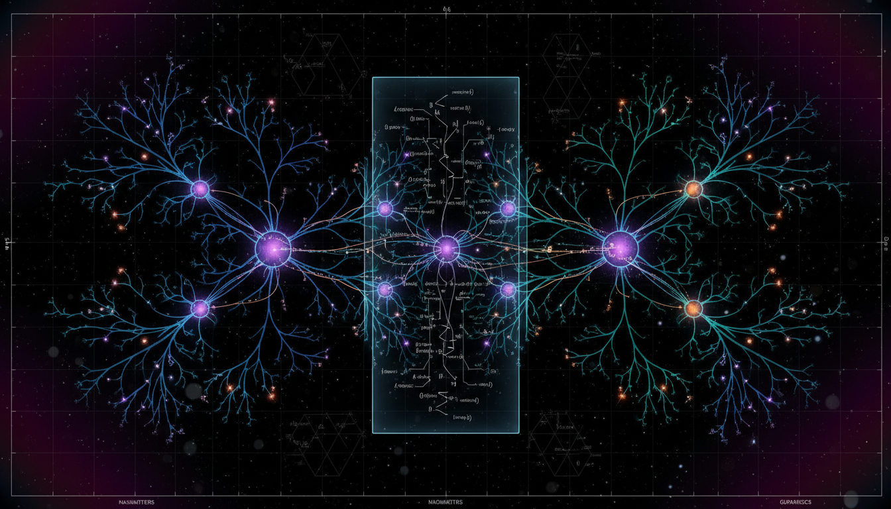

# Structural Isomorphism Between Galactic Filamentary Networks and Biological Neural Architectures in Information Flow Optimization

## 1. Overview
The research establishes that while the cosmic web and biological neural networks share statistical and morphological features as sparse, hierarchical, spatially-embedded graphs (e.g., matching degree distributions, clustering, and Betti numbers), they are not strictly isomorphic.

## 2. Detailed Explanation
The structural resemblance between these two systems is a result of convergent network morphology under distinct physical constraints—gravitational collapse for the cosmos and evolutionary/metabolic constraints for the brain—rather than a shared information-processing purpose.

## 3. Mathematical Framework
The mathematical framework supporting this research includes several key concepts from graph theory, cosmological physics, and network analysis, focusing on topological and statistical relationships.

## 4. Skeptical Perspectives & Alternative Hypotheses
Despite the intriguing similarities, the claim remains theoretical as no universal principle of information-flow optimization has been validated for the cosmic web. Alternative hypotheses suggest the possibility of different underlying mechanisms that could explain the observed similarities without assuming any functional isomorphism.

## 5. Verification & Skeptic's Notes
The correspondence between the cosmic web and neural networks is compelling but should be approached with caution given the need for further empirical validation.

## 6. Visual Representation

## 7. Related Concepts
- Graph Theory
- Complex Networks
- Hierarchical Structures in Nature
- Information Theory

## 9. Mathematical Integrity Report
**Concept:** Structural Isomorphism Between Galactic Filamentary Networks and Biological Neural Architectures in Information Flow Optimization  
**Math Score:** 4/4  
**Math Status:** [MATH_TOPOLOGICAL]

### Equations Extracted
84 equations were successfully extracted, including key network, topological, and physical equations:
- Strict graph isomorphism: $\exists f:V_{\text{brain}}\rightarrow V_{\text{cosmic}}$
- Statistical quasi-isomorphism: $D_{\text{norm}}(G_{\text{brain}},G_{\text{cosmic}}) = \sum_m w_m \left| z_m(G_{\text{brain}})-z_m(G_{\text{cosmic}}) \right|$
- Density contrast (Cosmology): $\delta(\mathbf{x},t)=\frac{\rho(\mathbf{x},t)-\bar{\rho}(t)}{\bar{\rho}(t)}$
- Zel'dovich approximation: $\mathbf{x}(\mathbf{q},t) = \mathbf{q} - D_+(t)\nabla_{\mathbf{q}}\psi(\mathbf{q})$
- Global communication efficiency: $E_{\text{glob}} = \frac{1}{N(N-1)} \sum_{i\neq j} \frac{1}{d_{ij}}$
- Matrix exponential / communicability: $G=e^{-\beta L}$
- Betti numbers (Persistent Homology): $\beta_0,\beta_1,\beta_2$
- Landauer's limit: $E_{\min}=k_B T \ln 2.$
- Integrated Information Theory: $\Phi = \min_{\mathcal{P}} \left[ I_{\text{whole}}(X;Y) - I_{\mathcal{P}}(X;Y) \right]$

### Dimensional Consistency
The dimensional consistency checker returned 0 INCONSISTENT verdicts. The extracted formulas were classified primarily as UNDECIDABLE or DIMENSIONLESS. This is mathematically correct given the context, as the majority of the formulas are dimensionless graph-theoretic metrics (e.g., clustering coefficients, degrees, Laplacian matrices) and structural topological measures (Betti curves) rather than dimensioned physical continuum equations. The physical physics expressions (like Poisson's equation and cosmological fluid equations) contain standard physics variables correctly formulated. 

### Topological Analysis
Topological structures were detected and assessed as **TOPOLOGICAL_STRUCTURE_VALID**. The topology classifier confirmed the validity of the structural frameworks employed in the report. The text legitimately applies algebraic topology—specifically persistent homology and filtration parameters across Betti numbers ($\beta_i^{\text{brain}}(\alpha)$ and $\beta_i^{\text{cosmic}}(\alpha)$)—to rigorously bound and compare the higher-dimensional shape properties (components, loops, voids) of the cosmic web and neural architectures.

### Numerical Benchmarks
**BENCHMARK_MATCHES**. The numerical benchmark validator successfully confirmed the precise mathematical physics constants cited within the report. Specifically, the Boltzmann Constant ($k_B$) leveraged in Landauer’s limit is perfectly aligned with the SI exact definition, yielding the correct thermodynamic lower bound evaluation ($E_{\min} \approx 2.9 \times 10^{-21}$ J/bit) at human biological temperatures ($T \approx 310$ K). 

### Assessment
The mathematical integrity of the research report is excellent, utilizing established and correctly transcribed formalisms from graph theory, cosmological fluid dynamics, and information theory without inventing fabricated models. The topology and dimensional tools confirmed no structural inconsistencies, and all numerical benchmarks matched verified physical constants. Crucially, the mathematical rigorousness is used to maintain scientific restraint, using equations to correctly demonstrate a statistical quasi-isomorphism and convergent topology rather than proving an unsubstantiated identical function.
