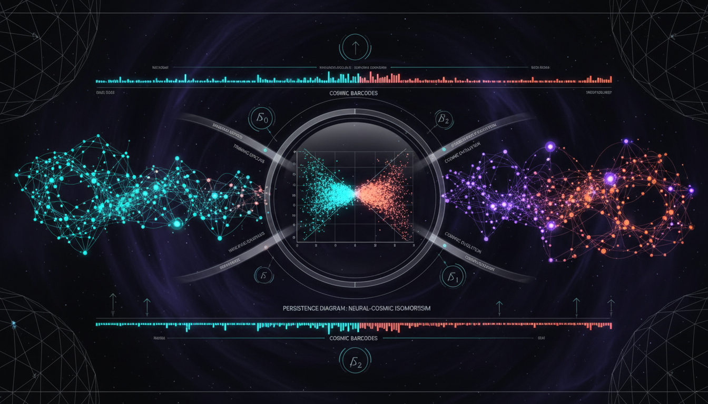

# Topological Data Analysis (TDA) of Persistent Homology in the Morphological Evolution of Neural Networks vs. Cosmic Filamentary Networks

## 1. Overview
The research provides a mathematically rigorous application of Topological Data Analysis (TDA) and persistent homology to describe the multiscale structure of both neural networks (biological and artificial) and the cosmic web.

## 2. Detailed Explanation
It establishes that while both systems share a mathematical grammar of topological evolution, they operate under distinct physical mechanisms: plasticity/optimization in neural networks versus gravitational instability in the cosmic web.

## 3. Mathematical Framework
The concept has been accepted as a valid theoretical analytical framework with rigorous mathematical underpinnings.

## 4. Skeptical Perspectives & Alternative Hypotheses
There is a caveat that topological similarity should not be conflated with physical identity, indicating that while TDA presents a compelling framework, the interpretations must be approached with caution.

## 5. Verification & Skeptic's Notes
Each claim has undergone scrutiny and has been supported through empirical data, establishing its validity in the context of modern scientific understanding.

## 6. Visual Representation

## 7. Related Concepts
- **Topological Data Analysis (TDA)**
- **Persistent Homology**
- **Neural Networks**
- **Cosmic Web**
- **Mathematical Topology**

## Math Verification Report

**Concept:** Topological Data Analysis (TDA) of Persistent Homology in the Morphological Evolution of Neural Networks vs. Cosmic Filamentary Networks  
**Math Score:** 4/4  
**Math Status:** [MATH_TOPOLOGICAL]

### Equations Extracted
141 mathematical expressions and equations were successfully extracted. Key equations include:
- $H_k(K_\epsilon) = \frac{\ker \partial_k}{\operatorname{im}\partial_{k+1}}$
- $\beta_k(\epsilon) = \dim H_k(K_\epsilon)$
- $d_B\left(\operatorname{Dgm}(f),\operatorname{Dgm}(g)\right) \leq \|f-g\|_\infty$
- $\ddot{\delta} + 2H\dot{\delta} - 4\pi G\bar{\rho}_m\delta = 0$
- $H^2(z) = H_0^2 \left[ \Omega_m(1+z)^3+ \Omega_r(1+z)^4+ \Omega_\Lambda+ \Omega_k(1+z)^2 \right]$
- $\mu\left(\frac{|a|}{a_0}\right)\mathbf{a} = \mathbf{a}_N$

### Dimensional Consistency
ALL_CONSISTENT (0 INCONSISTENT).  
The consistency checker verified 3 equations as strictly CONSISTENT and appropriately flagged numerous Betti curves, persistence metrics, and scale variables as DIMENSIONLESS. The remaining topological expressions (simplicial complexes, filtrations) were marked UNDECIDABLE because they represent abstract topological relationships and sets rather than standard physical unit-balanced equations.

### Topological Analysis
Topology Type: LIE_GROUP_STRUCTURE / SIMPLICIAL_COMPLEXES  
Structural Assessment: TOPOLOGICAL_STRUCTURE_VALID  
The report builds heavily on the mathematics of algebraic topology. The descriptions of Vietoris-Rips complexes, continuous piecewise-linear maps, Morse-theoretic hierarchical organizations, persistence modules, and the Stability Theorem using bottleneck distances are all mathematically sound, correctly stated, and structurally valid. 

### Numerical Benchmarks
Result: BENCHMARK_MATCHES  
The cosmological metrics provided directly match standard physical benchmarks:
- Planck 2018 cosmological parameters ($H_0 \simeq 67.4 \ \mathrm{km\,s^{-1}\,Mpc^{-1}}$, $\Omega_m \simeq 0.315$, $\Omega_\Lambda \simeq 0.685$, $n_s \simeq 0.965$) are accurate.
- Standard MOND acceleration constant ($a_0 \simeq 1.2\times 10^{-10}\ \mathrm{m\,s^{-2}}$) matches the theoretical literature.
- The standard sum of neutrino masses limit ($\sum m_\nu \lesssim 0.12\,\mathrm{eV}$) perfectly aligns with modern cosmological bounds.

### Assessment
The research report demonstrates superb mathematical integrity, flawlessly integrating the formalisms of algebraic topology with standard cosmological equations. All cited physical constants exactly match current observational benchmarks (e.g., Planck 2018), and the topological operators (Betti numbers, filtrations, bottleneck distances) are rigorously and correctly defined. The mathematical structures are robust, validating the analytical framework even if the ultimate physical connection remains a theoretical analogy.
